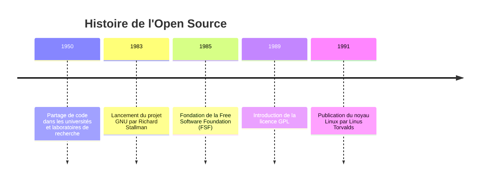
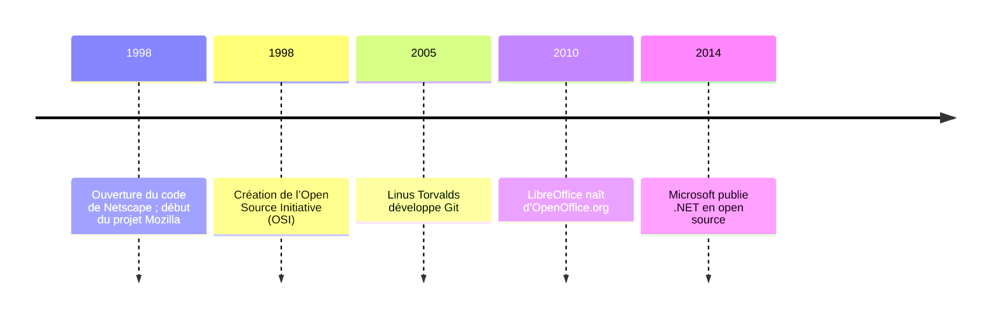

## Qu'est-ce que l'open source ?

Déjà, il faut poser les bases : c’est quoi l’Open Source ?
<!-- truncate -->

On peut commencer par la définition classique :
* c’est une méthode d’ingénierie logicielle qui consiste à développer un logiciel ou des composants logiciels en rendant le code source librement accessible.

C’est souvent un peu rébarbatif les définitions, mais concrètement, ça donne quoi ?

Prenons un exemple : `Word` vs `LibreOffice`.

D’un côté, on a `Word`, développé par une entreprise (*Microsoft*), et considéré comme un logiciel **propriétaire**. Les utilisateurs ne peuvent l’utiliser que sous certaines conditions (notamment les politiques de confidentialité et d’utilisation). Seuls les développeurs de Microsoft peuvent le modifier, et ce, uniquement pour les versions officielles. 

De l’autre côté, LibreOffice, développé par [**The Document Foundation**](https://www.documentfoundation.org/), est un logiciel **libre**. Cela signifie que n’importe qui peut consulter son code, le modifier, personnaliser l’interface, ajouter des fonctionnalités, etc. Et comme beaucoup de logiciels libres sont **communautaires**, chacun peut contribuer à leur évolution.

C’est cet aspect communautaire qui, à mes yeux, rend l’Open Source si puissant.

Maintenant qu’on a cerné le concept, voyons un peu l’histoire de l'Open Source.

### C’est qui qui a créé l’Open Source ?

Il n’y a pas vraiment **une seule** personne qui aurait « inventé » l’Open Source.

C’est plutôt une évolution collective. Cela dit, certains noms ressortent lorsqu’on parle de l’émergence de cette philosophie :

* [**Richard Stallman**](https://fr.wikipedia.org/wiki/Richard_Stallman), souvent considéré comme le père du mouvement du logiciel libre. En 1983, il lance le projet [**GNU**](https://www.gnu.org/home.fr.html) pour créer un système d’exploitation entièrement libre. Il fonde aussi la **Free Software Foundation** (FSF) en 1985 et propose la licence **GPL** en 1989, introduisant le principe de *copyleft*.
* **Christine Peterson** propose en 1998 le terme "[open source](https://en.wikipedia.org/wiki/Open-source_software_movement)" pour rendre le concept plus compréhensible et acceptable dans le monde de l’entreprise, sans confusion avec le terme "free software".
* [**Eric Raymond**](https://fr.wikipedia.org/wiki/Eric_Raymond) et [**Bruce Perens**](https://fr.wikipedia.org/wiki/Bruce_Perens), fondateurs de l’**Open Source Initiative** (OSI) en 1998, qui définissent les principes de l’Open Source et les promeuvent.

Voici une chronologie plus lisible :

### Quelles sont les valeurs de l'Open Source

Suite à cette histoire, l’Open Source s’est structuré autour de valeurs fondamentales :

* **Collaboration** : encourager la participation collective et le partage des responsabilités.
* **Transparence** : Rendre le code source accessible pour inspection et modification.
* **Méritocratie** : Valoriser les contributions en fonction de leut qualité plutôt que de la position hiérarchique.
* **Communauté** : Favoriser un environnement inclusif où chacun peut contribuer.

On peut retrouver d'autres listes comme Red Hat et ses [Open source culture](https://www.redhat.com/en/blog/open-source-culture-9-core-principles-and-values), mais pour moi, ces valeurs résument bien l’esprit du mouvement.

Certaines entreprises récentes construisent même leur produits **avec** leur communauté, comme Nothing, une entreprise de technologie londonienne : [Nothing - Community edition](https://fr.nothing.tech/pages/community-edition).

Je ne l'ai pas précisé, cependant qui dit communauté, dit forcément que les contributeurs viennent du **monde entier**. Ces communautés ne sont pas des entreprises, mais des personnes **bénévoles** qui développent des logiciels pour rendre gratuit et libre l'utilisation de l'outil informatique.

## Ducoup pourquoi choisir l'Open Source ?

Revenons en à nos moutons qu'est-ce qui peut nous motiver à choisir des logiciels Open Source ?

Chaque approche qu'elle soit libre ou propriétaire a ses avantages et ses limites. Les contributeurs à l'Open Source n'ont pas une organisation hiérarchique et définie conrètement. Chaque projet prend de l'importance en fonction de sa communauté, de son intérêt, de son utilisation et de sa fiabilité.

A l'inverse, les logiciels propriétaire possèdent généralement de moyens colossaux (financiers ou humains). Ils ont surtout une organisation et une hiérarchie bien définie.

### Comment garantir la Séurité ?

Aujourd'hui la sécurité informatique est un enjeu central. Que ce soit la protection de notre vie privé, l'utilisation de nos données personnelles ou simplement le risque que possède un logiciel à être utilisé sur notre ordinateur.

Pour le cas du logiciel propriétaire, la sécurisation peut se faire de pluieurs manières : 
* **AUdit interne** : Les grosses entreprises peuvent se peremettre d'embaucher des experts en sécurité qui passent leur journée à essayer de trouver des failles afin de les corriger et rendre le logiciel plus robuste.
* **Bug bounty** : Le principe est simple. Une entreprise propose une prime à quiconque est capable de déceler une faille dans leur logiciel et à le prouver. Cela permet à des personnes du monde entier d'essayer de gagner de l'argent en rendant service à une entreprise.
* **Appel à une société externe** : Il existe des sociétés spécialisées dans la sécurisation de l'informatique. Que cela soit sur des logiciels voire même une entreprise directement. 

**Mais qu'en est-il pour le monde libre ?**

Comme je l'ai dis précédemment il n'y a pas vraiment d'organisation fixe. Donc comment garantir la sécurité ?

* Déjà il y a les développeurs qui font en sorte de développer un logiciel **sécurisé** (mais bon, tout bon développeur se doit de penser comme cela).
* Ensuite, c'est principalement la communauté qui va jouer un rôle crucial. Le code étant totalement libre, on peut donc installer une version test du logiciel et tester des éléments, voir si on ne trouve pas des problèmes, des bugs etc...

### Alors comment garantir la sécurité d'un logiciel ?

Bah en fait, **personne** ne peut le garantir.

Cependant, des éléments notables ont pu être remarqués récemment posant véritablement la question sur la sécurité des logiciels libres et propriétaires. Généralement les entreprises privées dépendent uniquement d'une équipe d'employé ou d'une entreprise externe. Ce sont constamment **les mêmes personnes** qui veillent à la sécurité de ces logiciels.

Au contraire, dans le libre, ce sont des personnes du monde entier qui peuvent consulter le code et le logiciel. Il y a bien évidemment des contributeurs qui sont plus actifs et réguliers que d'autres. Cependant rien n'empêche tout un chacun de faire de même.

Un exemple concret apparu récement : la faille de **xz utils** : [Korben - une backdoor critique découvert dans xz utils](https://korben.info/backdoor-linux-faille-securite-critique-xz-utils.html).
Je vous laisse regarder cet article qui expliquera ce qu'il s'est passé. Mais concrètement, la faille a pu être détecté car un développeur a remarqué une lenteur inhabituelle en se connectant en SSH à un serveur. Par la suite il va révéler que cela était une tentative de compromission à grande échelle de la quasi totalité des machines Linux qui étaient en jeu.

Et c'est là selon moi que repose la puissance de la communauté. Ce sont des milliers de personnes passionnées par l'informatique qui passent en revues les nouveautées des logiciels libres.
Il est donc très compliqué de corrompre le logiciel ou de le modifier dans un but malveillant sans que personne ne le remarque.

Cela peut également être le cas sur des logiciels privés, mais en tant qu'utilisateur il sera beaucoup plus compliqué de comprendre d'où vient le problème et surtout les conséquences qu'il peut avoir. Pour cela on peut se baser uniquement sur les dires des entreprises responsables de ces logiciels.

## Et donc c'est quoi la fin

Pour finir sur tout ça, l'utilisation du libre ou propriétaire, n'est qu'un **choix personnel**. Rien ne vous force à utiliser l'un ou l'autre. Le libre peut parfois demander plus d'effort, mais il ne faut pas en faire une généralité.

L'essentiel, c'est que vous soyez à l'aise avec ce que vous utilisez et que cela vous convienne.

Mais si vous pouvez garder une chose à l'esprit, c'est qu'à chaque solution propriétaire, il existe **preque toujours** une alternative libre (sinon devenez celui ou celle qui la développera).
