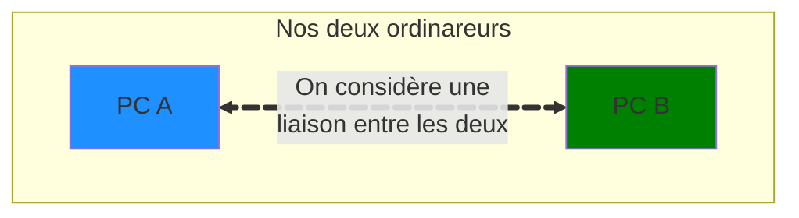
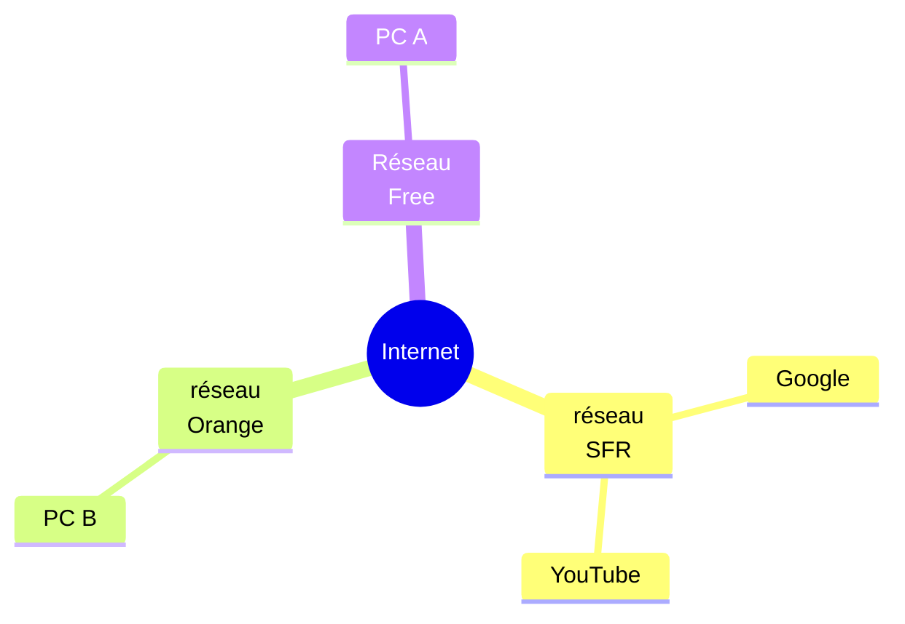

Avant de parler directement de ce que l'on nomme "internet", il faut que l'on définisse les bases.
<!-- truncate -->
<link
  href="https://cdnjs.cloudflare.com/ajax/libs/font-awesome/6.5.1/css/all.min.css"
  rel="stylesheet"
/>
## Quelques définition

### Un réseau informatique

Je suis certain que vous avez déjà entendu ce terme, on parle constamment de réseau, que ça soit avec les **réseaux sociaux**, ou dans votre vie professionelle. 
Le concept ici reste le même. Pour illustrer ça, on va prendre deux ordinateurs nommé respectivement `A` et `B` :

On considère également que ces deux ordinateurs sont connecté par un câble. À partir de là, on peut afficher que :
* Le `PC A` ainsi que le `PC B` sont tous les deux en réseau. Ici simplement connecté l'un à l'autre, mais ils sont en réseau.

Maintenant qu'ils sont connecté, ils peuvent faire plein de chose, communiquer entre eux, échanger des information. En gros, ils peuvent désormais discuter mais dans leur language.

Nous humains parlons avec des mots et des phrases. Mais les ordinaterus eux communiquent avec des impulsions électriques (qui transitent dans des câbles ou dans l'air, ce qu'on appelle Wi-Fi d'ailleur) et ce à des vitesses totalement déconcertantes.

### Et ducoup internet dans tout ça ?

Je vais pousser la chose un petit peu plus loin pour que vous compreniez. On va toujours prendre `A` et `B`, mais maintenant ils sont séparé par **Internet** :

Maintenant, on se retrouve avec trois réseaux dit **opérateurs** (Free, Orange et SFR). Ces réseaux sont ceux d'entreprise qui connectent des milliers d'appareils informatique ensemble.
Ainsi, en étant chez l'un des oparateurs, vous vous retrouvez connecté avec tous les appareils que cet opérateur connecte.

Mais il y a mieux !

Maintenant, vous remarquez qu'**internet** est au centre de tout. La raison est simple : internet est **l'interconnexion de tous les réseaux**.

Si vous êtes le PC A et que vous voulez aller sur youtube. Il faudra que vous fassiez : 
1. vous déplacer dans le réseau Free jusqu'au point d'interconnexion
2. du point d'interconnexion aller sur le réseau SFR
3. dans le réseau SFR naviguer jusqu'aux serveurs YouTube.

> Cet exemple est indicatif, en réalité il y a des milliers d'oparateurs dans le monde, qu'ils soient en France, en Europe, en Amérique ou en Asie.

## Un peu d'histoire
Même si on n'aime pas forcément l'histoire, on aime tous raconter des anectodes à ses amis, pensez-y, ça vous rend plus impressionant.
### Les origines et la création d'internet - années 1950-1990)

Déjà quelques éléments de contexte :

* **1957**: Lancement du satellite soviétique *spoutnik* qui déclenche alors une course technologique entre les Etats-Unis et l'URSS
* **1958**: Création de la **DARPA** (**D**efense **A**dvanced **R**esearch **P**rojects **A**gency) aus Etats-Unis, visant à développer des technologies avancées pour la défense

Et à partir de là, on commence à rentrer dans une très grosse croissance technologique.

Lancé en **1966**, le projet [ARPANET](https://fr.wikipedia.org/wiki/ARPANET) ne voit le jour qu'en **1969**
C'est le premier **réseau** interconnectant 4 universités (UCLA, Stanford, UCSB, Utah). Le protocole **NCP** (**N**etwork **C**ontrol **P**rotocol) voit le jour mais sera remplacé par TCP/IP.

**1973 - 1974**, le protocole TCP/IP voit le jour
* [Vinton Cerf](https://fr.wikipedia.org/wiki/Vint_Cerf) ainsi que [Robert Kahn](https://fr.wikipedia.org/wiki/Robert_Elliot_Kahn) développent les bases du protocole qui se standardise progressivement dans les années 70.
* C'est ainsi qu'en 1983 ARPANET adopte officielement TCP/IP qui est l'un des **actes fondateurs** d'internet.

Et c'est en **1991** que [Tim berners-lee](https://fr.wikipedia.org/wiki/Tim_Berners-Lee) invente le **W**orld **W**ide **W**eb (le www que vous voyez dans l'URL des sites web ça veut dire ça !) et donc le protocole **HTTP**, le language **HTML** ainsi que les premiers navigateurs web voient le jour.

### Le développement d'internet dans les années 2000

* **Le web 2.0** (2004 - 2010) :
	* On passe de page web statique à du web interactif : blog, réseaux sociaux et plateforme collaboratives. Vous ne faites plus que cliquez sur des liens, maintenant le site bouge, il s'anime et peut évoluer en fonction de vous.

* Développement **d'infrastructure réseau** :
	* Généralisation du haut débit (ADSL, Fibre).
	* Expansion du Wi-Fi et de la 3G / 4G

* Développement de **l'Economie Numérique** :
	* Naissance de GAFA (Google, Amazon, Facebook, Apple) comme les géants d'internet.
	* Emergence de modèles publicitaires **basés sur la donnée** (et la donnée c'est vous !)

Le développement de solutions sécurisées se font introduire en masse. Les entreprises ne peuvent plus se permettre de transmettre les données en clair sur internet. Tout doit être chiffré.
On voit émerger les première discussions internationales de la grouvernance d'internet comme le **sommet mondial sur la société de l'information** en **2003-2005** ! 

Les protocoles comme HTTPS (aujourd'hui plus que largement utilisé) voient le jour afin de rendre internet plus sécurisé.

### Internet de nos jours

Aujourd'hui, nous connaissons un développement extrêmement rapide de l'IA. Cette technologie en à peint 5 ans a pris la possession d'absolument tout.

Malgré le fait que cette technologie soit en développement depuis les années 1950, c'est désormais un outil utilisé mondialement.

Ce développement rapide de l'IA nous force désormais à développer de nouvelles loi comme [l'IA Act](https://artificialintelligenceact.eu/fr/) qui permet de réguler l'utilisation de l'IA au sein de l'Europe et surtout les données utilisées pour faire fonctionner ces modèles.

Et maintenant plus qu'à attendre une vingtaine d'année pour voir à quoi internet ressemblera.
Si vous voulez vous amusez, vous pouvez allez voir ces quelques théories : 
* [L'internet mort - Wikipedia](https://fr.wikipedia.org/wiki/Th%C3%A9orie_de_l'Internet_Mort)

Et je vous recommande chaudement de regarder cette vidéo si cela vous intéresse : 
<iframe width="560" height="315" src="https://www.youtube.com/embed/q0HYmOPPkl4?si=72axnqisTtrAaQYW" title="YouTube video player" frameborder="0" allow="accelerometer; autoplay; clipboard-write; encrypted-media; gyroscope; picture-in-picture; web-share" referrerpolicy="strict-origin-when-cross-origin" allowfullscreen></iframe>
