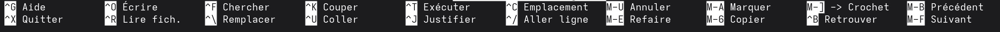

Ça fait un petit moment que je n'ai pas écrit d'article, et je vais faire en sorte d'y remédier. Je vais essayer de m'y mettre plus sérieusement en proposant des éléments toujours plus diversifiés.
<!-- truncate --> 

Donc aujourd'hui, on se retrouve pour parler d'un outil présent sous Linux. Je l'ai découvert suite à la recommandation d'un intervenant lors de mes cours à l'IUT d'Annecy. Et je lui en suis reconnaissant vu que cet outil est vraiment très très classe.

En ligne de commande, il y a tout un tas d'éditeurs de texte qui existent. On peut noter **vim**, **nano** qui sont les plus courants et les plus installés et utilisés sur les distributions Linux.

## Et pourquoi micro il serait mieux
Je n'irais pas jusqu'à dire qu'il est mieux ou que les autres sont moins bien.

Personnellement, je considère que les utilisateurs de Vim sont un peu des êtres sombres qui ne vivent pas sur la même planète que nous. Rien que pour supprimer un paragraphe, il faut utiliser plusieurs raccourcis clavier, ou en configurer soit même et ce pour chaque type d'interactions que l'on a avec l'éditeur.

Concrètement Vim est très puissant et nous permet de faire vraiment beaucoup de choses, mais je n'ai jamais vraiment eu la motivation de m'y investir, il était plus frustrant pour moi de m'y mettre que d'essayer d'autres outils. 
Si vous voulez un peut rire sur Vim, je vous conseille cette vidéo : 

<iframe width="560" height="315" src="https://www.youtube.com/embed/h4ZQfr-q3EA?si=KaCqSAbbtTXMFCqY" title="YouTube video player" frameborder="0" allow="accelerometer; autoplay; clipboard-write; encrypted-media; gyroscope; picture-in-picture; web-share" referrerpolicy="strict-origin-when-cross-origin" allowfullscreen></iframe>

Le type est un peut barge, mais il finit à la fin par faire fonctionner ses outils (même lorsque ce n'est pas censé fonctionner).

### Et nano c'est pas si mal non ?

Nano, de mon expérience est devenu petit à petit de plus en plus implémenté dans les images des distributions officielles telles que Debian, Ubuntu ou Arch. C'est un éditeur simple à utiliser et qui **affiche** ses raccourcis clavier en bas de page : 



Rien qu'avec ça, on se retrouve avec un éditeur simple à utiliser et beaucoup plus *user-friendly*.

Mais il me manquait quelques éléments : 

* pouvoir afficher le numéro des lignes. On peut en partie le faire en utilisant l'option `-c` lors de l'ouverture d'un fichier. Problème : les lignes sont affichées au milieu bas de l'écran et ne permettent pas réellement de se repérer.
* Pouvoir personnaliser l'interface. Nous sommes toujours avec le même éditeur, la même apparence et les mêmes couleurs. Je suis d'accord, ça fait très gimmick, mais j'aime bien mettre beaucoup de temps et d'effort dans des choses insignifiantes comme celle-ci.
* Pouvoir faire `Ctrl + Z`. Là je touche un point faible, en ligne de commande on a souvent le réflexe de faire un fichier `.bak` avant de le modifier. Mais le jour où vous avez oublié, vous vous en voudrez. Pouvoir faire des retours arrière en cas d'erreur c'est vraiment pas du luxe (enfin si un peu).

Mis à part ça, on a quand même des raccourcis clavier très utile, on peut couper une ligne ou une sélection avec `Ctrl + K` et la coller avec `Ctrl + U`. On peut rechercher dans notre fichier ou alors afficher l'aide avec `Ctrl + G` (Et pourquoi G ? pour l'aide c'est **H** de **H**elp, mais bon passons).

ça reste tout de même un éditeur très léger et qu'on peut utiliser partout.

## l'éditeur Micro
Maintenant que j'ai un peu fait le tour, micro dans tout ça, il fait quoi de plus ?

eh bien il fait pas mal de chose : 

* Permet une intégration complète de la souris directement dans le terminal. 

> Je vous vois venir, oui il faut un gestionnaire graphique qui intègre la souris, et ce n'est pas utile sur les serveurs. Mais ça reste un plus.

* Permet une auto-complétion en fonction de ce que l'on a marqué dans le fichier. Plus votre fichier contiens des éléments, plus Micro est capable de vous aider dans la rédaction de vos scripts.  
Et je vous assure que de récupérer la variable que vous avez noté `Ma_Super_Variable_Pas_Du_Tout_Longue` simplement en appuyant sur `tab`, eh bien ça sauve des vies et du temps.
* Permet d'utiliser votre terminal tout en éditant votre fichier. En appuyant sur `Ctrl + e` vous passez dans la petite interface de commande de Micro. Vous pouvez utiliser soit : 
    + les commandes système, comme lancer un serveur, compiler un fichier
    + utiliser les commandes de micro pour de la personnalisation

* Personnaliser l'éditeur. Dans l'interface de commande de Micro, vous pouvez notamment utiliser la commande : `set coloscheme` et vous pouvez soit en créez un vous même, ou alors utiliser un des thème de la communauté comme [Micro • Dracula Theme](https://draculatheme.com/micro) ou [GitHub - liste de thèmes Micro](https://github.com/Hunter-Github/micro-colorschemes)

> et vous pouvez passez d'un thème très classe à du rose bonbon très très vite.

* Ajouter des plugins. Micro intègre avec sa communauté des [Plugins](https://micro-editor.github.io/plugins.html) que vous pouvez intégrer directement dans l'éditeur.

Cependant, à tout points positif, des points négatifs. Au vu de ses fonctionnalités, il reste un éditeur assez lourd : 12Mo. C'est peu, mais en comparaison à vim (4Mo) ou Nano (277Ko) c'est assez gros.
En tout cas, vous vous retrouvez avec une interface très conviviale, simple à utiliser et disponible sur la plupart de vos distributions Linux.

Je l'ai mis en place dans plusieurs environnements en tant qu'éditeur par défaut. Et ce surtout pour les collègues qui n'aiment pas la ligne de commande ou qui font un infarctus à chaque utilisation de vim.

Je pense avoir fait le tour de ce petit éditeur de texte. Je vous invite à aller voir le projet [GitHub](https://github.com/zyedidia/micro) pour de la docummentaiton, ou alors le site officiel de [Micro](https://micro-editor.github.io/) pour l'installer.

### Installer l'éditeur
Je ne vais pas vous laisser ici sans vous indiquer comment l'installer, je suis pas comme ça.

Dans un premier temps, placez vous où vous voulez (de préférence dans les téléchargements) et récupérer l'outil : 
```bash
cd ~/Téléchargements
curl https://getmic.ro | bash
```

Une fois que vous l'avez récupéré, l'outil est disponible là où vous vous trouvez, vérifiez que les droits en exécution sont bien présents, et ajoutez les si jamais :
```bash
ls -la ~/Téléchargements
-rwxr-xr-x 1 vous vous  12M 27 août   2024 micro
#  ^ vérifiez surtout ce X là
# Si jamais vous n'avez pas les droits en exécution dessus : 
chmod 750 ~/Téléchargements/micro
```

Enfin, pour que vous puissiez l'utiliser n'importe quand avec l'auto-complétion, copiez le fichier dans le dossier `/usr/bin` :
```bash
cp ~/Téléchargemnts/micro /usr/bin/
```

et maintenant, vous pouvez l'utiliser en tant qu'éditeur texte en ligne de commande : 
```bash
micro [Nom du fichier]
```

Bonne chance et à la prochaine 👋
