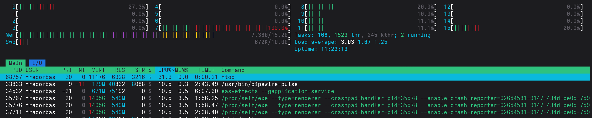
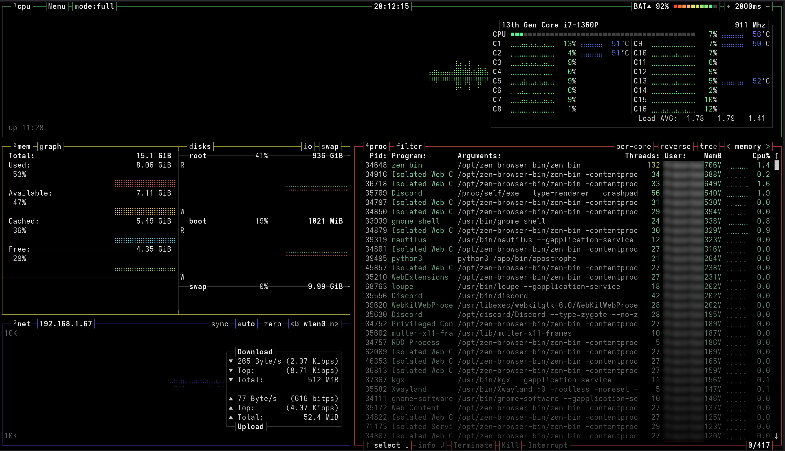
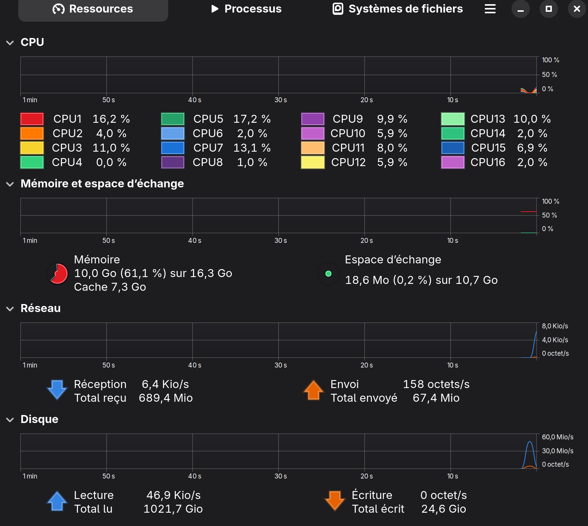
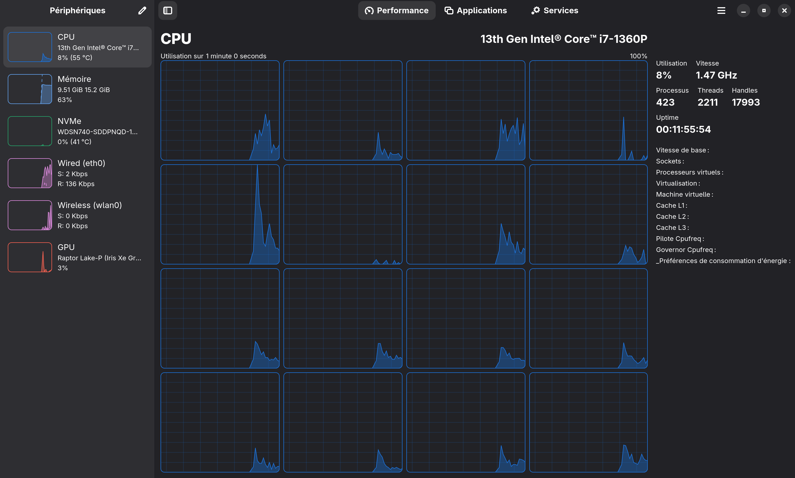

Je pense que beaucoup d'entre-vous connaissent ce que signifie "monitorer son OS", concrètement, cela veut dire que vous voulez voir ce qu'il se passe sur votre ordinateur. Que ça soit la température de votre processeur, son utilisation et surtout quels processus utilisent votre processeur ou votre RAM.
<!-- truncate -->
On connaît tous Chrome qui nous prend 10Go de RAM sans qu'il ne s'y passe grand chose.

Je vais donc vous présenter différents outils présent sur la plupart des distributions Linux qu'ils soient en ligne de commande ou en interface graphique.

## pourquoi on fait ça ?
La première réponse qui me vient à l'esprit c'est juste qu'on est qu'une bande de geek et que de voir des graphique bouger nous amuse. Personnellement, c'est l'une des raisons principale, j'aime voir des couleurs dans tous les sens.

Mais bon, un peu de sérieux. Si on fait ça c'est plutôt pour voir s'il ne se passe pas quelque chose d'étrange. Sur un PC portable, on ne veut pas forcément qu'un programme nous prenne 50% de nos ressources alors qu'il ne devrait pas. Cela peut concerner l'utilisation du disque, du processeur, de la RAM et plus encore.  
On veut également en plus de les afficher, avoir la possibilité de tuer ou geler les processus qui nous gênent. Il y a plein de cas de figure qui rentrent en comptent, un processus planté, une fenêtre fermée mais qui reste active. Pouvoir directement voir et tuer le ou les processus problématique

Ça s'applique au delà de votre utilisation personnelle à tout ce qui concerne les serveurs. Des processus trop gourmand peuvent coûter cher en ressource serveur et en électricité. En fonction de l'entreprise, les chiffres peuvent vite faire tourner la tête.

## quelques outils
Je vais commencer par vous présenter les outils en ligne de commande, du moins classe au plus classe. Commençons

### la commande ps
Là on est sur du vieux de vieux. Cette commande permet de lister tous les processus en cour d'utilisation sur votre ordinateur :
```
ps -aux
USER         PID %CPU %MEM    VSZ   RSS TTY      STAT START   TIME COMMAND
root           1  0.0  0.0  24060 12764 ?        Ss   08:44   0:10 /sbin/init
root           2  0.0  0.0      0     0 ?        S    08:44   0:00 [kthreadd]
root           3  0.0  0.0      0     0 ?        S    08:44   0:00 [pool_workqueue_release]
root           4  0.0  0.0      0     0 ?        I<   08:44   0:00 [kworker/R-rcu_gp]
root           5  0.0  0.0      0     0 ?        I<   08:44   0:00 [kworker/R-sync_wq]
```

On peut afficher les utilisateurs, les binaires, l'utilisation CPU à un moment donné.

Cette commande sera partout, c'est l'une des commandes de base que vous retrouverez un peu partout. Vous pouvez avoir plus de précision ici pour son utilisation : [ps : Lister les processus sur Linux - Wiki - Wiki](https://www.linuxtricks.fr/wiki/ps-lister-les-processus-sur-linux)

### la commande top

Là on commence à avoir quelque chose de plus interactif et surtout, on a toutes les informations en direct, c'est actualisé en direct.

Les informations vont s'afficher comme cela : 
```
top - 20:03:51 up 11:19,  1 user,  load average: 0,91, 0,99, 1,01
Tâches: 408 total, 2 running, 406 sleep, 0 d-sleep, 0 stopped, 0 zombie
%Cpu(s):  4,0 ut,  1,8 sy,  0,0 ni, 92,7 id,  0,0 wa,  0,9 hi,  0,5 si,  0,0 st 
MiB Mem :  15543,8 total,   5398,0 libr,   7403,1 util,   5343,0 tamp/cache     
MiB Éch :  10240,0 total,  10222,2 libr,     17,7 util.   8140,6 dispo Mem 
    PID UTIL.     PR  NI    VIRT    RES    SHR S  %CPU  %MEM    TEMPS+ COM.                                                                                                       
  35709 vous+  20   0 1405,6g 562460 173308 S  31,8   3,5  30:21.29 Discord                                                                                                    
  37367 vous+  20   0 1836380 160624 113976 S  17,6   1,0   0:37.67 kgx                                                                                                        
  33939 vous+  20   0 4928356 330420 202392 R  14,6   2,1   7:02.11 gnome-shell                                                                                                
  34416 fracorb+  20   0  687428  75192  46340 S   8,6   0,5   5:53.25 easyeffects        
``` 

Vous pouvez voir en direct, chaque processus, son utilisation processeur, RAM etc.  
Pour mieux comprendre le retour de cette commande, je vous invite à aller voir : [Lire, comprendre, et analyser la commande top](https://guillaume.fenollar.fr/blog/top-lire-comprendre-analyser-la-commande-top/) de Guillaume FENOLLAR. Et un petit wiki pour la route [La commande top - Debian-facile](https://debian-facile.org/doc:systeme:top).

### la commande htop
Là, on commence à arriver sur des commandes plus graphiques, plus simple à utiliser. On retrouve une intégration de la souris avec des informations plus claires et facile à comprendre. Voici un petit appercu : 



Vous voyez directement l'utilisation de chacun de vos coeurs processeur, de votre RAM, SWAP, et vous pouvez cliquer sur chacun des éléments pour trier comme vous le souhaitez l'affichage.

Cette commande est largement utilisé, mais pas souvent implémenté par défaut dans les distributions. Pour celle-là je ne pense pas avoir besoins de vous donner un WIKI, tout est très simple à comprendre.

### la commande nvtop

Cette commande là ne fait pas que monitorer votre OS, elle se concentre principalement sur l'utilisation de votre processeur graphique.  
il signifie **N**eat **V**ideocard top et a donc pour principal objectif de regarder le comportement de votre processeur graphique.

Vous pouvez retrouver le projet github ici : [GitHub - Syllo/nvtop](https://github.com/Syllo/nvtop)


### le projet bpytop
Là, c'est quelque chose que j'ai découvert très récemment. J'ai souvent vu cette commande dans des vidéos de Youtubeurs, mais je n'ai jamais trouvé le nom de cette commande jusqu'à ce qu'un collègue m'en parle.  
Vous pouvez considérer que c'est bien un htop sous stéroïde, mais bien monté.



Dans cet affichage, tout est interactif, tous les boutons le sont, et vous avez même la possibilité d'aller dans dans un menu permettant de gérer l'affichage ou les thèmes que vous voulez utiliser.

N'hésitez pas à aller dans le projet github [Bpytop: Linux/OSX/FreeBSD resource monitor](https://github.com/aristocratos/bpytop)

On voit que certains sont très motivés pour mettre plein de couleur pour voir l'utilisation en direct de nos ressources. Moi j'aime, pouvoir afficher ça sur un serveur CLI only, je trouve ça génial.

Passons désormais à des outils graphiques

### system monitor
Étant un utilisateur de Gnome, je ne peux passer à côté de cet outil installé par défaut sous ce gestionnaire graphique.  
On a quelque chose de simple sans fioriture et qui fait largement ce qu'on lui demande : 



On peut également afficher les processus, et surtout les tuer ! On peut avoir un affichage avec dépendance, qui nous permet de voir le processus parent afin de tuer directement l'entièreté des processus. [Moniteur système – Applis pour GNOME](https://apps.gnome.org/fr/SystemMonitor/)

### Centre de mission
Celui-là, c'est littéralement une copie conforme de ce qu'on a sous Windows avec le gestionnaire des tâches. 

Il vous permet d'avoir l'utilisation par processeur, la vitesse à laquelle il tourne, il récupère également la température sur la plupart de vos périphériques.



On retrouve dans les applications, une interface très conviviale, qui montre directement vos applications : 


Idem pour la partie des services où vous pouvez démarrez n'importe lequel des services de votre machine.
N'hésitez pas à aller y jeter un oeil : [Mission Center](https://missioncenter.io/).

Je pense avoir fait le tour de ce que je connais et que j'utilise. Il doit exister encore tant d'autres outil graphique ou console. 

Passez une bonne journée, et à la prochaine.


