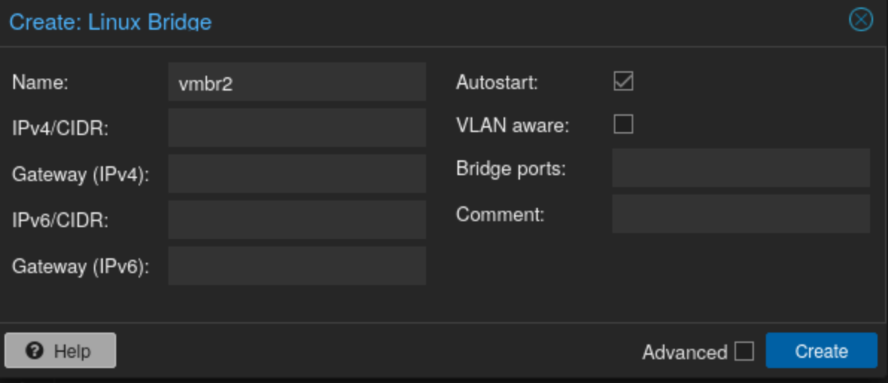
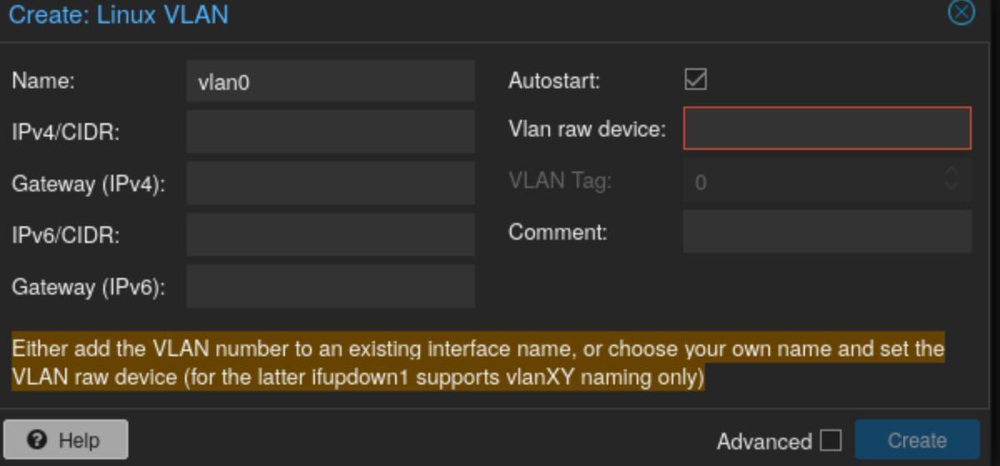

# Qu'est-ce qu'un hyperviseur
Après tout ce temps à ne plus rien écrire, il faut bien que je me ratrappe.

Aujourd'hui, que ça soit pour son petit lab personnel ou pour une infrastructure professionnelle, il existe plusieurs solutions :
<!-- truncate -->
* Utiliser un serveur dédié sur lequel on fait tourner un hyperviseur de niveau 0. Ce dernier est un système d'exploitation à part entière qui a pour unique but de virtualiser des machines. On peut notamment trouver ces solutions :
	* `VmWare`. Solution payante voire exorbitante lorsque l'on souhaite utiliser cet outil sur une infrastructure décente.
	* La solution open-source : `Proxmox`. Cette solution gratuite (avec possibilité de payer des mises à jour de sécurité plus rapide et un support professionnel) est largement reconnu et a fait ses preuves depuis longtemps
* Utiliser un outil / une application permettant de virtualiser des machines au dessus de son OS actuel. Ce sont des hyperviseurs de niveau 1, ils s'installent directement au dessus d'un OS (Windows, Linux, MacOS ...), on retrouve :
	* `VmWare Workstation` qui peut s'installer sous Windows
	* `VirtualBox` qui peut s'installer globalement partout

Peu importe quel outil est utilisé, on aura toujours à configurer des réseaux. Aujourd'hui, je souhaite principalement me concentrer sur la partie Proxmox, mais je risque pour sûr de faire de sarticles sur les autres solutions qui existe.
:::info
J'utilise quelques achronymes dans cet article, au cas où voici leur signification
* `VM` : **V**irtual **M**achine, ou plutôt machine virtuelle en Français.
* `OS` : **O**perating **S**ystem, ou Système d'Exploitation en Français.
:::
## Pourquoi le réseau est-il important
Lorsque l'on traite à des infrastructure comme celles-ci, il est très important de toujours se rappeler du [modèle OSI](../docs/protocol/Le-modele-OSI).

Le réseau occupe la grande majorité de toutes ces couches, cela passe par le transport des trames, la gestion de l'information ou l'identification. Ce ne sont que les couches 6 et 7 qui sortent de cet aspect du réseau.
Tout ça pour dire qu'un réseau initialement bien configuré et cela passe donc en premier sur la partie proxmox. Ce à quoi est connecté physiquement le serveur fera office d'une configuration par la suite, mais pour le moment concentrons-nous sur le réseau à configurer dans proxmox lui-même.

# Les réseaux dans proxmox
Premièrement, il est important de bien repérer les interfaces réseaux physique présentent sur votre serveur et de savoir à quoi elles correspondent au niveau de proxmox. Avec certains châssis, on peut vite arriver à une dizaine d'interfaces voire plus et arriver avec des noms complexes en fonction de la nature de l'interface (SFP, Ethernet 10G, 1G etc.).

Une fois fait, on peut passer à la suite. Tout comme sur un switch manageable, il existe tout un tas de configuration que l'on peut faire et surtout plein de méthode que l'on peut utiliser pour arriver à la même fin. Je vais essayer d'être le plus clair possible pour la suite.

## Réseau virtuel
l'objectif d'un tel réseau est de fournir un espace réseau local au proxmox. Ce dernier permet ainsi à plusieurs VM de communiquer ensemble sans jamais sortir physiquement du serveur.

Dans proxmox et dans Linux de manière générale, on peut "créer un switch" via l'utilisation de `bridge`. 
Une fois ce bridge associé à une interface physique du proxmox, on peut considérer que l'on a physiquement branché le proxmox à ce switch virtuel. Dans ce cas, tout trafic externe sera en capacité de communiquer dessus. Cette association est à faire avec parcimonie en fonction de ce que l'on fait sur ce bridge.
### Réseau Virtuel privé
On va avoir deux manières pour arriver à effectuer un tel réseau. En se connectant à votre proxmox, dans la partie réseau de votre serveur physique, ajoutez une nouvelle interface de type bridge :

Vous pourrez remarquer plusieurs éléments important :
* `Bridge ports` : C'est cette partie qui permet de connecter le bridge à une interface phyisique du proxmox (liaison de niveau 2)
* `Vlan aware` : cette partie permet de transformer le bridge en un "switch manageable" et ainsi faire circuler des Vlan en son sein.
* `IPv4` ou `IPv6` : Au delà de donner une IP au proxmox sur ce bridge, cela permet surtout au proxmox de communiquer avec ce qui est en dessous du bridge. Cela peut en fonction des cas être utile.

:::warning attention
Comme je le mentionne au desssus, en fonction de ce que vous souhaitez faire, il est important de garder à l'esprit de l'importance que chaque paramètre possède.  
Associer une interface à un bridge le rend accessible depuis l'extérieur. Si vous utilisez un Vlan déjà utilisé sur le réseau auquel est branché votre serveur cela peut vite engendrer des problème ou autoriser certaines machines à atteindre des endroits auxquels vous ne pensiez pas.
:::

Maintenant passons aux deux méthodes :

#### 1 ) Associer des Vlan directement aux VM
:::info
Ici je part du principe que vous avez un bridge avec cette configuration :
* Aucune interface physique liée
* le tag `Vlan Aware` d'activé
* pas d'IP associé au proxmox
:::

Une fois votre bridge de configuré, vous pouvez directement dans l'interface réseau de votre VM y ajouter un tag : 

Afin que cela fonctionne, il est impératif que votre bridge ait le tag `Vlan aware` afin qu'il puisse faire passer le vlan.

Vous n'avez plus qu'à mettre le même tag Vlan sur toutes les interfaces réseaux de vos VM et vous avez un réseau privé qui ne réccorde que les VM que vous souhaitez

#### 2 ) Utiliser un bridge seul
:::info
La configuration du bridge est la suivante :
* Aucune interface physique liée
* le tag `Vlan Aware` désactivé
* pas d'IP associé au proxmox
:::

Ce coup-ci, la configuration est bien plus simple. Une fois le bridge créé, il vous suffit de l'associer aux serveurs concernés. Ces derniers communiquerons directement dans ce bridge.

#### 3 ) Utiliser un linux Vlan
:::info
La configuration du bridge est la suivante :
* Aucune interface physique liée
* le tag `Vlan Aware` d'activé
* pas d'IP associé au proxmox
:::

Cette méthode n'a pas été recommandée du tout dans la quasi totalité des articles que j'ai pu lire. La raison est que l'on peut directement attribuer un vlan à l'interface associé.

Cependant, vu que je l'ai déjà vu actif, je la partage.

Pour cete méthode, il faut en plus du bridge créer un `linux Vlan` dans les interfaces du proxmox :

Il faut dans le `Vlan raw device` y renseigner le nom du bridge ainsi que le tag Vlan de cette manière : `vmbr1.10` pour le vlan 10 avec un bridge nommé `vmbr1`.
:::info
Vous pouvez d'ailleur avec cette méthode faire une interface Vlan de niveau 3 pour votre proxmox en y ajoutant une IP et en liant une interface physique au lieu du bridge. Votre proxmox sera ainsi en capacité de communiquer sur un vlan spécifique.
:::

Lorsque c'est fait, il vous suffira de choisir ce linux Vlan comme interface dans la configuration réseau des VM que vous souhaitez lier.

# Crédits
Même si on progresse seul et tous les jours, il est important de mentionner les personnes qui rendent ces compétences plus importante chaque jour.
j'ai pu comprendre plus en profondeur les réseaux proxmox grâce à cette vidéo :
<iframe width="560" height="315" src="https://www.youtube.com/embed/zx5LFqyMPMU?si=mploUJFoPjKQuhEg" title="YouTube video player" frameborder="0" allow="accelerometer; autoplay; clipboard-write; encrypted-media; gyroscope; picture-in-picture; web-share" referrerpolicy="strict-origin-when-cross-origin" allowfullscreen></iframe>
