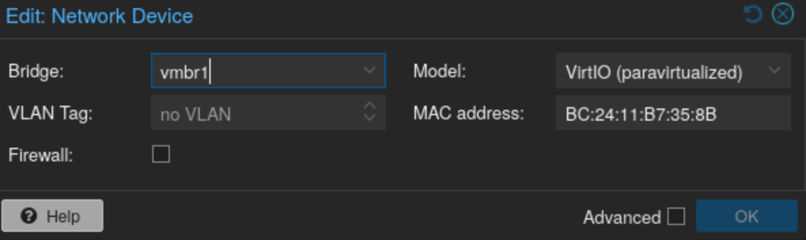

# Qu'est-ce qu'un hyperviseur ?

Après tout ce temps sans rien écrire, il faut bien que je me rattrape.

Aujourd'hui, que ce soit pour monter un petit lab personnel ou gérer une infrastructure professionnelle, plusieurs solutions s'offrent à nous :

<!-- truncate -->

- **Les hyperviseurs de type 1** (ou *bare-metal*) : il s'agit d'un système d'exploitation dédié à la virtualisation, installé directement sur le matériel, sans OS hôte intermédiaire. On y retrouve notamment :
  - `VMware ESXi` — solution payante, dont le coût peut rapidement devenir prohibitif sur une infrastructure de taille décente.
  - `Proxmox VE` — solution open-source, gratuite (avec option payante pour un support professionnel et des mises à jour de sécurité prioritaires). Elle est largement adoptée, aussi bien dans les labs à la maison que dans les environnements professionnels.

- **Les hyperviseurs de type 2** (ou *hosted*) : il s'agit d'applications qui s'installent par-dessus un OS existant (Windows, Linux, macOS…). La virtualisation est donc soumise aux performances et à la stabilité de l'OS hôte. On retrouve :
  - `VMware Workstation` — principalement disponible sous Windows et Linux.
  - `VirtualBox` — multiplateforme, et entièrement gratuit.

Peu importe la solution choisie, la configuration réseau sera toujours incontournable. Dans cet article, je me concentre sur la partie Proxmox, mais je couvrirai probablement les autres solutions dans de futurs articles.

:::info Acronymes utilisés dans cet article
- `VM` : **V**irtual **M**achine — machine virtuelle.
- `OS` : **O**perating **S**ystem — système d'exploitation.
- `VLAN` : **V**irtual **L**ocal **A**rea **N**etwork — réseau local virtuel.
:::

## Pourquoi le réseau est-il si important ?

Quand on travaille avec des infrastructures virtualisées, il est essentiel de garder en tête le [modèle OSI](../docs/protocol/Le-modele-OSI). Le réseau intervient à pratiquement toutes ses couches : transport des trames (couche 2), adressage IP (couche 3), gestion des flux (couche 4), jusqu'aux couches applicatives.

Une infrastructure bien conçue commence toujours par une configuration réseau solide — et dans le cas de Proxmox, cela commence dès la configuration de l'hyperviseur lui-même, avant même de parler de ce à quoi le serveur est connecté physiquement.

---

# Le réseau dans Proxmox

## Identifier ses interfaces physiques

La première étape est de bien identifier les interfaces réseau physiques présentes sur le serveur et de comprendre à quoi elles correspondent dans Proxmox. Sur certains châssis (avec des ports SFP+, des ports 10G, du 1G…), il est facile de se retrouver avec une dizaine d'interfaces aux noms peu explicites. Prendre le temps de les cartographier évite bien des erreurs par la suite.

## Le bridge Linux — le cœur du réseau Proxmox

Proxmox s'appuie sur le concept de **bridge Linux**, qui se comporte exactement comme un switch virtuel. C'est l'élément central autour duquel tout le réseau de l'hyperviseur s'organise.

Lorsqu'on associe une interface physique à un bridge, on branche virtuellement le serveur à ce switch — tout trafic externe peut alors y circuler. Cette association est donc à réaliser avec soin.

---

## Créer un réseau virtuel privé

L'objectif d'un réseau virtuel privé est de permettre à plusieurs VM de communiquer entre elles **sans que le trafic ne sorte physiquement du serveur**. C'est utile pour isoler des environnements (dev, prod, DMZ…) ou simuler des topologies réseau complexes.

Pour créer ce type de réseau dans Proxmox, on ajoute une nouvelle interface de type **Linux Bridge** depuis la section réseau du nœud physique :

Quelques paramètres importants à connaître :

- **Bridge ports** : permet d'associer le bridge à une ou plusieurs interfaces physiques (liaison de niveau 2). Si ce champ reste vide, le bridge est entièrement isolé du réseau physique.
- **VLAN aware** : active la gestion des VLANs sur le bridge, le transformant en switch "manageable". Indispensable si on souhaite faire circuler du trafic tagué.
- **IPv4 / IPv6** : attribue une adresse IP à Proxmox sur ce bridge. Utile si l'hyperviseur lui-même doit communiquer avec les VM ou les équipements de ce segment.

:::warning À garder en tête
Associer une interface physique à un bridge rend ce dernier accessible depuis l'extérieur. Si vous réutilisez un VLAN déjà présent sur votre réseau physique, vous risquez d'autoriser des accès non prévus entre vos segments. Anticipez toujours les implications avant de lier une interface physique.
:::

---

### Méthode 1 — Tagger le VLAN directement sur la VM

:::info Prérequis pour le bridge
- Aucune interface physique liée
- **VLAN Aware** activé
- Pas d'IP attribuée à Proxmox sur ce bridge
:::

Une fois le bridge configuré, il est possible d'assigner un tag VLAN directement au niveau de l'interface réseau de chaque VM :

Toutes les VM partageant le même tag VLAN forment un réseau isolé entre elles. C'est la méthode la plus souple : elle permet de faire cohabiter plusieurs VLANs sur un seul bridge, avec une granularité par VM.

---

### Méthode 2 — Un bridge dédié sans VLAN

:::info Prérequis pour le bridge
- Aucune interface physique liée
- **VLAN Aware** désactivé
- Pas d'IP attribuée à Proxmox
:::

La méthode la plus simple. Le bridge joue le rôle d'un switch non manageable : toutes les VM qui y sont connectées se trouvent dans le même segment réseau et communiquent directement entre elles. Pas de notion de VLAN, pas de configuration supplémentaire.

Idéale pour des environnements simples ou des labs où l'isolation fine n'est pas requise.

---

### Méthode 3 — Utiliser un Linux VLAN (interface VLAN dédiée)

:::info Prérequis pour le bridge
- Aucune interface physique liée
- **VLAN Aware** activé
- Pas d'IP attribuée à Proxmox
:::

Cette méthode est moins répandue et rarement recommandée dans les ressources que j'ai consultées — la méthode 1 couvre généralement le même besoin de façon plus directe. Je la documente tout de même car on la croise parfois dans des configurations existantes.

Elle consiste à créer une **interface Linux VLAN** en plus du bridge :

Dans le champ **VLAN raw device**, on renseigne le nom du bridge suivi du tag VLAN, par exemple : `vmbr1.10` pour le VLAN 10 sur le bridge `vmbr1`. Cette interface VLAN est ensuite sélectionnée comme interface réseau dans les VM concernées.

:::info Cas d'usage avancé
En attribuant une IP à cette interface VLAN et en liant une interface physique (plutôt qu'un bridge), on peut configurer Proxmox lui-même pour communiquer sur un VLAN spécifique — pratique pour segmenter l'accès à l'interface d'administration.
:::

---

## Les types de liaisons avancées

Au-delà des bridges classiques, Proxmox propose deux types de liaisons supplémentaires particulièrement utiles dans certains contextes.

### Agrégation de liens (LACP / Bond)

L'agrégation de liens consiste à regrouper plusieurs interfaces physiques en une seule interface logique. L'objectif principal est d'**augmenter la bande passante disponible** et, dans certains modes, d'apporter de la redondance.

Dans Proxmox, on crée une interface de type **Bond** en mode **LACP (802.3ad)**. On y ajoute les ports à agréger (séparés par des virgules, sans espace), et on configure la **hash policy**, qui détermine comment le trafic est réparti entre les liens.

:::warning Synchronisation avec le switch
La hash policy doit être configurée de manière cohérente **des deux côtés** : sur Proxmox et sur le switch en face. Un mauvais alignement peut entraîner des performances inférieures à ce qu'un seul lien offrirait.
:::

Pour aller plus loin sur le sujet, deux ressources utiles :
- [lafibre.info — LACP Proxmox](https://lafibre.info/serveurs/serveurs-proxmox-lacp/)
- [virtualizationhowto — LACP Proxmox](https://www.virtualizationhowto.com/2026/01/i-tried-lacp-in-my-proxmox-home-lab-and-heres-what-actually-happened/)

> Je consacrerai probablement un article dédié à LACP — la répartition du trafic entre les liens est plus subtile qu'il n'y paraît, et les compromis entre latence et débit méritent d'être détaillés.

Une fois le bond créé, on l'utilise comme interface **slave** des bridges ou VLAN que l'on crée ensuite.

---

### Lien de secours (Active-Backup)

Ce type de liaison met en place une logique **maître/esclave** : l'interface secondaire ne devient active que si Proxmox détecte une défaillance sur l'interface principale. C'est une forme de redondance réseau gérée directement par l'hyperviseur.

Je le trouve utile à connaître, même si en pratique, cette logique de failover est généralement mieux gérée par un pare-feu ou un équipement réseau placé en amont — qui a une vision plus globale de l'état du réseau.

---

## Crédits

On progresse souvent seul, mais rarement sans les ressources que d'autres ont prises le temps de partager. Cet article doit beaucoup à cette vidéo, qui m'a permis de mieux appréhender les mécanismes réseau de Proxmox :

<iframe width="560" height="315" src="https://www.youtube.com/embed/zx5LFqyMPMU?si=mploUJFoPjKQuhEg" title="YouTube video player" frameborder="0" allow="accelerometer; autoplay; clipboard-write; encrypted-media; gyroscope; picture-in-picture; web-share" referrerpolicy="strict-origin-when-cross-origin" allowfullscreen></iframe>

Ainsi qu'aux blogs cités tout au long de l'article :
- [lafibre.info — LACP Proxmox](https://lafibre.info/serveurs/serveurs-proxmox-lacp/)
- [virtualizationhowto — LACP Proxmox](https://www.virtualizationhowto.com/2026/01/i-tried-lacp-in-my-proxmox-home-lab-and-heres-what-actually-happened/)
