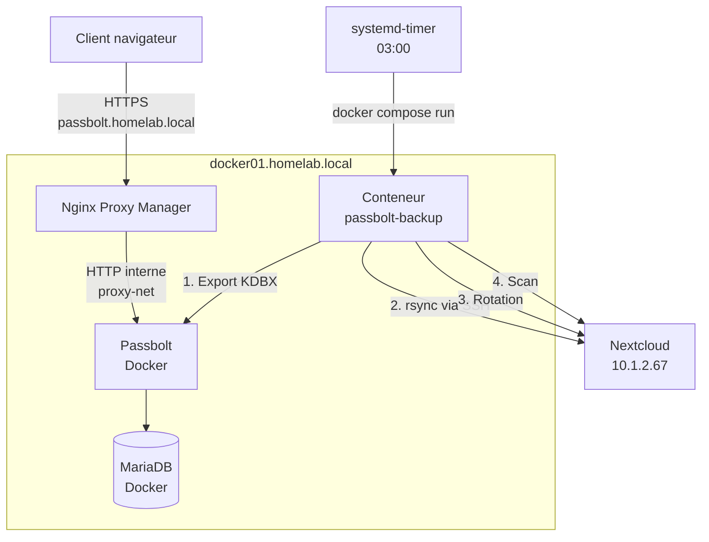
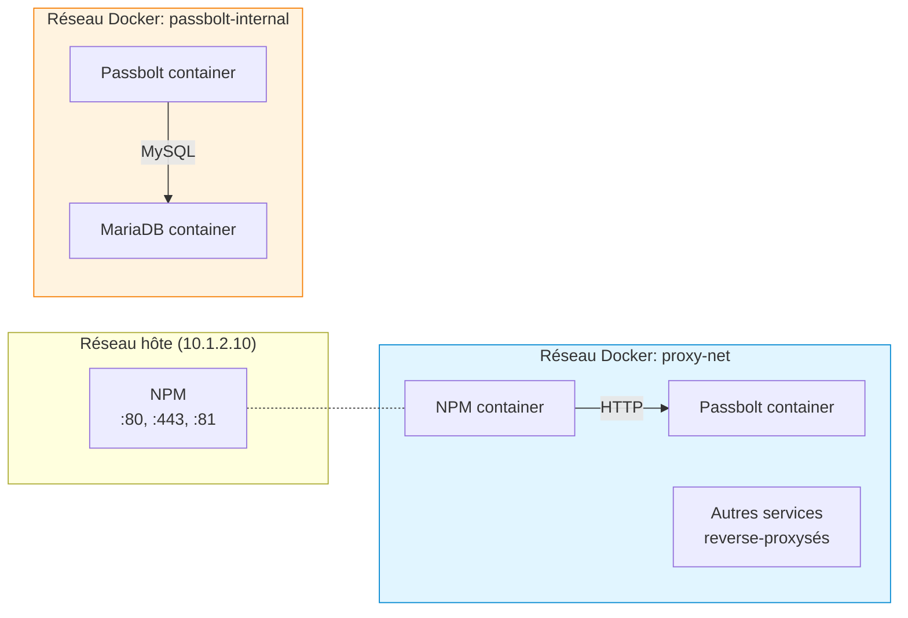
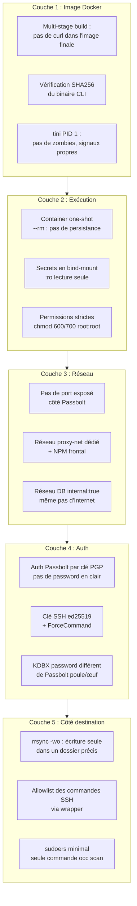
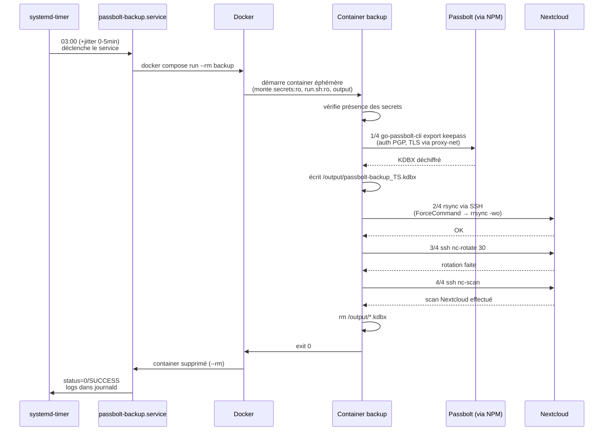

# Sauvegarder sa base Passbolt de manière sécurisée sous Docker

Passbolt, c'est génial. Open source, auto-hébergeable, chiffré de bout en bout côté client, parfait pour gérer ses mots de passe à la maison ou en équipe. Mais comme tout outil critique, **un Passbolt sans sauvegarde est une bombe à retardement**. Une mauvaise manip, un disque qui lâche, un container qu'on supprime un peu trop vite, et c'est des années de credentials qui partent en fumée.

Dans cet article, je détaille la solution que j'ai mise en place sur mon homelab : **un Passbolt en Docker derrière Nginx Proxy Manager, avec une sauvegarde quotidienne automatisée vers un Nextcloud, le tout chiffré et orchestré par systemd**. Je vais expliquer non seulement le *quoi*, mais surtout le *pourquoi* de chaque choix, parce que c'est là que se cache l'intérêt de l'exercice.

<!-- truncate -->

## Contexte et objectifs
:::info
Petite présition avant de commencer. Vous vous direz probablement "*Oui, mais avec une sauvegarde de la VM, tout est bon*", en effet. Cependant, il suffit d'une fausse manip réseau, un coupure générale ou un incident assez grave pour que vous perdiez tout. Avoir une sauvegarde dans un système de fichier synchronisé (nextcloud se synchronise en local) permet de palier à ces situations d'urgence
:::

### Mon environnement

Avant de rentrer dans le dur, posons le décor. Mon homelab tourne autour de :

- **Un serveur Docker** (`docker01.homelab.local`, `10.1.2.10`) sous Debian 12, qui héberge la majorité de mes services.
- **Un Nextcloud** (`10.1.2.67`) qui me sert de stockage centralisé pour mes fichiers et, désormais, mes backups Passbolt.
- **Un Nginx Proxy Manager** (NPM) en frontal, qui termine le TLS et fait du reverse proxy vers tous mes services internes.
- **Un DNS interne** qui résout `*.homelab.local` vers mes IPs privées.

Tout le réseau est en `10.1.2.0/24` derrière un firewall, donc rien n'est exposé directement sur Internet.

### Ce que je veux obtenir

| Objectif | Solution retenue |
| --- | --- |
| Sauvegarder la base Passbolt | Export quotidien en **KeePass (KDBX)** via `go-passbolt-cli` |
| Transférer les sauvegardes | `rsync` vers Nextcloud via SSH |
| Automatiser le processus | `systemd-timer` + service one-shot |
| Sécuriser les accès | Clés SSH restreintes (`ForceCommand`), secrets en bind mount, permissions strictes |
| Gérer la rétention | Rotation automatique (30 backups) côté Nextcloud |
| Isoler Passbolt | Réseau Docker dédié `proxy-net`, pas d'exposition directe |

L'idée n'est pas juste « ça marche », mais « ça marche, et le jour où ça pète, je sais quoi faire et je n'ai rien perdu ».

## Architecture globale
Voici la vue d'ensemble de la stack :



Trois grandes briques :

1. **Passbolt en Docker**, derrière NPM, sur un réseau Docker isolé.
2. **Un conteneur de sauvegarde dédié**, éphémère (one-shot), qui parle à Passbolt en interne et exporte vers Nextcloud.
3. **systemd** comme orchestrateur, parce que cron c'est bien en 1998 mais on est en 2026.

## Les choix techniques expliqués

### Pourquoi Docker ?

Passbolt fournit officiellement une image Docker. C'est isolé du reste du système, facile à upgrader (`docker compose pull && docker compose up -d`), et ça me permet de reproduire l'env à l'identique si je dois changer de serveur. La base MariaDB est dans son propre container, lié uniquement à Passbolt.

### Pourquoi un réseau Docker dédié (`proxy-net`) ?

C'est un point que je veux détailler parce qu'il est central pour la sécurité.

Par défaut, Docker crée un réseau `bridge` partagé par tous les containers qui ne précisent rien. C'est pratique pour démarrer, mais ça veut dire que **tous tes containers se voient les uns les autres**. Si demain un container compromis se met à scanner le réseau, il accède directement à Passbolt.

L'approche que j'utilise :



Concrètement :

- **`proxy-net`** : un réseau Docker dédié que partagent NPM et tous les services qu'il reverse-proxy. Seul NPM publie des ports sur l'hôte (80, 443, 81). Passbolt **n'expose aucun port**.
- **`passbolt-internal`** : un second réseau, uniquement entre Passbolt et sa base MariaDB. La DB n'est ainsi joignable que par Passbolt, point.

Le résultat : pour atteindre Passbolt depuis l'extérieur, on passe forcément par NPM. Et pour atteindre la base, on passe forcément par Passbolt. C'est le principe de **défense en profondeur** appliqué au réseau.

Création du réseau côté NPM :

```bash
docker network create proxy-net
```

Et dans le `docker-compose.yml` de Passbolt :

```yaml
services:
  passbolt:
    # ... image, env, etc.
    networks:
      - proxy-net
      - passbolt-internal
    # PAS de ports: ici !

  db:
    image: mariadb:11
    networks:
      - passbolt-internal
    # PAS non plus de ports: ici

networks:
  proxy-net:
    external: true   # créé en dehors du compose, partagé avec NPM
  passbolt-internal:
    driver: bridge
    internal: true   # 👈 ce réseau n'a pas accès à Internet
```

Le `internal: true` sur `passbolt-internal` : MariaDB n'a même pas accès à Internet. Si elle est compromise, elle ne peut pas exfiltrer de données sortantes.

### Pourquoi `go-passbolt-cli` et le format KDBX ?

Pour l'export, j'avais plusieurs options : sauvegarder le volume MariaDB brut, utiliser `mysqldump`, ou exporter via l'API Passbolt. J'ai choisi la troisième pour plusieurs raisons :

1. **Lisibilité hors-Passbolt** : un dump MariaDB ne sert à rien si Passbolt est mort. Les mots de passe y sont chiffrés avec les clés PGP des utilisateurs. Sans Passbolt et ses clés serveur, c'est illisible.
2. **Le KDBX est un format ouvert et standard** : KeePass, KeePassXC, KeePassDX (Android)... n'importe quel outil sait l'ouvrir.
3. **`go-passbolt-cli`** est l'outil officiel maintenu par Passbolt SA. Il s'authentifie via la clé PGP d'un compte de service, télécharge **toutes les ressources accessibles à ce compte**, les déchiffre localement, et écrit un KDBX.

Le KDBX produit est protégé par un mot de passe **différent** de celui de Passbolt — j'y reviens dans la section sécurité, c'est important.

### Pourquoi `rsync` over SSH ?

J'ai hésité avec WebDAV (Nextcloud le supporte nativement), mais :

- **rsync** est incrémental, gère bien les coupures réseau, et est trivial à scripter.
- **SSH** me donne un contrôle fin sur ce que la clé peut faire (`ForceCommand`, `rrsync`, etc. — voir la section sécurité).
- Pas besoin de gérer un token applicatif Nextcloud qui peut être révoqué silencieusement.

### Pourquoi `systemd-timer` plutôt que cron ?

Après avoir fait l'expérience de plusieurs panne pénible à corriger, j'avoue avoir un avis particulièrement tranché sur la question :

| Critère | `systemd-timer` | `cron` |
| --- | --- | --- |
| Logs | Natifs via `journald` (`journalctl -u ...`) | Fichier séparé, mal corrélé |
| Échec | `OnFailure=`, `Restart=`, hooks natifs | Tu te démerdes |
| Dépendances | `After=docker.service` | Pas de gestion |
| Reboot manqué | `Persistent=true` rejoue au boot | `anacron` ou rien |
| Validation syntaxe | `systemd-analyze calendar "..."` | Aucune |
| Lecture des logs d'un run précis | Trivial | Pénible |

Un job critique mérite un orchestrateur qui sait dire « j'ai échoué » plutôt qu'un fichier `MAILTO=` qu'on ne lit jamais.

### Pourquoi Nextcloud comme destination ?

Parce que j'en ai déjà un qui tourne, qu'il est sauvegardé séparément (snapshots ZFS + offsite), et que ça me donne une interface web pour récupérer un backup en cas d'urgence — y compris depuis mon téléphone si jamais le homelab est inaccessible.

Vu que de manière générale Nextcloud synchronise les fichiers en local, cela permet vraiment de garder son coffre de mot de passe en local en cas de panne majeure. C'est à la fois l'avantage de passbolt et son meilleur défaut : il vit sur un serveur sur le réseau. Si un problème arrive entre nous et le serveur, plus de mot de passe...

## Mise en place du conteneur de sauvegarde

### Arborescence

Tout vit dans `/opt/docker/passbolt-backup/` :

```
/opt/docker/passbolt-backup/
├── build/
│   ├── Dockerfile          # construction de l'image
│   └── run.sh              # script d'orchestration (bind-monté)
├── docker-compose.yml      # définition du service one-shot
├── secrets/                # mode 700, root:root
│   ├── gpg_passphrase
│   ├── kdbx_password
│   ├── passbolt_privkey.asc
│   ├── ssh_id_ed25519
│   └── ssh_id_ed25519.pub
└── output/                 # dossier temporaire pour le KDBX (vidé à chaque run)
```

### Le Dockerfile

```docker
# syntax=docker/dockerfile:1
#
# Image pour l'export quotidien de la base Passbolt en KDBX,
# transfert vers Nextcloud via rsync, et déclenchement du scan.
# Basé sur Debian bookworm-slim pour compatibilité glibc (go-passbolt-cli)
# et openssh-client complet (ed25519).

# ---------- Stage 1 : téléchargement du binaire go-passbolt-cli ----------
# On télécharge dans un stage de build pour ne PAS embarquer curl/wget
# dans l'image finale (réduction de surface d'attaque).
FROM debian:bookworm-slim AS fetcher
ARG PASSBOLT_CLI_VERSION=0.4.2
ARG PASSBOLT_CLI_SHA256=72a411491df67c27e2844448f09a01e85099b42f75338d65c677f6ae3366a7a5
ARG PASSBOLT_CLI_URL=https://github.com/passbolt/go-passbolt-cli/releases/download/v${PASSBOLT_CLI_VERSION}/go-passbolt-cli_${PASSBOLT_CLI_VERSION}_linux_amd64.tar.gz

RUN apt-get update \
    && apt-get install -y --no-install-recommends ca-certificates curl \
    && rm -rf /var/lib/apt/lists/*
WORKDIR /tmp
RUN curl -fsSLo cli.tar.gz "${PASSBOLT_CLI_URL}" \
    && echo "${PASSBOLT_CLI_SHA256}  cli.tar.gz" | sha256sum -c - \
    && tar -xzf cli.tar.gz \
    && chmod +x go-passbolt-cli

# ---------- Stage 2 : image finale, minimaliste ----------
FROM debian:bookworm-slim

RUN apt-get update \
    && apt-get install -y --no-install-recommends \
        ca-certificates \
        rsync \
        openssh-client \
        tini \
    && rm -rf /var/lib/apt/lists/*

# Récupère uniquement le binaire depuis le stage 1
COPY --from=fetcher /tmp/go-passbolt-cli /usr/local/bin/go-passbolt-cli

# tini comme PID 1 → propage proprement les signaux et reap les zombies.
# Indispensable pour un conteneur one-shot.
ENTRYPOINT ["/usr/sbin/tini", "--"]

# Pas de CMD : il sera fourni par le docker-compose run
```

Petite explication : 

**Multi-stage build.** Le binaire `go-passbolt-cli` n'est pas dans les dépôts Debian, donc il faut le télécharger. Mais embarquer `curl` dans l'image finale, c'est ajouter une surface d'attaque pour rien : un attaquant qui obtient l'exec dans le container pourrait s'en servir pour faire des appels sortants. Avec le multi-stage, `curl` reste dans le stage 1 et seul le binaire arrive dans l'image finale.

**Vérification SHA256.** Si demain GitHub se fait compromettre ou qu'un MITM intercepte le téléchargement, le build échoue. C'est gratuit, autant le faire. Le hash est figé en `ARG` : si je passe à la 0.4.3, je dois explicitement mettre à jour le hash, ce qui m'oblige à le vérifier.

**Debian bookworm-slim** plutôt qu'Alpine. `go-passbolt-cli` est compilé en glibc, donc il refuse de tourner sur musl (Alpine). Et l'`openssh-client` de Debian est plus à jour côté ed25519 et ChaCha20-Poly1305.

**`tini` comme PID 1.** Quand tu lances un script bash en PID 1, il ne gère pas correctement les signaux (`SIGTERM` notamment) et ne « reap » pas les processus zombies. Pour un container one-shot, c'est mineur, mais `tini` coûte 200ko et règle le problème proprement. Sans lui, un `docker stop` peut timeouter pendant 10s avant que Docker n'envoie `SIGKILL`.

**Pas de `CMD`.** Le script `run.sh` est monté en bind mount, donc je peux le modifier sans rebuild. Le `docker compose run` fournira la commande.

### Le docker-compose.yml

```yaml
services:
  backup:
    image: passbolt-backup:0.1
    build:
      context: ./build
      dockerfile: Dockerfile
    container_name: passbolt-backup-run
    restart: "no"   # one-shot, jamais de redémarrage auto
    volumes:
      - ./secrets:/secrets:ro                     # lecture seule
      - ./output:/output
      - ./build/run.sh:/usr/local/bin/run.sh:ro
    environment:
      PASSBOLT_SERVER: https://passbolt.homelab.local
      NEXTCLOUD_HOST: 10.1.2.67
      NEXTCLOUD_USER: passbolt-backup
      KDBX_PREFIX: passbolt-backup
      RETENTION_COUNT: "30"
    command: ["/usr/local/bin/run.sh"]
    networks:
      - proxy-net   # 👈 même réseau que Passbolt et NPM
```

Le point clé : `networks: [proxy-net]`. Comme NPM et Passbolt sont sur ce réseau, mon container de backup peut résoudre `passbolt.homelab.local` via NPM. Il n'a pas besoin d'exposer de ports ni d'aller chercher Passbolt par son IP interne Docker.

### Le script `run.sh`

```bash
#!/bin/bash
# Script d'orchestration pour la sauvegarde Passbolt → Nextcloud
set -euo pipefail

# ------ Variables ------
PASSBOLT_SERVER="${PASSBOLT_SERVER:-https://passbolt.homelab.local}"
NEXTCLOUD_HOST="${NEXTCLOUD_HOST:-10.1.2.67}"
NEXTCLOUD_USER="${NEXTCLOUD_USER:-passbolt-backup}"
KDBX_PREFIX="${KDBX_PREFIX:-passbolt-backup}"
RETENTION_COUNT="${RETENTION_COUNT:-30}"

GPG_PASSPHRASE_FILE="/secrets/gpg_passphrase"
KDBX_PASSWORD_FILE="/secrets/kdbx_password"
PASSBOLT_PRIVKEY="/secrets/passbolt_privkey.asc"
SSH_KEY="/secrets/ssh_id_ed25519"

# ------ Logging ------
log()       { echo "[$(date -u +'%Y-%m-%dT%H:%M:%SZ')] $*"; }
log_error() { log "ERREUR: $*" >&2; exit 1; }

# ------ Vérifications ------
for f in "$GPG_PASSPHRASE_FILE" "$KDBX_PASSWORD_FILE" "$PASSBOLT_PRIVKEY" "$SSH_KEY"; do
    [ -f "$f" ] || log_error "Fichier $f introuvable"
done
[ -d /output ] || log_error "Dossier /output introuvable"

GPG_PASSPHRASE=$(tr -d '\n' < "$GPG_PASSPHRASE_FILE")
KDBX_PASSWORD=$(tr -d '\n' < "$KDBX_PASSWORD_FILE")

# ------ 1/4 : Export KDBX ------
log "=== Début du backup Passbolt ==="
TIMESTAMP=$(date -u +'%Y-%m-%d_%H-%M-%S')
KDBX_FILE="/output/${KDBX_PREFIX}_${TIMESTAMP}.kdbx"

log "Étape 1/4 : Export Passbolt vers $KDBX_FILE"
go-passbolt-cli export keepass \
    --serverAddress "$PASSBOLT_SERVER" \
    --tlsSkipVerify \
    --userPrivateKeyFile "$PASSBOLT_PRIVKEY" \
    --userPassword "$GPG_PASSPHRASE" \
    --mfaMode none \
    --file "$KDBX_FILE" \
    --password "$KDBX_PASSWORD" || log_error "Échec de l'export Passbolt"

log "Export terminé : $(stat -c%s "$KDBX_FILE") octets"

# ------ 2/4 : Transfert ------
log "Étape 2/4 : Transfert vers Nextcloud"
rsync -av \
    -e "ssh -i $SSH_KEY -o StrictHostKeyChecking=accept-new" \
    "$KDBX_FILE" \
    "${NEXTCLOUD_USER}@${NEXTCLOUD_HOST}:./" \
    || log_error "Échec du rsync"

# ------ 3/4 : Rotation ------
log "Étape 3/4 : Rotation (garder $RETENTION_COUNT)"
ssh -i "$SSH_KEY" -o StrictHostKeyChecking=accept-new \
    "${NEXTCLOUD_USER}@${NEXTCLOUD_HOST}" \
    "nc-rotate $RETENTION_COUNT" || log_error "Échec rotation"

# ------ 4/4 : Scan Nextcloud ------
log "Étape 4/4 : Scan Nextcloud"
ssh -i "$SSH_KEY" -o StrictHostKeyChecking=accept-new \
    "${NEXTCLOUD_USER}@${NEXTCLOUD_HOST}" \
    "nc-scan" || log_error "Échec scan"

# ------ Cleanup ------
log "Nettoyage du fichier local $KDBX_FILE"
rm -f "$KDBX_FILE"

log " Backup Passbolt terminé avec succès"
```

Quelques détails à expliquer :

**`set -euo pipefail`** : c'est la base de tout script de prod. `-e` plante au premier échec, `-u` plante si on lit une variable non définie, `-o pipefail` plante si une étape d'un pipe échoue (pas juste la dernière). Sans ça, un script bash continue gaiement après une erreur silencieuse.

**`--mfaMode none`** : le compte de service Passbolt **ne doit pas avoir de 2FA**. Le CLI bloquerait sur un prompt TOTP en mode non-interactif et le job timeouterait. Le compte est donc dédié uniquement à la sauvegarde, protégé par sa clé PGP forte, et tracé dans les logs d'audit Passbolt.

**`--tlsSkipVerify`** : le certificat de NPM est auto-signé dans mon homelab. Tant que le trafic ne sort pas du réseau interne (et c'est le cas, on est sur `proxy-net`), c'est acceptable. Pour durcir, on peut récupérer la CA NPM et la monter dans `/etc/ssl/certs/` du container.

**`StrictHostKeyChecking=accept-new`** : plutôt que `no` (qui accepte n'importe quoi à chaque fois), `accept-new` accepte la clé du serveur à la première connexion et **râle si elle change ensuite**. C'est la bonne option pour ce cas d'usage : on accepte le serveur la première fois et on détecte un MITM ensuite. (Note : ça suppose un `known_hosts` persistant, ce qui n'est pas le cas dans un container éphémère. Pour bien faire, il faudrait bind-mount un `known_hosts` figé. C'est une amélioration à venir.)

## Configuration côté Nextcloud
:::info
Au cas où, mon serveur est installé an bare metal. Aucun service docker, l'installation est l'identique à ce que l'on peut retrouver dans les docs officielle d'installation de nextcloud en ligne.
:::
### Utilisateur applicatif vs utilisateur système

Petite subtilité importante : Nextcloud connaît deux types d'utilisateurs :

1. **L'utilisateur Nextcloud** (dans la base Nextcloud), qui peut se connecter à l'interface web et possède des fichiers visibles dans l'app.
2. **L'utilisateur Linux/système**, qui sert à se connecter en SSH au serveur.

Pour mon backup, j'ai besoin des deux :
- Un **utilisateur Nextcloud** `backup-passbolt` qui *possède* les fichiers backup dans l'interface (pour pouvoir les télécharger via le web si besoin).
- Un **utilisateur Linux** `passbolt-backup` qui *reçoit* les fichiers via SSH+rsync.

Côté Nextcloud (interface web ou commande) :

```bash
sudo -u www-data php /var/www/nextcloud/occ user:add \
    --display-name="Passbolt Backup" backup-passbolt
```

Côté système Linux :

```bash
# UID fixé pour éviter les conflits, home dans /var/lib
sudo useradd -u 997 -m -d /var/lib/passbolt-backup -s /bin/bash passbolt-backup

# Ajout au groupe www-data pour que Nextcloud puisse lire ce qui est déposé
sudo usermod -aG www-data passbolt-backup

# Création du dossier de stockage côté Nextcloud
sudo mkdir -p /var/www/nextcloud/data/backup-passbolt/files/Passbolt-Backups
sudo chown -R passbolt-backup:www-data /var/www/nextcloud/data/backup-passbolt
sudo chmod 2770 /var/www/nextcloud/data/backup-passbolt/files/Passbolt-Backups
```

### Le bit setgid (`2770`), pourquoi ?
> J'avoue avoir été heureux quand je l'ai trouvé celui-là.

C'est un piège dans lequel je suis tombé initialement. Quand `passbolt-backup` (UID 997) dépose un fichier dans le dossier, Linux fixe par défaut le **propriétaire** à 997 et le **groupe** au groupe primaire de l'utilisateur (donc `passbolt-backup` aussi). Résultat : Nextcloud, qui tourne en `www-data`, ne peut pas lire le fichier.

Le bit **setgid** (`2` devant `770`) change ce comportement : **tous les fichiers créés dans ce dossier héritent du groupe du dossier**, donc `www-data`. Du coup Nextcloud peut lire, et le user `passbolt-backup` peut écrire.

```
ls -ld /var/www/nextcloud/data/backup-passbolt/files/Passbolt-Backups
drwxrws--- 2 passbolt-backup www-data 4096 May 12 03:00 Passbolt-Backups
       ^
       └── le 's' à la place du 'x' du groupe = setgid actif
```

### SSH verrouillé avec ForceCommand et allowlist

C'est le cœur de la sécurité côté Nextcloud. Le compte `passbolt-backup` a une clé SSH, mais cette clé **ne peut pas faire grand-chose**.

#### Le wrapper `forcecommand.sh`

`/usr/local/lib/passbolt-backup/forcecommand.sh` (root:root, chmod 755) :

```bash
#!/bin/bash
# Wrapper SSH appelé via ForceCommand.
# La commande réelle envoyée par le client est dans $SSH_ORIGINAL_COMMAND.

set -euo pipefail

BACKUP_DIR="/var/www/nextcloud/data/backup-passbolt/files/Passbolt-Backups"

# Pas de commande = on rejette
if [ -z "${SSH_ORIGINAL_COMMAND:-}" ]; then
    echo "Aucune commande fournie. Connexion interactive interdite." >&2
    exit 1
fi

# On décompose la commande envoyée par le client
set -- $SSH_ORIGINAL_COMMAND

case "$1" in
    # rsync se présente avec "rsync --server ..."
    rsync)
        # On délègue à rrsync, qui contraint la cible au seul BACKUP_DIR
        exec /usr/bin/rrsync -wo "$BACKUP_DIR"
        ;;
    nc-rotate)
        exec /usr/local/lib/passbolt-backup/rotate.sh "${2:-30}"
        ;;
    nc-scan)
        exec /usr/local/lib/passbolt-backup/scan.sh
        ;;
    *)
        echo "Commande non autorisée : $*" >&2
        exit 1
        ;;
esac
```

Et dans `~passbolt-backup/.ssh/authorized_keys` :

```
command="/usr/local/lib/passbolt-backup/forcecommand.sh",no-port-forwarding,no-agent-forwarding,no-X11-forwarding,no-pty ssh-ed25519 AAAA... backup-key
```

Décortiquons ces restrictions SSH :

| Option | Effet |
| --- | --- |
| `command="..."` | Quelle que soit la commande envoyée par le client, c'est `forcecommand.sh` qui est exécuté (la commande originale est dans `$SSH_ORIGINAL_COMMAND`) |
| `no-port-forwarding` | Pas de `ssh -L` ou `-R` pour tunneler des ports |
| `no-agent-forwarding` | Pas de `ssh -A` pour récupérer l'agent SSH du client |
| `no-X11-forwarding` | Pas de `ssh -X` |
| `no-pty` | Pas d'allocation de TTY (donc pas de shell interactif possible) |

Même si la clé privée est volée, l'attaquant ne peut **rien faire d'autre** que :
- déposer un fichier dans `Passbolt-Backups/` (via rrsync)
- déclencher `nc-rotate` (qui ne fait que supprimer des fichiers de ce dossier)
- déclencher `nc-scan` (qui ne fait que rafraîchir la vue Nextcloud)

#### Pourquoi `rrsync` ?

`rrsync` est un wrapper officiel fourni avec `rsync` (souvent dans `/usr/share/doc/rsync/scripts/`). Il limite une session rsync à un dossier précis et permet de spécifier `-ro` (read-only), `-wo` (write-only) ou rien (les deux). Avec `-wo`, le client peut **écrire mais pas lire** ce qu'il y a déjà dans le dossier — donc il ne peut pas exfiltrer les anciens backups.

#### Les scripts `rotate.sh` et `scan.sh`

`rotate.sh` supprime les KDBX au-delà des N plus récents :

```bash
#!/bin/bash
set -euo pipefail
RETENTION_COUNT="${1:-30}"
BACKUP_DIR="/var/www/nextcloud/data/backup-passbolt/files/Passbolt-Backups"

# On trie par nom (qui contient le timestamp ISO), on garde les N derniers
find "$BACKUP_DIR" -maxdepth 1 -name "*.kdbx" -type f -printf '%f\n' \
    | sort \
    | head -n "-$RETENTION_COUNT" \
    | while IFS= read -r f; do
        rm -f -- "$BACKUP_DIR/$f"
      done
```

`scan.sh` notifie Nextcloud qu'il y a du nouveau/du moins :

```bash
#!/bin/bash
sudo -u www-data php /var/www/nextcloud/occ files:scan \
    --path="backup-passbolt/files/Passbolt-Backups/"
```

Le `sudo -u www-data` impose une règle sudoers minimale pour `passbolt-backup` :

```
# /etc/sudoers.d/passbolt-backup
passbolt-backup ALL=(www-data) NOPASSWD: /usr/bin/php /var/www/nextcloud/occ files:scan *
```
:::note
sudo n'est autorisé **que** vers `www-data`, **uniquement** pour cette commande précise, **uniquement** sur le path `files:scan *`. Pas de joker élargi.
:::
##  Automatisation avec systemd

### Le service

`/etc/systemd/system/passbolt-backup.service` :

```ini
[Unit]
Description=Passbolt KDBX backup to Nextcloud
Documentation=https://blog.fracorbas.local/Sauvegarde-securise-passbolt-docker
Requires=docker.service
After=docker.service network-online.target
Wants=network-online.target

[Service]
Type=oneshot
WorkingDirectory=/opt/docker/passbolt-backup
ExecStart=/usr/bin/docker compose run --rm backup
TimeoutStartSec=600
Restart=no
StandardOutput=journal
StandardError=journal

[Install]
WantedBy=multi-user.target
```

Les directives qui méritent un mot :

- **`Type=oneshot`** : le service est censé démarrer, faire son boulot, et s'arrêter. Sans `oneshot`, systemd considère que la fin du processus = échec.
- **`Requires=docker.service`** + **`After=docker.service`** : `Requires` exprime la dépendance forte (sans Docker, le service ne démarre pas), `After` exprime l'ordre (Docker doit être prêt avant). Les deux sont nécessaires.
- **`WorkingDirectory=`** : `docker compose` cherche son `docker-compose.yml` dans le CWD. Sans ça, il tomberait dans `/` et planterait.
- **`--rm`** dans `ExecStart` : le container est supprimé après exécution, pas de trace résiduelle (et donc pas l'export keepass qui traine en local dans le serveur).
- **`TimeoutStartSec=600`** : un backup normal prend 10-15 secondes. 10 minutes c'est très large, mais ça évite qu'un job bloqué tourne indéfiniment.

### Le timer

`/etc/systemd/system/passbolt-backup.timer` :

```ini
[Unit]
Description=Trigger daily Passbolt KDBX backup

[Timer]
OnCalendar=*-*-* 03:00:00
Persistent=true
RandomizedDelaySec=5min

[Install]
WantedBy=timers.target
```

- **`OnCalendar=*-*-* 03:00:00`** : tous les jours à 3h. La syntaxe systemd n'est pas du cron, c'est `année-mois-jour heure:minute:seconde` avec `*` comme joker.
- **`Persistent=true`** : si la machine était éteinte à 3h (maintenance, panne courte), le job s'exécute au prochain démarrage. systemd garde une trace du dernier déclenchement réussi dans `/var/lib/systemd/timers/`.
- **`RandomizedDelaySec=5min`** : jitter aléatoire de 0 à 5 minutes. Évite que tous mes timers tapent simultanément à 3h pile.

### Activation

```bash
sudo systemctl daemon-reload
sudo systemctl enable --now passbolt-backup.timer
systemctl list-timers passbolt-backup.timer
```

Et pour vérifier la syntaxe du calendrier :

```bash
systemd-analyze calendar "*-*-* 03:00:00"
```

## Sécurité : approche en couches

C'est la partie qui m'intéresse le plus, parce que c'est là que se trouve la vraie valeur de l'exercice. L'idée est qu'**aucune couche ne doit être indispensable** — la sécurité doit reposer sur la combinaison des couches, pas sur l'efficacité d'une seule.



### Couche 1 : intégrité de l'image

**Multi-stage build** : `curl` et `ca-certificates` ne sont présents que dans le stage de fetch. L'image finale ne contient que les binaires strictement nécessaires (`rsync`, `ssh`, `tini`, `go-passbolt-cli`, et leurs dépendances). Si une CVE sort sur curl, mon image n'est pas concernée.

**SHA256 du binaire externe** : c'est gratuit et ça protège contre :
- Une compromission de la release GitHub.
- Un proxy malveillant entre Docker Hub/GitHub et mon serveur.
- Un accident de l'éditeur (mauvais binaire poussé).

Si le hash change sans que je le sache, le build échoue. Si je veux mettre à jour, je dois explicitement aller chercher le nouveau hash sur GitHub, ce qui m'oblige à vérifier que c'est bien la version officielle.

**`tini` comme PID 1** : moins critique pour la sécurité que pour la robustesse, mais évite qu'un signal mal géré laisse un processus en zombie qui mangerait des ressources.

### Couche 2 : conteneur en exécution

**One-shot avec `--rm`** : le container vit 10 secondes. Aucune surface d'attaque persistante. Si quelqu'un veut s'y planquer, c'est compliqué.

**Secrets en bind-mount avec `:ro`** : les secrets sont sur le host (`/opt/docker/passbolt-backup/secrets/`), pas dans l'image. L'image peut être pushée sans inclure aucun secret. Et le `:ro` empêche que le container modifie les secrets — même un code malveillant injecté ne peut pas réécrire la clé PGP pour exfiltrer une nouvelle version.

**Permissions du dossier secrets** :

```bash
ls -la /opt/docker/passbolt-backup/secrets/
# drwx------ root root  secrets/        ← 700
# -rw------- root root  gpg_passphrase  ← 600
# -rw------- root root  kdbx_password   ← 600
# -rw------- root root  passbolt_privkey.asc
# -rw------- root root  ssh_id_ed25519
# -rw-r--r-- root root  ssh_id_ed25519.pub  ← 644, c'est la clé publique
```

Seul root peut lire. Le container tourne aussi en root, donc il peut lire. Aucun autre user de la machine n'y accède.

### Couche 3 : isolement réseau

Détaillé plus haut, mais je résume :

- **Passbolt n'a aucun port exposé sur l'hôte**. Pour le joindre, il faut être sur `proxy-net` (donc être un container Docker autorisé) ou passer par NPM (donc avoir traversé le reverse proxy avec auth/TLS valide).
- **MariaDB est sur un réseau `internal: true`**, qui n'a pas de gateway vers Internet. Même compromise, elle ne peut pas exfiltrer de données vers un C2.
- **Mon container de backup** est aussi sur `proxy-net` : il peut joindre Passbolt en passant par NPM (résolution DNS via `passbolt.homelab.local`), mais il ne peut pas joindre MariaDB directement. La seule façon d'extraire des données est l'API Passbolt authentifiée.

### Couche 4 : authentification

**Auth Passbolt par clé PGP** : `go-passbolt-cli` s'authentifie en signant un challenge avec la clé PGP du compte de service. Aucun mot de passe applicatif n'est en clair dans les logs ou en variables d'environnement. La passphrase de la clé PGP est elle-même dans un fichier monté `:ro`.

**Compte de service dédié, sans 2FA** : c'est volontaire. Un compte de service qui doit fonctionner sans interaction humaine ne peut pas avoir de 2FA. Pour compenser :
- Clé PGP forte (ed25519 ou RSA 4096).
- Permissions Passbolt limitées (le compte n'a accès qu'à ce qu'il doit sauvegarder).
- Audit : toutes les actions de ce compte sont tracées dans Passbolt.

**Clé SSH ed25519** : plus moderne, plus rapide, et clés/signatures plus courtes que RSA 4096. Sans passphrase (parce qu'une passphrase stockée à côté de la clé ne protège rien — quiconque a accès à la clé a accès à la passphrase).

**Mot de passe KDBX différent de Passbolt** : c'est le point « poule-œuf ». Si je met le même mot de passe que mon compte Passbolt, alors :
1. Passbolt tombe.
2. J'ai mon KDBX de backup.
3. Le mot de passe pour l'ouvrir est dans... Passbolt. Qui est tombé.

Le mot de passe KDBX est donc :
- Différent du master Passbolt.
- Stocké séparément (dans ma tête + dans un coffre physique offline).
- Long et complexe.

### Couche 5 : côté Nextcloud

**`rrsync -wo`** : la clé SSH peut uniquement écrire dans `Passbolt-Backups/`. Pas de lecture, pas d'accès aux autres dossiers Nextcloud.

**Allowlist via `forcecommand.sh`** : seules `rsync`, `nc-rotate` et `nc-scan` sont acceptées. Un attaquant qui aurait la clé ne peut pas faire `ssh ... ls /` ou `ssh ... cat /etc/shadow`.

**`no-pty`** : pas de shell interactif. Même en supposant un bug dans le wrapper, pas de fallback vers `bash`.

**sudoers minimal** : `passbolt-backup` ne peut sudo qu'une commande très précise vers `www-data`. Pas d'escalade vers root.

### Synthèse : que se passe-t-il si X est compromis ?

| Compromission | Impact maximal |
| --- | --- |
| Clé SSH volée | Dépôt de fichiers dans `Passbolt-Backups/` + déclenchement `nc-rotate` (qui peut au pire supprimer les backups). Pas d'accès à autre chose sur Nextcloud. |
| Clé PGP du compte de service volée | Extraction de la base Passbolt — **mais** il faut aussi la passphrase, qui est dans un fichier sur le host. |
| Container backup compromis pendant son run | Accès à Passbolt en lecture (via le compte de service) et à `Passbolt-Backups/` en écriture. Mais le container vit 10s puis disparaît. |
| Host `docker01` root compromis | Game over de toute façon, c'est le scénario du pire à n'importe quel niveau. C'est pour ça que `docker01` lui-même a son propre durcissement (firewall, fail2ban, MAJ auto, audit). |

## Flux d'exécution complet

Pour résumer ce qui se passe chaque nuit à 3h :



Durée totale typique : **8 à 15 secondes**.

## Procédures opérationnelles

### Vérifier qu'un backup s'est bien passé

```bash
# Quand est le prochain déclenchement ? Quand était le dernier ?
sudo systemctl list-timers passbolt-backup.timer

# Logs des dernières 24h
sudo journalctl -u passbolt-backup.service --since "24 hours ago"

# Statut du dernier run
sudo systemctl status passbolt-backup.service
```

Sortie attendue :

```
● passbolt-backup.service - Passbolt KDBX backup to Nextcloud
     Loaded: loaded (/etc/systemd/system/passbolt-backup.service; static)
     Active: inactive (dead) since Tue 2026-05-12 03:00:13 UTC
    Process: 12345 ExecStart=/usr/bin/docker compose run --rm backup
             (code=exited, status=0/SUCCESS)
```

Et côté Nextcloud :

```bash
ssh root@10.1.2.67 \
    "ls -la /var/www/nextcloud/data/backup-passbolt/files/Passbolt-Backups/ | grep '\.kdbx$' | wc -l"
# Doit retourner ≤ 30
```

### Déclencher un backup manuel

```bash
sudo systemctl start passbolt-backup.service
sudo journalctl -u passbolt-backup.service -f
```

### Restaurer en cas de désastre

1. Récupérer le dernier KDBX :
   ```bash
   scp passbolt-backup@10.1.2.67:Passbolt-Backups/passbolt-backup_*.kdbx .
   ```
   (ou via l'interface Nextcloud).
2. Ouvrir avec KeePassXC. Mot de passe : celui défini dans `kdbx_password` (et stocké séparément, *cf.* couche 4).
3. Toutes les ressources Passbolt sont dans le KDBX, organisées par groupes.
4. Reconstruire Passbolt à neuf si besoin, puis ré-importer manuellement les credentials critiques.

## Limitations connues et améliorations possibles

Je ne prétends pas que c'est parfait. Quelques points faibles que j'ai identifiés :

| Limitation | Solution envisagée |
| --- | --- |
| `--tlsSkipVerify` actif | Récupérer la CA NPM et la monter dans `/etc/ssl/certs/` du container. À faire dans un v0.2. |
| `known_hosts` non persistant | Bind-mount un `known_hosts` figé contenant la clé du Nextcloud. |
| Pas d'alerting en cas d'échec | Ajouter une unit `OnFailure=passbolt-backup-failure.service` qui envoie un mail/notification. |
| KDBX non chiffré au-delà de son propre mot de passe | Le KDBX est déjà chiffré par lui-même (AES-256), mais on pourrait ajouter une couche GPG pour le repos. Discutable : ça ajoute un point de défaillance. |
| Pas de test de restauration automatique | Script qui ouvre le KDBX avec `keepassxc-cli` après chaque backup pour vérifier l'intégrité. |
| Dépendance à `go-passbolt-cli` | Suivre les releases. Si le projet meurt, fallback sur `mysqldump` + extraction manuelle des clés serveur. |

## Commandes de référence rapide

| Action | Commande |
| --- | --- |
| Statut du timer | `sudo systemctl list-timers passbolt-backup.timer` |
| Logs du dernier run | `sudo journalctl -u passbolt-backup.service --since "24 hours ago"` |
| Backup manuel | `sudo systemctl start passbolt-backup.service` |
| Suivre en temps réel | `sudo journalctl -u passbolt-backup.service -f` |
| Recharger systemd | `sudo systemctl daemon-reload` |
| Activer le timer | `sudo systemctl enable --now passbolt-backup.timer` |
| Désactiver le timer | `sudo systemctl disable --now passbolt-backup.timer` |
| Builder l'image | `cd /opt/docker/passbolt-backup/build && docker build -t passbolt-backup:0.1 .` |
| Valider le calendrier | `systemd-analyze calendar "*-*-* 03:00:00"` |
| Vérifier les secrets | `sudo ls -la /opt/docker/passbolt-backup/secrets/` |
| Vérifier le setgid | `ls -ld /var/www/nextcloud/data/backup-passbolt/files/Passbolt-Backups/` |

## Conclusion

Ce qui rendait l'exercice intéressant, ce n'était pas tant de « faire tourner un backup », c'était d'empiler les bonnes couches pour qu'aucun point unique de défaillance ne mette en danger la sauvegarde — et que la sauvegarde elle-même ne devienne pas un nouveau vecteur d'attaque.

Les principes que je retiens et que je réutiliserai pour d'autres projets :

- **Container one-shot piloté par systemd** plutôt que cron : meilleurs logs, meilleures dépendances, meilleur diagnostic.
- **Multi-stage Docker build** systématique pour les outils dont l'installation nécessite des binaires externes.
- **Réseau Docker dédié** entre reverse-proxy et services, jamais d'exposition de port directe.
- **`internal: true`** pour les bases de données : si elle n'a pas besoin d'Internet, retire-le lui.
- **`ForceCommand` + allowlist** : on ne donne jamais juste « accès SSH », on donne accès à une liste précise de commandes.
- **`rrsync -wo`** : la destination ne doit pas pouvoir relire les anciens backups.
- **Mot de passe de la sauvegarde ≠ mot de passe de la source** : casse le scénario poule-œuf.
- **Bit setgid** : la solution propre quand un dossier est partagé entre plusieurs utilisateurs systèmes.

Et au final, l'effort de réflexion compte plus que le code. Quand le jour J arrivera (parce qu'il arrivera), c'est la confiance dans la chaîne complète qui me permettra de restaurer sereinement.

C'est toujours un petit kiff de faire ce genre de chose, on recherche toujours plus loin, on trouve toujours de nouveaux problèmes à résoudre pour au final découvrir un peu plus un outil pourtant utilisé quotidiennement : Linux...
C'est ça que j'adore dans l'informatique, on a 50 manières de faire la même chose, j'aurais pu le faire en cron, mais avec ses inconvénients. C'est en comparant chauqe outil / solution qu'on trouve son bonheur afin de faire quelque chose qui nous convient.

A une prochaine fois !
---

**Ressources utiles** :
- [Documentation officielle `go-passbolt-cli`](https://github.com/passbolt/go-passbolt-cli)
- [Passbolt Self-Hosted](https://www.passbolt.com/self-hosting)
- [Systemd Timers (Arch Wiki)](https://wiki.archlinux.org/title/Systemd/Timers)
- [`rrsync` upstream script](https://github.com/RsyncProject/rsync/blob/master/support/rrsync)
- [Nginx Proxy Manager](https://nginxproxymanager.com/)
