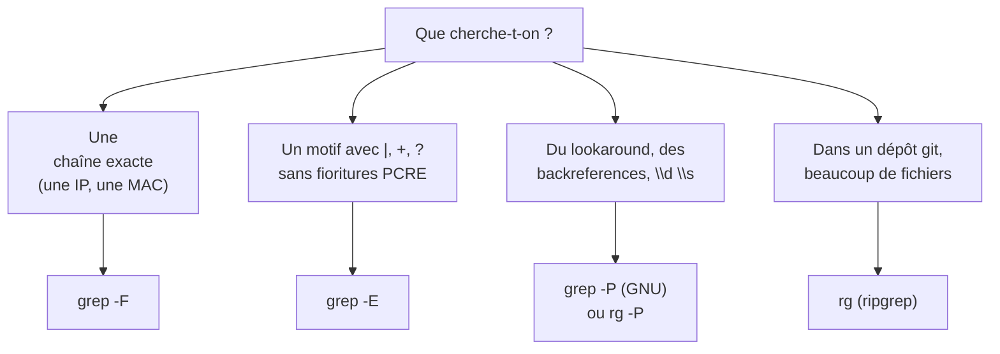

On a tous déjà fait ça : on cherche une ligne précise dans un `running-config` de 4000 lignes, on balance un `grep mot` et on se retrouve avec 200 correspondances dont la moitié dans des commentaires. `grep` est l'une des commandes les plus utilisées sous Linux, et c'est aussi l'une des plus mal utilisées. Le but de cet article n'est pas de refaire le `man grep`, mais de montrer comment l'utiliser pour des recherches **vraiment ciblées** : filtrer le bon fichier, le bon moteur d'expressions rationnelles, le bon niveau de contexte, et surtout savoir quand arrêter de marteler `grep` pour passer à un outil plus adapté.

<!-- truncate -->

Je pars du principe que vous êtes à l'aise en ligne de commande. Les exemples tournent sous GNU grep (donc Arch, Debian, RHEL — tout ce qui n'est pas BSD/macOS par défaut) et j'utilise des cas concrets d'admin réseau, parce que c'est là que le besoin de recherche ciblée se fait le plus sentir.

## Les quatre moteurs de grep

C'est la première chose à comprendre : `grep` n'a pas un seul moteur de regex. Le comportement par défaut dépend de l'option choisie, et c'est ce que fait la différence entre une recherche qui matche trop et une qui matche juste.

| Option | Moteur | Ce que ça change |
|--------|--------|------------------|
| *(défaut)* | BRE (Basic) | `?`, `+`, `{}`, `|` perdent leur sens spécial et doivent être échappés `\?` `\+` `\|` |
| `-E` (ou `egrep`) | ERE (Extended) | `?`, `+`, `{}`, `|` actifs sans échappement — le mode intuitif |
| `-P` | PCRE (Perl) | lookaround, backreferences, `\d`, `\s`, `\b`… puissance maximale |
| `-F` (ou `fgrep`) | Chaîne fixe | Aucune interprétation regex, le motif est pris littéralement |



:::note Sous macOS, attention
Le `grep` système de macOS est un `grep` BSD : il ne supporte **pas** `-P`. Si vous bossez sur un Mac, installez `grep` via Homebrew (`brew install grep`) et utilisez `ggrep -P`, ou partez directement sur `ripgrep`.
:::

En pratique, 80 % des recherches se font en `-E` ou en `-F`. On réserve `-P` aux cas oʼn l'on a vraiment besoin d'assertions (lookahead/lookbehind) ou de classes `\d`/`\s` — et encore, dès que ça devient tordu, c'est souvent le signe qu'il faut `awk` ou un vrai script.

## Les options qui changent vraiment la donne

Plutôt que de lister le manuel, voici celles que j'utilise tous les jours et qui transforment une recherche brouillonne en recherche chirurgicale.

### `-n`, `-c`, `-l` : contrôler la sortie

```bash
# Numéro de ligne à côté du match — indispensable pour retrouver le contexte
grep -n 'mtu 9000' running-config.cfg

# Juste le nombre de correspondances (pas les lignes)
grep -c 'interface Ethernet' running-config.cfg

# Uniquement les FICHIERS qui contiennent le motif (idéal sur un répertoire)
grep -rl 'channel-group 10 mode active' /tftpboot/configs/
```

`-l` (lowercase L) ne sort que les noms de fichiers qui matchent. C'est l'option à combiner avec `-r` dès qu'on cherche « où est-ce que ce truc est configuré ? » plutôt que « quoi exactement ».

### `-v`, `-i`, `-w`, `-x` : filtrer précisément

```bash
# Inverser : tout sauf les commentaires et les lignes vides d'un fichier de conf
grep -vE '^\s*(!|#)' running-config.cfg | grep -vE '^\s*$'

# Sensible à la casse ou non
grep -i 'bgp' messages        # BGP, bgp, Bgp...
grep -w 'UP' interfaces.txt   # UP, mais pas "STOPUP" ni "GROUP"

# -x : la ligne entière do
it matcher (utile pour des valeurs exactes)
grep -x 'shutdown' running-config.cfg
```

`-w` (mot entier) est sous-estimé. Sans lui, `grep UP` attrape `SETUP`, `WRAPUP`, `GROUP`… ce qui est exactement le genre de faux positif qui vous fait chercher un bug qui n'existe pas.

### `-A`, `-B`, `-C` : le contexte autour du match

C'est l'option la plus précieuse quand on débugge. `-A` (after), `-B` (before), `-C` (context, des deux côtés).

```bash
# Les 3 lignes qui suivent chaque match BGP (pour voir l'état du neighbor)
grep -A3 'neighbor 10.0.0.5' bgpd.conf

# 2 lignes avant, pour récupérer le nom de l'interface au-dessus d'un mtu 9000
grep -B2 'mtu 9000' running-config.cfg

# 5 lignes de contexte de part et d'autre d'un événement de flap
grep -C5 'BGP-5-ADJCHANGE' /var/log/messages
```

:::tip Combiner contexte et numérotation
`grep -nC5 motif` vous donne les numéros de ligne **et** le contexte. C'est mon réflexe par défaut quand je fouille un log : je veux savoir où je suis dans le fichier, pas juste voir le match isolé.
:::

## Recherches récursives ciblées

Le grand classique : chercher un motif dans une arborescence entière. Le piège, c'est de faire un `grep -r motif *` et de récupérer du binaire, des fichiers de swap, du `.git/`, bref du bruit. GNU grep propose des filtres d'inclusion/exclusion précis.

```bash
# Récursif, uniquement dans les fichiers .cfg
grep -r --include='*.cfg' 'channel-group' /tftpboot/

# Récursif, en excluant les répertoires .git et les backups
grep -r --exclude-dir='.git' --exclude='*.bak' 'mtu 9000' .
# -r ne suit pas les liens symboliques ; -R les suit
grep -rl --include='*.conf' 'bgp' /etc/
```

Pour lister les fichiers où un motif **n'apparaît pas** (typiquement : quels routeurs n'ont pas encore la config NTP), c'est `-L` :

```bash
grep -rL --include='*.cfg' 'ntp server 10.10.10.1' /tftpboot/configs/
```

## Les expressions rationnelles qui servent vraiment

Plutôt que la théorie, des motifs que j'utilise réellement sur des configs
 et des logs.

```bash
# Toutes les interfaces avec leur nom exact (on capture juste le motif)
grep -oE 'interface [A-Za-z0-9./:_-]+' running-config.cfg | sort -u

# Les adresses IPv4 présentes dans un fichier
grep -oE '([0-9]{1,3}\.){3}[0-9]{1,3}' bgpd.conf | sort -u

# Les lignes BGP indiquant un passage à l'état Established ou Down
grep -iE 'BGP.*(Established|Idle|Active|OpenSent)' /var/log/messages

# Les neighbors BGP dont l'IP commence par 10.0.0.
grep -E 'neighbor 10\.0\.0\.[0-9]+' bgpd.conf
```

Le point à retenir : en `-E`, le point `.` est un joker et `.` littéral doit être échappé en `\.`. C'est l'erreur la plus fréquente — `grep -E '10.0.0.1'` matche aussi `10x0x0x1`. On écrit `10\.0\.0\.1`.

## PCRE : quand on a besoin de vraies expressions rationnelles

`-P` débloque ce que `-E` ne sait pas faire : les assertions, les références arrières, les classes `\d \s \S \b` extensives.

```bash
# lookahead : un MTU qui précède une ligne "no shutdown"
grep -P 'mtu \d+\n\s*no shutdown' running-config.cfg   # nécessite \n => voir -z

# Trouver deux lignes identiques consécutives (doublon dans une conf)
grep -nP '^(.*)\n\1$' running-config.cfg
```

:::warning Le piège du multiligne
Par défaut, `.` et `\n` ne traversent pas les fins de ligne : grep travaille ligne par ligne. Pour matcher un motif **à cheval sur plusieurs lignes**, il faut `-z` (qui rend l'entrée « NUL-séparée »). Dans un fichier sans octet NUL, cela revient à traiter tout le fichier comme une seule grande ligne.
:::

```bash
# -z + -P + -o : extraire tout un bloc d'interface contenant un mtu 9000
grep -Pzo 'interface \S+[\s\S]*?mtu 9000[\s\S]*?!\s*\n' running-config.cfg
```

Ici `[\s\S]*?` est l'équivalent non-avide de `(?s).*?` (le `?` rend la quantification non-gourmande). C'est puissant, mais dès qu'on en est là, je vous le dis : un petit `awk` ou `sed` entre les blocs sera souvent plus lisible pour un collègue qui relit. grep reste roi pour **trouver*, pas pour **transformer**.

## Cas concrets 
d'admin réseau

Quelques recettes que j'utilise réellement sur du Arista EOS / Cisco, au-delà du simple « cherche-moi ce mot ».

```bash
# Combien d'interfaces ont une MTU jumbo (9000) dans un dump de conf ?
grep -c 'mtu 9000' running-config.cfg

# Les port-channels actifs en LACP, uniquement les noms, trkɳ uniques
grep -oE 'interface (Po|Port-Channel)[0-9]+' running-config.cfg | sort -u

# Les events BGP de changement de voisinage sur les dernières 24h
grep -iE '%BGP-[0-9]+-ADJCHANGE' /var/log/syslog

# Les lignes de log entre deux horodatages (approche simple par plage)
grep -E '^Aug 31 (0[8-9]|1[0-2]):' /var/log/syslog
# Vérifier qu'aucun switch n'a oublié le serveur NTP cible
grep -rL --include='*.cfg' 'ntp server 10.10.10.1' /tftpboot/configs/
```

Pour filtrer un `show running-config` Arista à la volée (sans fichier intermédiaire), grep se combine trés bien avec ce que renvoie l'équipement via SSH :

```bash
ssh admin@leaf-01 'show running-config' | grep -iE 'interface (Ethernet|Vlan)|mtu |no shutdown'
```

:::tip grep n'est pas un parser
`grep` cherche des lignes, il ne comprend pas la structure d'une config. Pour extraire proprement un bloc `interface … !` complet, `awk '/^interface/{p=1} p{print} /^!/{p=0}'` est plus juste que n'importe quelle gymnastique PCRE. grep trouve, awk structure.
:::

## grep vs ripgrep : quand changer d'outil

`ripgrep` (`rg`) est un remplaçant moderne de `grep -r` écrit en Rust. Il est plus rapide, plus sûr par défaut et plus ergonomique pour fouiller du code ou une arborescence. Ce n'est pas un remplacement universel : grep reste partout, rg s'installe en plus.

| Besoin | grep | ripgrep (rg) |
|--------|------|--------------|
| Disponible par défaut | oui, partout | non, à installer |
| Respecte `.gitignore` | non | **oui**, par défaut |
| Smart case (insensible seulement si minuscules) | non | `-S` |
| Filtres par type de fichier | `--include` | `-t conf`, `-t yaml` |
| Exclure un glob | `--exclude` | `-g '!*.log'` |
| Fichier
s cachés | inclus par défaut | ignorés (`--hidden` pour les voir) |
| PCRE (lookaround) | `-P` (GNU) | `-P` (si compilé avec pcre2) |
| Multiligne | `-z` + `-P` | `--multiline`, `--multiline-dotall` |

```bash
# L'équivalent grep -r --include, mais en lisant le .gitignore et en smart case
rg -S 'channel-group' /tftpboot/

# Uniquement les fichiers de conf, en excluant les logs
rg -t conf -g '!*.log' 'mtu 9000' .

# Multiligne sans la gymnastique de -z : un bloc d'interface avec mtu 9000
rg --multiline -U 'interface \S+[\s\S]*?mtu 9000[\s\S]*?!\s*\n' running-config.cfg
```

Ma règle de poche : si je cherche dans un fichier unique ou que je pipe la sortie d'une commande, c'est `grep`. Dès que je cherche dans une arborescence, un dépôt ou un gros volume de configs, c'est `rg`. Et si je dois **transformer** ce que je trouve, je passe à `awk`/`sed`.

## Quelques pièges et bons réflexes

- **Toujours échapper le point** quand on cherche une IP : `10\.0\.0\.1`, jamais `10.0.0.1`.
- **Préférer `-F` pour les chaînes fixes** (IP, MAC, ASN). Plus rapide, plus sûr, et pas de surprise avec les regex.
- **`-c` ne compte pas les lignes, il compte les lignes qui matchent**. Pour le nombre d'occurrences réelles (plusieurs sur une ligne), il faut `-o` puis `wc -l`.
- **`grep` est sensible à la locale** : le tri et la définition de `[a-z]` dépendent de `LC_COLLATE`. Pour des résultats reproductibles, `LC_ALL=C grep …` force le mode byte.
- **Sur des fichiers binaires**, grep signale « Binary file matches ». `-a` force le traitement en texte, `-I` ignore purement les binaires (utile en récursif).
- **`--line-buffered`** rend grep utilisable en pipe temps réel (suivi de log) : `tail -f /var/log/syslog | grep --line-buffered -i bgp`.

## Pour résumer

`grep` n'est pas un « cherche-moi ce mot ». C'est un sélecteur de lignes configurable à quatre niveaux : le **moteur** (`-F`/`-E`/`-P`), le **filtre** (`-v`/`-w`/`-x`/`-i`), le **contexte** (`-n`/`-A`/`-B`/`-C`) et le **périmètre** (`-r`/`-
-include /`--exclude-dir`). Maîtriser ces quatre axes, c'est passer de « j'ai 200 résultats dont la moitié inutiles » à « j'ai exactement ce que je cherche, avec le contexte, dans le bon fichier ». Et savoir quand `rg` ou `awk` prend le relais, c'est ce qui distingue un usage efficace d'un usage bourrin.

Quelques ressources pour aller plus loin :
- [grep(1) — man page GNU](https://www.man7.org/linux/man-pages/man1/grep.1.html)
- [ripgrep — guide officiel](https://github.com/BurntSushi/ripgrep/blob/master/GUIDE.md)
- [Regular-Expressions.info — référence PCRE](https://www.regular-expressions.info/)

Passez une bonne journée, et à la prochaine.
