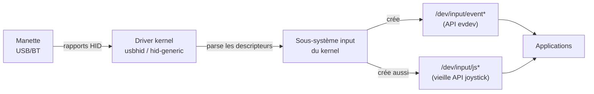
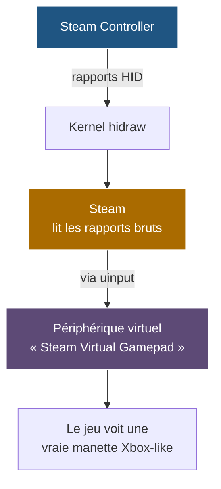

Voilà alors que la semaine s'achève et que je reçois enfin ma [Steam controller](https://store.steampowered.com/sale/steamcontroller?l=french), je décide alors de jouer toute la nuit pour découvrir ce nouveau périphérique. Après tout qu'est-ce qu'il pourrait mal se passer ?

<!-- truncate -->

D'un côté je me dis heureusement que ce genre de journée ne m'arrive pas souvent, car elles ont beau être plus qu'instructives, elles n'en restent pas moin déplaisante lorsque la seule envie que j'avais était de revenir sur expédition 33.

Avant de commencer, une petite mise en bouche ne fait pas de mal : [Github - issue #10442](https://github.com/ValveSoftware/steam-for-linux/issues/10442).
Oui cette erreur date de 2024 et n'est toujours pas à ce jour corrigée...

Malgré ça, j'ai tout de même pu jouer avec, après beaucoup, beaucoup de mal. 

Tout a commencé lorsque j'ai vu l'erreur s'afficher à mon écran. Ce magnifique pop-up qui me demande de faire un partage d'écran avec ma manette, après tout pourquoi pas ? tout irait bien si derrière chaque bouton de la manette ne se comportait pas comme un périphérique clavier/souris.
Donc, comme tout utilisateur Linux, je me dis "Ça doit être une mise à jour" -> **BOOOM** - une mise à jour sauvage de 35Go apparaît (ça devait faire une bail que je n'avais pas mis à jour mon poste).

Et quelle fut ma surprise de découvrir au démarrage de mon poste que, je n'ai plus de bluetooth 🙂.
Vous pourrez comprendre assez vite pourquoi j'ai voulu créer une nouvelle section dans ma documentation ici : [Bastodoc - Debug](../docs/Debug/panneBluetoothmt7922). J'explique ici tout ce que j'ai appris, mais aussi tout le cheminement que j'ai parcouru pour finalement me dire "Bon... ça a vraiment l'air d'être un bug moyennement sympa".

Donc pour le moment, je n'ai plus de bluetooth, heureusement que j'ai ma super manette Steam qui utilise le PUC pour connecter en sans fil la manette (RIP ma pauvre manette Xbox que je n'utilisais qu'en bluetooth).

Ducoup, vu que je suis dans ma période explication, on fonce droit dedan :

## Comment ton OS "voit" ta manette

Quand tu branches une manette USB ou Bluetooth, elle ne parle pas un langage propre à elle-même. La quasi-totalité des périphériques d'input modernes utilisent un protocole standardisé : **HID** (*Human Interface Device*). C'est un protocole qui définit comment décrire les contrôles d'un périphérique (boutons, axes analogiques, accéléromètres, etc.) et comment transmettre leurs états via des *rapports HID*. Une souris USB envoie des rapports HID. Un clavier USB envoie des rapports HID. Une manette de jeu aussi.

Côté Linux, voici la chaîne qui se met en place :

Le driver `usbhid` (ou `hid-generic`) reçoit les rapports HID bruts, lit le *descripteur* envoyé par le périphérique au moment du branchement, et **interprète ce que chaque rapport veut dire**. Si le descripteur déclare "je suis une souris avec deux axes et trois boutons", le kernel expose un device souris. S'il déclare "je suis une manette avec deux sticks, dix boutons et un D-pad", le kernel expose une manette.

Tous les events parviennent ensuite aux applications via les fichiers spéciaux dans `/dev/input/`. L'API moderne s'appelle **evdev** (event device) et c'est elle que toutes les applications sérieuses utilisent : Wayland, X11, SDL, libinput, et donc Steam. Il existe aussi une vieille API joystick (`/dev/input/js*`) gardée pour la compatibilité, mais elle est dépréciée.

## Le cas particulier de la Steam Controller

Là où ça devient intéressant — et où l'origine du bug se cache — c'est que la Steam Controller est un périphérique **bimodal**. Ses descripteurs HID déclarent au kernel : "je suis un clavier *et* une souris". Pas une manette. Quand tu la branches en l'absence de Steam, le kernel la voit comme un combo K/M, et chaque interaction avec la manette produit donc des événements clavier ou souris.

C'est volontaire, et c'est même intelligent : ça permet à la manette de fonctionner *sans logiciel* sur n'importe quelle machine, pour naviguer dans un menu Steam ou un jeu non-Steam, sans avoir besoin d'un driver spécial. C'est le fameux mode "lizard" (Valve l'appelle comme ça en interne).
:::info
C'est là que c'est marrant. On branche la manette sans allumer Steam, elle se comporte comme une souris / clavier, et ça marche nikel.
On allume Steam, et là c'est le drame, peu importe quel input on fait, le pop-up apparaît
:::

Quand Steam tourne, il prend la main différemment. Au lieu de laisser le kernel interpréter les rapports HID, Steam ouvre un accès direct au périphérique HID (via `/dev/hidraw*`, qui contourne l'interprétation evdev), parle son propre protocole avec la puce de la manette, et reçoit des données beaucoup plus riches : positions des trackpads, accéléromètre, force des trigger analogiques, etc.

Steam crée ensuite en parallèle un **périphérique virtuel** côté kernel, via une interface qui s'appelle **uinput** (*user input*). Uinput permet à un programme userspace de simuler un périphérique d'input comme s'il était physiquement branché — il apparaît dans `/dev/input/`, génère des events evdev, et les applications le voient comme n'importe quel autre périphérique.

C'est ça, la magie de Steam Input : il fait croire à n'importe quel jeu (même un vieux jeu DirectInput) qu'il est connecté à une manette Xbox standard, alors que physiquement tu peux avoir une Steam Controller, une DualSense, une manette générique chinoise, ou même un clavier mappé via la fonction "configuration manette" de Steam.

Les *templates* dont parlent les forums sont les profils de mapping : "le bouton physique A → l'input virtuel A", ou plus créatif, "le trackpad droit → la souris dans l'OS", etc.

## La race condition qui produit le bug

Maintenant le bug : sur Wayland, quand Steam veut **envoyer des inputs synthétiques à d'autres fenêtres** — ce qu'il fait pour son overlay, pour ses raccourcis clavier globaux, et pour injecter les inputs de la Steam Controller dans les jeux — il se heurte à un mur architectural.

Sur X11, n'importe quelle application pouvait faire `XGrabKeyboard()` ou `XSendEvent()` pour intercepter ou injecter des événements globalement. C'était puissant mais aussi dangereux pour la sécurité (un keylogger pouvait s'installer sans aucun privilège). Wayland a fait un choix radical de sécurité : **chaque application ne voit que ses propres événements**, et ne peut pas injecter dans les autres.

Pour les usages légitimes (logiciels d'accessibilité, automation, contrôle à distance, et donc aussi Steam), Wayland passe par **xdg-desktop-portal**. C'est une couche d'API standardisée, conçue à la base pour les applications Flatpak, qui sert d'intermédiaire entre l'app et le compositeur Wayland. Quand une app veut faire quelque chose de sensible (capturer l'écran, accéder à la webcam, injecter des inputs), elle demande à xdg-desktop-portal, qui affiche une boîte de dialogue de consentement à l'utilisateur, et seulement si l'utilisateur accepte, le compositeur autorise l'action.

L'interface du portal qui couvre l'injection d'inputs s'appelle **RemoteDesktop**, et son nom est trompeur : techniquement, "injecter des inputs dans d'autres fenêtres" et "permettre un contrôle à distance" sont la même primitive système. Du coup, quand Steam demande l'accès à cette interface, le portal affiche la fameuse pop-up "Une application veut partager votre écran et contrôler votre souris/clavier". C'est techniquement honnête mais visuellement effrayant pour le contexte "je viens juste de brancher une manette".

Et le bug `#10442` vient du fait que Steam :

1. Détecte la connexion de la Steam Controller.
2. Envoie immédiatement la requête à xdg-desktop-portal pour la permission RemoteDesktop.
3. **Pendant ce temps**, la manette est toujours en mode "lizard" (le kernel l'interprète comme K/M).
4. Chaque pression de bouton produit donc des événements clavier/souris *qui se propagent dans la fenêtre active* — y compris la pop-up de demande de consentement, ce qui peut la valider involontairement, et plus généralement dans tout ce qui se trouve sous le pointeur.
5. Idéalement, Steam devrait d'abord prendre le contrôle exclusif du périphérique via hidraw (passer la manette en mode "Steam Input natif") **avant** de demander le portal. Mais l'ordre actuel des opérations dans Steam fait l'inverse.

C'est une race condition au sens classique du terme : le bug n'existe pas dans le code de l'un ou de l'autre composant pris isolément, il vit dans **l'ordonnancement** des deux opérations. Et c'est exactement le genre de bug que Valve a du mal à corriger parce qu'il dépend du compositeur Wayland utilisé, de la version du portal, de la rapidité de la machine à afficher la pop-up, etc. Sur des configurations rapides, certains utilisateurs n'ont pas le bug ; sur des configurations plus lentes ou avec un compositeur particulier, il est systématique.

Pour ma part, après certains redémarrage, je n'ai aucun souci, mais alors vraiment aucun. Et à d'autres moments tout plance. Maintenant place à la solution

## La solution
Premièrement, on allume Steam on lance son meilleur jeux et on essaie d'utiliser sa manette. C'est avec un air particulièrement contrarié que l'on découvre ce misérable pop-up qui rend notre vie si difficile.

Toujours pendant que vous êtes en jeu, allez sur Steam dans la page du jeu de votre bibliothèque, vous devriez avoir sur la droite un paramètre `Voir les paramètres de la manette` ou quelque chose comme ça.

Dans ce menu, il faut impérativement que tous les inputs de la manette soient des boutons utilisable en jeux. Certains preset de la communauté permettent déjà ça. Pour mon cas, si un seul endroit était marqué comme `souris`, je pop-up revenait de manière incessante.

Une fois fait, de retour dans votre jeux, vous devriez être plus calme posé car ce pop-up n'apparaît plus.
