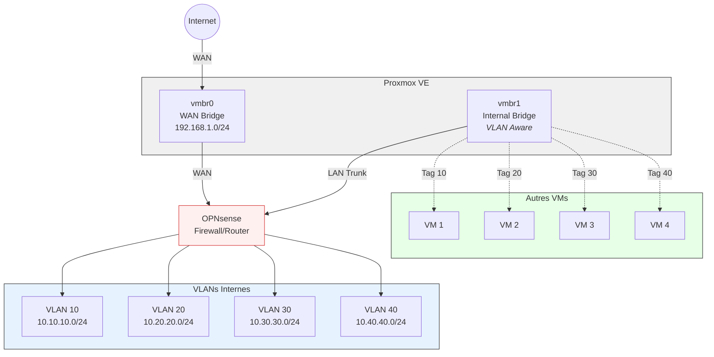

Je commence la mise en place de mon home-lab, cet article est le début d'une petite série de mise en place de plein de solution.

Quoi de mieux pour commencer une infra que de commencer par le pare-feu. L'entité qui me servira pour tous les éléments réseaux de mon lab
<!--truncate-->

## Le firewall
j'ai fais le choix de partir avec OpnSense. Plusieurs raisons ont porté mon choix. Notamment le fait que je me sois habitué à cet outil depuis un long moment et notament que c'est honnêtement une solution très simple à utiliser en GUI (avec la doc à côté certes).

D'autres solutions existent tel que PfSense (outil qui est forké par OpnSense), mais son interface graphique est honnêtement... vieillotte et très pu intuitive.

Il existe très probablement d'autres solutions que je ne connais pas, en tout cas dans le monde open source, je ne connais que celle-là.

### L'installation
Déjà, on ne part pas installer quelque chose sans savoir ce que l'on va faire, donc voici mon objectif :

Comme je le mentionne dans [Les réseaux proxmox](./Les-Reseaux-Proxmox), les bridges Linux sont littéralement des switchs. Une fois qu'on leur donne le paramètre "vlan aware", ils se comporte alors comme un switch managé.
Donc chaque serveur pourra être dans son vlan, directement relié au pare-feu qui sera leur seule porte de sortie.
