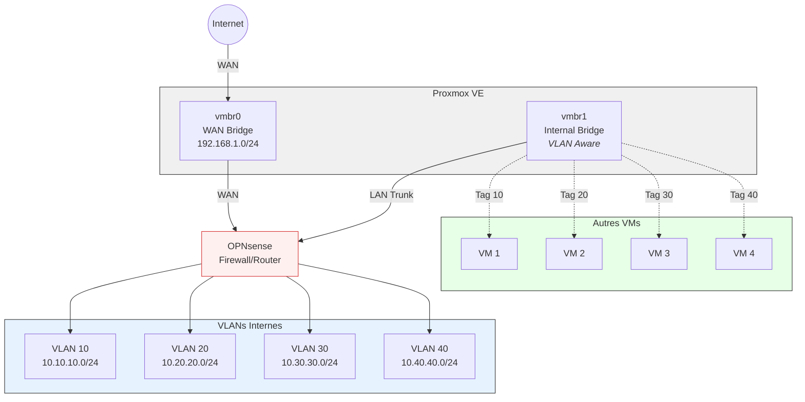

Je commence la mise en place de mon home-lab, cet article est le début d'une petite série de mise en place de plein de solution.

Quoi de mieux pour commencer une infra que de commencer par le pare-feu. L'entité qui me servira pour tous les éléments réseaux de mon lab
<!--truncate-->

## Le firewall
j'ai fais le choix de partir avec OpnSense. Plusieurs raisons ont porté mon choix. Notamment le fait que je me sois habitué à cet outil depuis un long moment et notament que c'est honnêtement une solution très simple à utiliser en GUI (avec la doc à côté certes).

D'autres solutions existent tel que PfSense (outil qui est forké par OpnSense), mais son interface graphique est honnêtement... vieillotte et très peu intuitive.

Il existe très probablement d'autres solutions que je ne connais pas, en tout cas dans le monde open source, je ne connais que celle-là.

### Préparation
Déjà, on ne part pas installer quelque chose sans savoir ce que l'on va faire, donc voici mon objectif :

Comme je le mentionne dans [Les réseaux proxmox](./Les-Reseaux-Proxmox), les bridges Linux sont littéralement des switchs. Une fois qu'on leur donne le paramètre `vlan aware`, ils se comporte alors comme un switch managé.
Donc chaque serveur pourra être dans son vlan, directement relié au pare-feu qui sera leur seule porte de sortie.

### Installation
déjà il vous faut récupérer l'ISO d'OpnSense : [OpnSense - Download](https://opnsense.org/download/).

Une fois fait, il faut l'ajouter dans proxmox, créer une nouvelle VM avec cette ISO (mettre les bonnes interfaces réseau au passage) puis lancer sa VM.

Lors de l'installation, on vous demandera quelques éléments, notamment quelle interface est la `WAN`, la `LAN` etc... Puis une fois terminé, vous pourrez vous connecter.
:::warning Attention
Cependant cette installation est pour le moment une installation live
:::

Pour installer OpnSense sur votre machine, il faut vous connecter en console / SSH avec l'identifiant : `installer` et le mot de passe : `opnsense`. Vous devriez alors arriver dans un shell interactif vous demandant quoi installer, sur quel média, quelle IP etc.

Lorsque tout est terminé, vous pourrez vous connecter sur l'interface web de votre machine.

## Et maintenant ?

Actuellement j'ai une question que je ne m'étais jamais posée : est-ce que le mode `vlan aware` permet à l'interface de voir n'importe quel Vlan ou alors uniquement ceux créés dans proxmox ?
*je répondrais instinvtivement qu'elle voit tout*
Actuellement j'ai une seule interface reliée à mon pare-feu qui est en vlan aware. Est-ce que si je créé les vlan dans le pare-feu ils seront balancés dans le bridge et sur les machines qui y sont connecté ?

>je me demande ça car ça conditionne s'il y a besoin de créer des vlan dans promxmox et de les ajouter en tant qu'interface dans le pare-feu ou alors si je peux tout créer dans OpnSense.

Concrètement, il n'y a pas 50 manières de vérifier.

### Le test
On créé le vlan et l'interface vlan afin de tester ça.

Si jamais pour créer une interface vlan il faut :
1. créer le vlan dans `Interfaces > Devices > Vlan` en choisissant son nom ainsi que l'interface sur laquelle il est (créer plusieurs vlan sur la même interface créé automatiquement un trunk)
2. Aller dans `interfaces > assignments` choisir son Vlan puis l'ajouter
3. Aller dans `Interfaces > [le nom de votre vlan]` et vous pourrez alors configurer votre vlan comme une interface à part entière

Pour ma part, je part sur un vlan 10 en `10.10.10.254`.

***

D'un autre côté, je mets le bridge dans une VM linux avec le bon vlan et fait un magnifique `ping 10.10.10.254`.

Côté pare-feu, il faut également autoriser le ping, par défaut ça ne fonctionne pas.

Et ducoup théorie vérifiée : les vlan déclarés dans OpnSense passent bien dans un bridge `vlan aware`. Je m'en doutais un peu, mais j'ai pu le vérifier assez rapidement.

Maintenant, il ne me restera plus qu'à configurer les différentes interfaces vlan en fonction du besoin et des VM que je fais. Le pare-feu est près. J'y reviendrais très certainement dessus par la suite sur les différentes solutions que je compte mettre en place.
