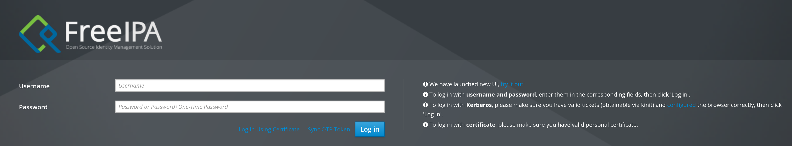

Pour faire suite à mes autres articles, je mets en place ici une solution d'authentification centralisée. Un annuaire open source nommé FreeIPA qui permet de faire tout un tas de chose, u pau à la `Active Directory` de Microsoft.

Ce serveur sera central dans l'authentification sur le réseau, la résolution DNS, la gestion des utilisateurs et des machines.
<!--truncate-->

## Pourquoi FreeIPA
Il existe beaucoup de solutions OpenSource qui permettent de faire office d'annuaire LDAP. Ce protocole a pour objectif d'être une source de vérifé des identités dans la plupart des organisations.
Cela permet plein de chose, notamment une harmonisation des utilisateurs. Au lieu de se retrouver avec le même compte ayant le même identifiant sur chaque ressource interne (et tous indépendant les uns des autres), on se retrouve avec une identité unique qui permet d'aller partout (lorsque le protocole est pris en charge).

L'avantage de FreeIPA est que c'est un outil particulièrement complet avec la possibilité de faire plein de choses :
* Annuaire LDAP
* Résolution DNS (sur un domaine interne ou en tant que serveur de relai)
* PKI afin de gérer des certificats et faire office d'autorité de certification principale
* Authentification sur le réseau via des protocoles comme RADIUS ou kerberos permettant ainsi d'authentifier un utilisateur ou une machine sur le réseau de manière sécurisée en utilisant l'annuaire LDAP

De surctoît, c'est une solution développée par RedHat qui reste une entité reconnue pour la sécurité des solutions qu'ils développent. Et qui d'ailleur sont utilisées mondialement.

## Quel OS utiliser ?
Là dessus, on a plein de solutions différentes. On peut se dire "FreeIPA = RedHat" donc on va aller sur RHEL. Souci, ça reste une solution privée même si on peut avoir des licences pour des environnements restreints (comme des labs).

Je commpte partir sur Fedora qui est en fait l'origine de RHEL. RedHat se base des sources de Fedora pour construire un OS plus restreint / sécurisé afin d'en faire une solution propre à une utilisation professionnelle pouvant remplacer microsoft.
Et donc tous les outils nécessaire seront disponible facilement / nativement dans fedora.

## Installation de fedora
Il faut pour ça aller récupérer sa meilleure iso [fedora server](https://fedoraproject.org/server/download/) et l'envoyer dans proxmox.

Pour ma part, j'ai donc créé mon serveur sur mon bridge `internal` avec le vlan 20 (donc sur le réseau `10.20.20.0/24`)

Une fois le serveur lancé, vous aurez une belle petite interface graphique qui vous permet de tout installer en quelques clics.

:::info apparté
Pour l'administration de mes serveurs qui sont pour le moment sur mon bridge internal, j'ai besoin de me connecter dessus en direct. Dans un monde idéal, on doit utiliser un bastion pour se connecter.

Mais dans mon infra, un simpe 
```bash
sudo ip route add 10.0.0.0/8 dev [l'interface réseau] via 192.168.1.250
```

me permet de me connecter à tous les réseaux de mon bridge `internal`.
:::
:::note
j'ai un souci que je ne comprend toujours pas. Il m'est impossible de me connecter à mon pare-feu sur son interface "WAN" (qui est en réalité sur mon LAN) :
```bash
curl https://192.168.1.250 -k
curl: (35) Recv failure: Connexion ré-initialisée par le correspondant
```
J'ai cherché pas mal de temps sur les trames qui passent et ça donnerait presque l'impression qu'il y a un souci, j'ai tout le temps un ttl à 63 contre 64 pour n'importe quelle autre destination.
je n'ai pas pour le moment trouvé, en tout cas la route que je donne au dessus permet de se connecter sur les interfaces vlan du pare-feu.
Je mettrai ça à jour si jamais je trouve la solution (et ça ne provient pas d'un reply-to ou d'un souci du driver vtnet de freeBSD, j'ai vérifié)
:::

Une fois l'installation terminée, le serveur redémarre et vous pouvez vous connecter avec le compte que vous avez configuré.

## Installation de FreeIPA
Avant de commencer l'installation de l'outil, il y a pas mal de points importants qu'il faut configurer au préalable pour garantir le bon fonctionnement de l'outil.

### Vérifier les dernières mises à jour
```bash
sudo dnf upgrade --refresh
```
:::info
Si vous avez correctement configuré vos interface réseau pas comme moi vous n'aurez pas de souci. Pour mon cas, je n'avais aucune résolution de nom qui se faisait :
```bash
~$resolvectl status
Global
         Protocols: LLMNR=resolve -mDNS -DNSOverTLS DNSSEC=no/unsupported
  resolv.conf mode: stub

Link 2 (ens18)
    Current Scopes: LLMNR/IPv4 LLMNR/IPv6
         Protocols: -DefaultRoute LLMNR=resolve -mDNS -DNSOverTLS DNSSEC=no/unsupported
     Default Route: no
```   
Si vous êtes dans le même cas, il faut définit à la main les différents dns à utiliser :
1. Vérifier le nom de la connexion :
```bash
~$nmcli connection show
NAME                UUID                                  TYPE      DEVICE
Wired connection 1  4a8a76d4-57c6-3690-b374-80b7cf81fe68  ethernet  ens18
lo                  1f2c0a59-bacc-4bda-af03-bbd99d9a6d94  loopback  lo
```
2. Modifier les paramètres de résolution DNS :
```bash
sudo nmcli connection modify "Wired connection 1" ipv4.dns "8.8.8.8 1.1.1.1"
sudo nmcli connection modify "Wired connection 1" ipv4.ignore-auto-dns no
sudo nmcli connection up "ens18"
```
3. Vérifiez que ça ait bien été pris en compte :

```bash
resolvectl status
Global
         Protocols: LLMNR=resolve -mDNS -DNSOverTLS DNSSEC=no/unsupported
  resolv.conf mode: stub

Link 2 (ens18)
    Current Scopes: DNS LLMNR/IPv4 LLMNR/IPv6
         Protocols: +DefaultRoute LLMNR=resolve -mDNS -DNSOverTLS DNSSEC=no/unsupported
Current DNS Server: 8.8.8.8
       DNS Servers: 8.8.8.8 1.1.1.1
     Default Route: yes
```
:::     


### Configuration hostname et DNS
C'est l'un des point les plus importants de kerberos (le protocole qui est au coeur de l'authentification sur FreeeIPA) qui est extrêmement sensible à la résolution DNS.
Lorsque l'on installe FreeIPA, ce dernier vérifie que le hostname ne soit pas `localhost` et qu'il soit pleinement qualifié (FQDN), qu'il soit résolvable et que le reverse DNS de l'IP résolue corresponde au hostname.

Beaucoup d'explication, mais pas beaucoup de commandes :
```bash
# Définition du nom de domaine de façon permanente
sudo hostnamectl set-hostname freeipa.home.lan

# Vérification
hostname -f
```
:::note
Je voulais initialement aller sur un domaine en `.local`, cependant, je me suis rendu compte que c'est un domaine réservé à **mDNS**. Sur Linux ce suffixe est intercepté par `systemd-resolved` qui l'envoie vers mDNS avant même d'interroger un DNS classique. Autant dire que pour des services basés sur de la résolution de nom, ce n'est pas la meilleure idée. Donc je suis parti sur `.lan` après avoir découvert ça
:::

Ensuite, il est impératif que ce nom de domaine que vous avez défini soit inscrit dans le fichier `/etc/hosts` afin que la résolution locale fonctionne.
:::warning Attention
FreeIPA refusera de s'installer si votre nom de domaine n'a qu'un seul niveau.
* `freeipa.lan` -> Ne fonctionnera pas
* `freeipa.home.lan` -> Fonctionnera

La raison est que FreeIPA s'appuie sur BIND et Kerberos qui tout deux demandent impérativement un domaine DNS avec **au moins** deux labels
:::
Pour ma part cette modification est :
```bash
10.20.20.1      freeipa.home.lan
```
#### Vérification
Pour vérifier ça :
```bash
hostname -f 			# Doit retourner le domaine complet, pour moi : freeipa.lan
ping -c1 freeipa.lan 	# Ou avec le nom de votre serveur, ce ping doit fonctionner et aller sur l'IP que vous avez défini dans le fichier hosts
ping -c1 google.com 	# Juste pour vérifier la résolution de nom internet
```

### Configuration des règles de pare-feu
FreeIPA empile plusieurs services réseaux, et pour cela Fedora propose des règles de service qui sont pré-définies dans Fedora.

Pour cela il suffit :
```bash
firewall-cmd --add-service=freeipa-4 --permanent
firewall-cmd --add-port=53/tcp --add-port=53/udp --permanent
```

La première commande prend en compte les ports : TCP `80, 443, 389, 636, 88, 464` et UDP `88, 464, 123`. Soit concrètement HTTP/S pour l'interface web, LDAP/S pour l'annuaire, Kerberos (88) et kadmin (464) pour l'authentification et NTP.

La seconde permet de rajouter le port `53` pour la résolution DNS.

## Installation de FreeIPA
Une fois tout ça fini, on installe FreeIPA
```bash
sudo dnf install freeipa-server-dns
```

Il existe également une version sans résolution, il suffit d'y enlever le `-dns` à la fin.

Une fois installé il suffit de :
```bash
sudo ipa-server-install
```

Vous serez alors amené dans un prompt interractif vous demandant :
1. si le script doit installer un DNS intégré (BIND)
	> Pour moi oui

2. Le nom complet de la machine (qui sera normalement déjà rempli)
3. Le nom de domaine de votre domaine 
	> Pour moi `home.lan`
4. Le mot de passe de l'utilisateur `Directory Manager`
5. Le mot de passe du compte `admin`
6. Si des DNS forwarders doivent être configurés
	> Dans mon cas oui, mes serveurs interne utiliseront freeipa pour résoudre des noms sur internet, donc il doit y en avoir
7. Si oui lesquels
8. Vérifier ce que vous avez mis et accepter l'installation

Une fois l'installation terminée, vous aurez une page web accessible en HTTPS sur l'IP

Si tout est fonctionnel, vous devriez arriver sur cette page une fois fait :

:::note
Lorsque vous vous connecte sur l'IP de votre serveur, automatiquement, le serveur vous redirige sur son nom de domaine.
Il peut être nécessaire sur votre machine d'ajouter le nom de domaine de votre serveur avec son IP pour que cette résolution fonctionne.

Pour ma part, j'ai modifié mon fichier `/etc/hosts` comme suit :
```bash
10.20.20.1 		freeipa.home.lan
```
:::

Je consacrerai un autre article sur la configuration de cet outil ainsi que sur l'enrollement de serveurs au sein de FreeIPA. Jusque là, je vous dis à la prochaine !
