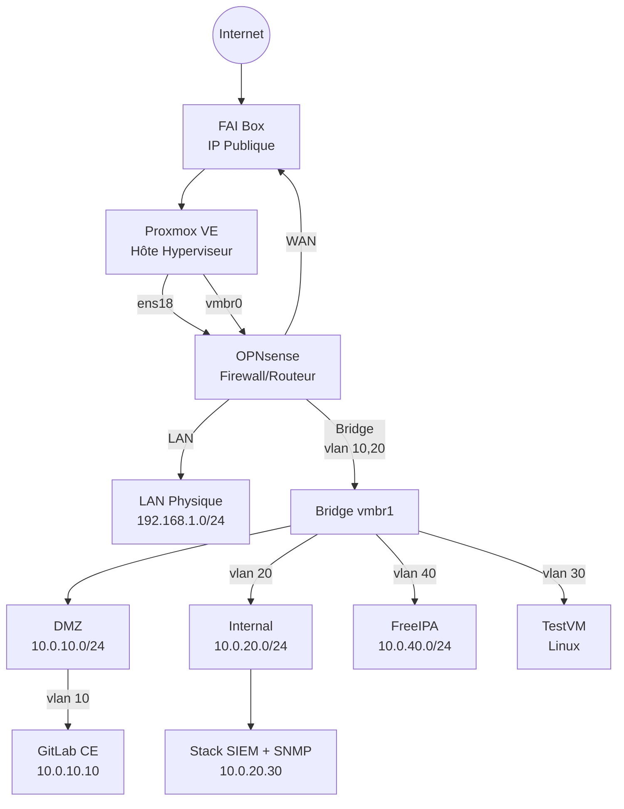

Ça fait un petit bout de temps que je fais des articles sur tout et rien, que je teste des choses sur ce qui me passe sous la main ou que je vois dans ma vie professionnelle.

Mais je dois reconnaître qu'il me manque pas mal de chose lorsque j'ai besoin de tester des éléments concrets, que ça soit de l'authentification, des protocoles  ou autre, très souvent on a besoin d'avoir une petite infra personnelle.

<!--truncate -->
 Ducoup voilà ce que je vais faire : une petite infra pour tester tout un tas de truc. Et je me servirais de ça dans de futurs articles afin d'avoir des éléments plus complets.

 ## L'architecture du projet
 
## Objectifs du Home-Lab

Ce lab a pour but de **simuler un environnement de production miniature** pour tout un tas de chose.

Aujourd'hui, je possède un vieu serveur DELL R620 avec 32Go de RAM, l'objectif n'est pas forcément de faire une infra complètement poussée, mais bon... Je vais utiliser ça pour les expériences que je ferais plus tard alors voilà l'objectif :

## Architecture globale

### Schéma d’ensemble

Comme j'ai pu l'expliquer dans un article précédent : [Les réseaux proxmox](./Les-Reseaux-Proxmox), je vais pouvoir mettre tout ça en pratique, et notamment mettre des interfaces vlan dans mon OpnSense.

Donc voilà l'objectif, je vais petit à petit faire ça dans des articles à venir. Quelques mots tout de même sur tout ça.

Déjà, comme vous vous en doutez, tout est sous Linux, que ça soit l'authentification, la rétention des logs, leur analyse. Grosso modo, ce que je veux réaliser c'est une infra certes simples mais utilisant les bonnes pratiques de l'informatique.

On se redit dans pas si longtemps pour le début de tout ça, expliquer l'interraction de chaque serveurs / service dans un seul article serait trop complexe à écrire et à lire alors flemme.
