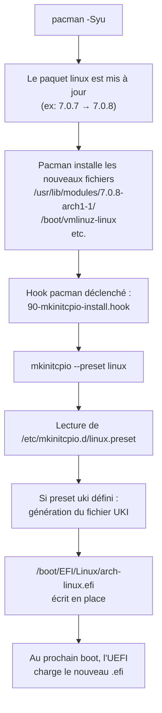
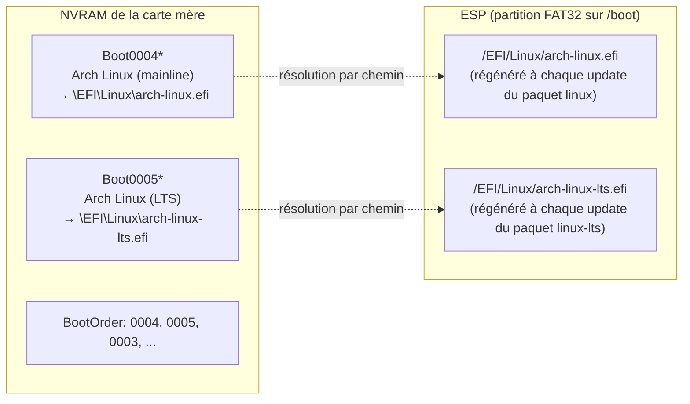
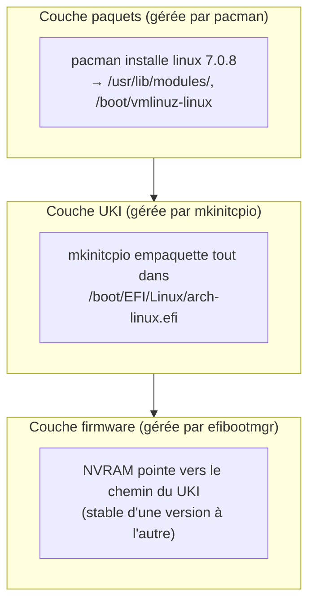

# Gérer le boot Linux sur Arch avec UKI et efibootmgr

Cet article complète la section précédente sur le diagnostic de panne Bluetooth, où l'on avait dû comprendre la chaîne de boot pour pouvoir tester un kernel alternatif. Ici, on se concentre sur **l'opération courante** : comment piloter quelle version du kernel boot, comment s'assurer que les mises à jour pacman propagent correctement le nouveau kernel jusqu'au boot, et comment éviter les pièges classiques.

## Rappel express : qu'est-ce qu'un UKI ?

Un **UKI** (*Unified Kernel Image*) est un fichier `.efi` unique qui empaquette dans un seul binaire signable :

- Le stub EFI (`systemd-stub`)
- Le kernel Linux (`vmlinuz`)
- L'initramfs (image RAM utilisée pendant le tout début du boot)
- La ligne de commande kernel (`cmdline`)
- Les microcodes CPU (`amd-ucode` ou `intel-ucode`)

C'est le format moderne pour booter Linux sur UEFI, devenu le défaut sur les installs récentes via `archinstall`. Le firmware UEFI lance le UKI **directement**, sans bootloader intermédiaire (pas de GRUB, pas de systemd-boot).

Sur une install Arch classique avec UKI, les fichiers atterrissent typiquement dans :

```
/boot/EFI/Linux/arch-linux.efi      ← UKI pour le kernel "linux" (mainline)
/boot/EFI/Linux/arch-linux-lts.efi  ← UKI pour le kernel "linux-lts" (LTS)
```

Le nom du fichier est **stable** d'une version à l'autre. Quand le paquet `linux` passe de 7.0.7 à 7.0.8, le fichier `/boot/EFI/Linux/arch-linux.efi` est **réécrit en place** avec le contenu correspondant à la nouvelle version. Le chemin ne change pas.

C'est crucial pour comprendre la suite.

## Comment le UKI est régénéré

Sur Arch, la régénération des UKI est gérée par **`mkinitcpio`** via un système de *presets*. C'est lui qui orchestre toute la chaîne, déclenché automatiquement par les hooks pacman lors de l'installation ou de la mise à jour d'un kernel.



Le fichier de preset est dans `/etc/mkinitcpio.d/` :

```bash
cat /etc/mkinitcpio.d/linux.preset
```

Exemple de preset minimaliste pour UKI :

```ini
ALL_kver="/boot/vmlinuz-linux"

PRESETS=('default' 'fallback')

default_uki="/boot/EFI/Linux/arch-linux.efi"
default_options="--splash /usr/share/systemd/bootctl/splash-arch.bmp"

fallback_uki="/boot/EFI/Linux/arch-linux-fallback.efi"
fallback_options="-S autodetect"
```

Décortiquons :

- **`ALL_kver`** : pointe sur le fichier `vmlinuz` du kernel. C'est la matière première à empaqueter.
- **`PRESETS`** : liste les variantes à générer. Le `default` est l'image principale ; le `fallback` est une image plus robuste qui embarque tous les modules connus (utile en dépannage).
- **`default_uki`** : chemin de sortie du UKI. **C'est cette valeur qui détermine l'emplacement final du fichier `.efi`.**

Important : ce preset n'est pas géré dynamiquement par les versions. La sortie est toujours `arch-linux.efi`, quelle que soit la version du kernel `linux`. Quand `pacman` met à jour le paquet, `mkinitcpio` est ré-exécuté et écrit un nouveau contenu **dans le même fichier**. Le firmware UEFI continue donc à pointer vers le bon fichier sans aucune intervention.

### La cmdline embarquée

Un point souvent surprenant : avec un UKI, la ligne de commande kernel (`cmdline`) est **incluse dans le binaire `.efi`**. Elle n'est pas dans un fichier de config séparé que le bootloader passerait au kernel.

Pour la voir actuellement utilisée :

```bash
cat /proc/cmdline
```

Pour la **changer**, deux mécanismes :

1. Éditer `/etc/kernel/cmdline` (chez certains setups) ou `/etc/cmdline.d/*.conf` (méthode plus moderne) puis régénérer le UKI avec `mkinitcpio -P`.
2. Passer un argument additionnel via SMBIOS ou un *addon* `.cmdline` placé à côté du UKI dans `/boot/EFI/Linux/<uki-name>.efi.extra.d/`.

Sur un setup `archinstall` standard, la cmdline est figée dans le fichier preset ou dans `/etc/kernel/cmdline`. Vérification :

```bash
ls /etc/kernel/ /etc/cmdline.d/ 2>/dev/null
```

## La NVRAM EFI : ce qui survit à la mise à jour

Les entrées de boot du firmware UEFI sont stockées dans la **NVRAM** de la carte mère — une mémoire qui persiste indépendamment du disque, du système, et des mises à jour pacman. Une entrée pointe vers un fichier `.efi` par **chemin** (ex: `\EFI\Linux\arch-linux.efi`), pas par contenu.



**Conséquence directe** : tant que `mkinitcpio` continue d'écrire le nouveau UKI au même chemin (ce qui est toujours le cas par défaut), la NVRAM reste valide. Aucune intervention manuelle n'est nécessaire après une mise à jour kernel. L'entrée NVRAM pointe vers `\EFI\Linux\arch-linux.efi`, le firmware charge ce fichier qui contient maintenant le nouveau kernel, et c'est terminé.

C'est ce qui rend ce setup robuste : **la mise à jour de kernel devient transparente pour le boot**.

## Piloter quel kernel boot par défaut

C'est l'opération courante. Trois cas à distinguer.

### Cas 1 : un seul kernel installé

Si tu n'as installé que `linux` (ou seulement `linux-lts`), il n'y a qu'un seul UKI, une seule entrée NVRAM utile, et tu n'as rien à piloter. Pacman met à jour, le UKI est régénéré, le firmware le charge.

### Cas 2 : deux kernels installés, on veut un défaut permanent

C'est typiquement quand on installe `linux-lts` comme filet de sécurité à côté du `linux` mainline. Tu veux que le mainline soit le défaut, et le LTS soit là en cas de pépin.

Vérifier l'état actuel :

```bash
sudo efibootmgr -v
```

Sortie typique :

```
BootCurrent: 0004
BootOrder: 0004,0005,0003,0000,2001,2002,2003
Boot0003* EFI Hard Drive
Boot0004* Arch Linux (mainline)  HD(...)/\EFI\Linux\arch-linux.efi
Boot0005* Arch Linux (LTS)       HD(...)/\EFI\Linux\arch-linux-lts.efi
```

- `BootCurrent` est l'entrée qui a servi au boot actuel.
- `BootOrder` est la séquence dans laquelle le firmware tente les entrées au prochain démarrage.

Pour rendre le mainline défaut permanent, il suffit qu'il soit en tête du `BootOrder` :

```bash
sudo efibootmgr --bootorder 0004,0005,0003,0000,2001,2002,2003
```

Cette commande réécrit l'ordre complet. Mets ton entrée préférée en première position, garde le reste en aval (notamment les entrées de secours type "EFI Hard Drive" qui peuvent t'aider en cas de problème).

### Cas 3 : tester un kernel ponctuellement sans changer le défaut

Pour un test isolé, utiliser `--bootnext` :

```bash
sudo efibootmgr --bootnext 0005
```

Le firmware ira sur `Boot0005` au prochain démarrage uniquement, puis reprendra le `BootOrder` normal au boot suivant. Si le test foire, un simple redémarrage te ramène à la situation antérieure.

C'est l'outil idéal pour valider qu'un nouveau kernel boote sans risquer de se bloquer avec une config buggée comme défaut.

## Workflow typique d'une mise à jour kernel

Sur un système configuré comme ci-dessus, voici ce qu'il se passe lors d'un `sudo pacman -Syu` qui inclut une mise à jour du paquet `linux` :

1. Pacman télécharge et vérifie le paquet.
2. Pacman installe les nouveaux fichiers : modules dans `/usr/lib/modules/<version>/`, `vmlinuz-linux` dans `/boot/`.
3. Le hook pacman `90-mkinitcpio-install.hook` se déclenche automatiquement.
4. `mkinitcpio -P` régénère **tous les UKI** définis par les presets — donc `arch-linux.efi` pour le kernel mainline.
5. Le fichier `/boot/EFI/Linux/arch-linux.efi` est **réécrit en place** avec le nouveau contenu.
6. Au prochain boot, le firmware UEFI charge ce fichier, qui contient maintenant le nouveau kernel.

L'utilisateur n'a **rien** à faire entre le `pacman -Syu` et le `reboot`. Aucune commande `grub-mkconfig`, aucune manipulation `efibootmgr`. C'est l'élégance du setup UKI.

### Vérification post-update

Si tu veux être sûr que tout est en ordre avant de rebooter :

```bash
# La date du fichier UKI doit correspondre à l'update
ls -la /boot/EFI/Linux/

# Vérifier les versions kernel embarquées par les UKI
sudo bootctl list
```

`bootctl list` énumère tous les UKI trouvés sur l'ESP avec leur version interne (extraite des métadonnées du UKI). Tu dois voir une ligne par UKI valide, avec un statut OK. Exemple :

```
        title: Arch Linux (default)
         type: Boot Loader Specification Type #2 (UKI, .efi)
       linux: /boot//EFI/Linux/arch-linux.efi
      version: 7.0.8-arch1-1
```

Si la version listée correspond à ce que `pacman -Q linux` t'affiche, l'UKI est synchronisé.

## Pièges classiques

### L'ESP qui se remplit

Les UKI sont gros (environ 50 à 100 Mo chacun, parce qu'ils embarquent kernel + initramfs + microcodes). Si tu as `linux`, `linux-lts`, leurs versions `fallback`, plus quelques anciens UKI orphelins, l'ESP de 300 Mo allouée par certaines installs anciennes se remplit vite.

Vérification :

```bash
df -h /boot
```

Si l'ESP est sous les 50 Mo libres, c'est risqué : la prochaine régénération UKI peut échouer pour manque d'espace, et un kernel update à moitié appliqué est un état où l'on ne veut jamais se retrouver.

Solution préventive : prévoir une ESP d'**au moins 1 Go** lors de l'install, surtout si l'on prévoit d'avoir plusieurs kernels en parallèle.

### Le hook mkinitcpio qui ne se déclenche pas

Si un UKI ne se régénère pas après une mise à jour kernel, deux causes possibles :

1. Le preset `mkinitcpio` ne définit pas `default_uki` (typique d'une install qui n'a pas activé le mode UKI). Dans ce cas `mkinitcpio` génère un initramfs classique mais pas de UKI. À fixer en éditant `/etc/mkinitcpio.d/<kernel>.preset`.
2. Les hooks pacman sont désactivés (rare).

Régénération manuelle si besoin :

```bash
sudo mkinitcpio -P
```

`-P` traite tous les presets disponibles dans `/etc/mkinitcpio.d/`.

### NVRAM en lecture seule

Sur certaines cartes mères, ou après certaines mises à jour de firmware UEFI, la NVRAM peut être en lecture seule depuis Linux. `efibootmgr --create` échouera alors avec une erreur explicite.

Solution : recréer les entrées depuis l'interface du firmware UEFI lui-même (souvent via une option "Add boot entry" dans le BIOS setup), ou via la couche `efivarfs` du noyau qu'il faut parfois remonter en lecture-écriture :

```bash
sudo mount -o remount,rw /sys/firmware/efi/efivars
```

### Quand l'entrée NVRAM pointe vers un fichier inexistant

Si tu as un jour renommé un UKI ou changé un preset pour pointer vers un nouveau chemin, l'ancienne entrée NVRAM va pointer vers un fichier disparu. Le firmware tentera de booter, échouera, et passera à l'entrée suivante du `BootOrder`. Ce n'est pas catastrophique, mais ça pollue.

Nettoyer une entrée obsolète :

```bash
sudo efibootmgr --bootnum 0004 --delete-bootnum
```

### Le piège des entrées NVRAM dupliquées

Chaque appel à `efibootmgr --create` crée **une nouvelle entrée** avec un nouveau numéro, même si une entrée identique existe déjà. À force d'expérimenter, on peut accumuler des entrées dupliquées qui pointent toutes vers le même UKI. Pas dangereux mais inélégant.

Pour faire le ménage périodique :

```bash
sudo efibootmgr -v          # Lister
sudo efibootmgr --bootnum XXXX --delete-bootnum  # Supprimer les doublons
```

## Une note sur SecureBoot

Les UKI sont conçus pour être **signables d'un bloc** pour le SecureBoot, et c'est un de leurs avantages majeurs. Si tu veux activer SecureBoot un jour, le UKI te permet de signer un seul fichier `.efi` (le UKI complet) plutôt que de devoir signer séparément le kernel et l'initramfs comme dans le modèle GRUB classique.

L'outil de référence pour gérer SecureBoot avec UKI sur Arch est `sbctl`, qui permet de générer ses propres clés, les enrôler dans le firmware, et signer automatiquement les UKI à chaque régénération via un hook pacman.

Ce sujet est suffisamment riche pour mériter son propre article. Note simplement que dans ton setup actuel, SecureBoot est désactivé (`Secure Boot: disabled` dans la sortie de `bootctl status`), ce qui est le cas par défaut.

## Récapitulatif des commandes utiles

```bash
# État du boot actuel
sudo bootctl status
sudo bootctl list
cat /proc/cmdline
sudo efibootmgr -v

# Régénérer les UKI manuellement
sudo mkinitcpio -P

# Vérifier les presets configurés
ls /etc/mkinitcpio.d/
cat /etc/mkinitcpio.d/linux.preset

# Manipuler la NVRAM EFI
sudo efibootmgr --bootnext NNNN              # Test ponctuel
sudo efibootmgr --bootorder NNNN,MMMM,...    # Définir l'ordre permanent
sudo efibootmgr --create --disk ... --part ... \
       --label "..." --loader '\EFI\Linux\foo.efi' --unicode  # Ajouter
sudo efibootmgr --bootnum NNNN --delete-bootnum   # Supprimer

# État de l'ESP
df -h /boot
ls -la /boot/EFI/Linux/
findmnt /boot
```

## Le mental model à retenir

Pour synthétiser, il y a trois couches indépendantes qu'il est utile de garder distinctes en tête :



À chaque mise à jour kernel, **les deux couches du haut sont entièrement automatiques**. Tu n'interviens manuellement qu'au niveau de la NVRAM, et uniquement lors de configurations initiales : créer une entrée pour un nouveau kernel installé pour la première fois, ou réorganiser `BootOrder` pour changer le défaut.

C'est ce qui rend ce setup à la fois moderne et discret : une fois configuré, il ne demande plus rien.
