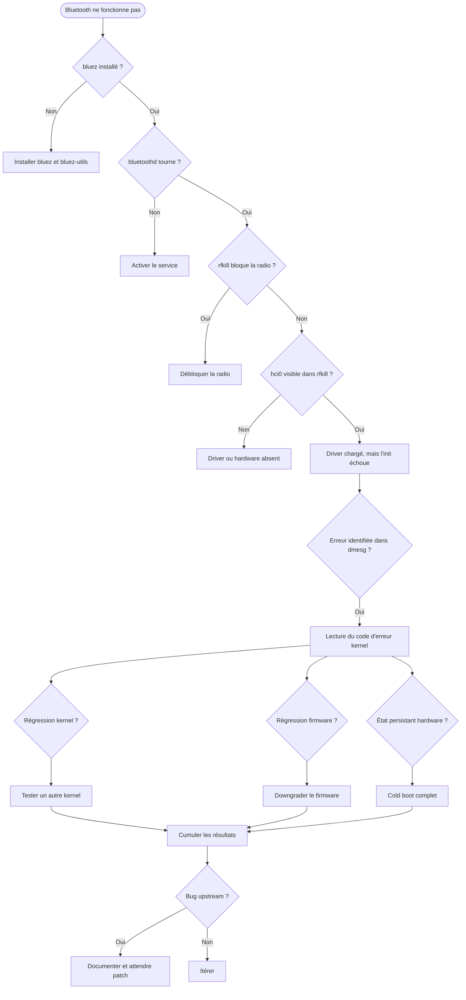
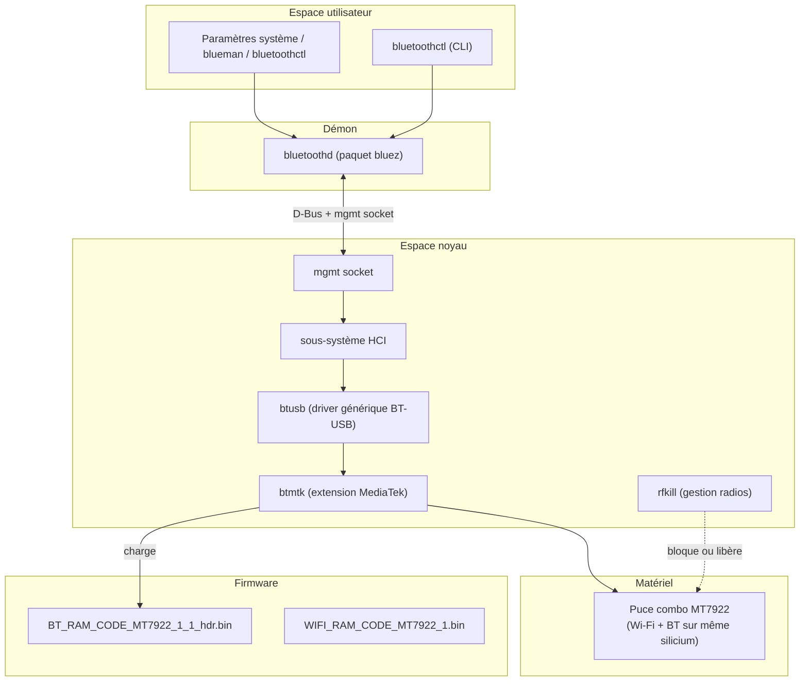
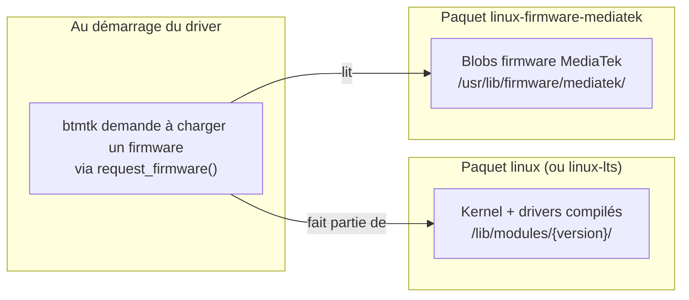
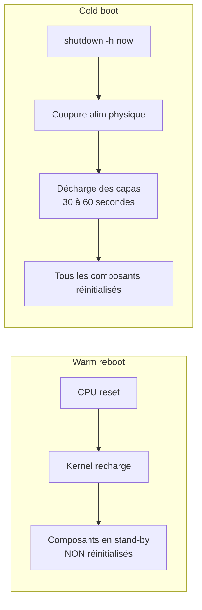
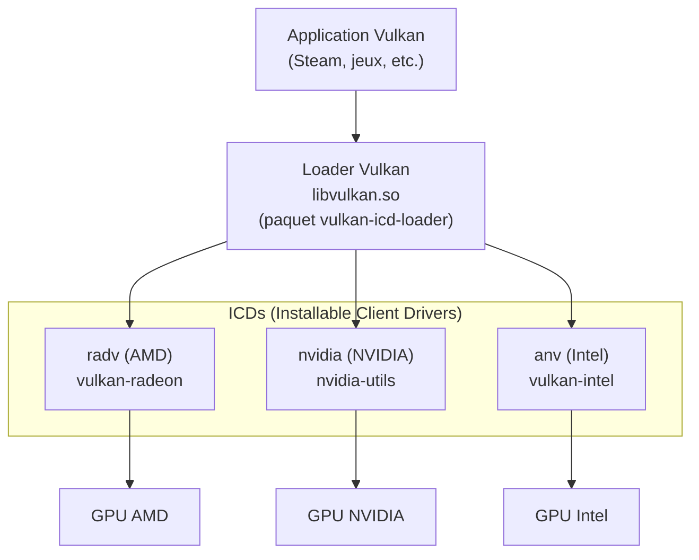
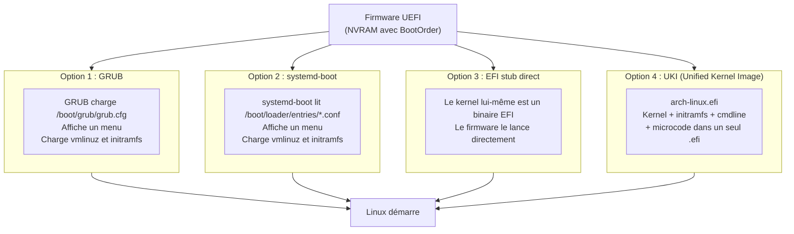

# Panne Bluetooth Mediatek MT7922 sous Arch Linux — méthodologie de diagnostic

Ayant passé un long moment à chercher une solution, j'ai retracé dans ce document tout ce que j'ai fais pour trouver la source du problème. Mon poste un un Lenovo Legion équipé d'une puce combo Wi-Fi+Bluetooth Mediatek MT7922, sous Arch Linux. L'objectif n'est pas tant la résolution finale — qui s'est avérée être un bug upstream non corrigeable localement — que la **méthodologie** et les **concepts techniques** sous-jacents qui s'appliquent à n'importe quelle panne hardware sous Linux.

## Le contexte initial

Après une réinstallation complète d'Arch Linux, le système refusait d'exposer un contrôleur Bluetooth utilisable, alors que tout indiquait que le démon `bluetoothd` tournait correctement et que le matériel était présent.

Configuration du test :

- **Distribution** : Arch Linux, install récente (mode `archinstall`)
- **Noyau** : `linux-lts` 6.18.30-1-lts (puis aussi `linux` 7.0.7 pour test)
- **Puce sans-fil** : Mediatek MT7922 (combo Wi-Fi 6 + Bluetooth 5.2), driver kernel `mt7921e` côté Wi-Fi et `btusb`/`btmtk` côté Bluetooth
- **Symptôme** : aucun contrôleur Bluetooth disponible dans les paramètres système, alors que le Wi-Fi fonctionnait parfaitement sur la même puce. Ou du moins Gnome refuse d'activer le bluetooth malgré que l'onglet soit présent.

## La méthodologie : éliminer les variables une par une

Face à une panne dont la cause n'est pas évidente, l'erreur classique est de tester des "solutions" trouvées en ligne sans comprendre ce qu'elles font. Cette approche fonctionne parfois par hasard, mais quand elle échoue, on se retrouve avec un système modifié de partout sans savoir ce qui a vraiment été tenté (*D'où ma réinstallation complète initiale...).

L'approche systématique consiste à :

1. **Formuler des hypothèses** sur la cause probable (driver, firmware, configuration, hardware, état persistant, etc.).
2. **Concevoir un test isolé** pour chaque hypothèse, qui ne change qu'**une** variable à la fois.
3. **Falsifier** les hypothèses incorrectes — c'est-à-dire les éliminer définitivement plutôt que les déclarer "peut-être encore valides".
4. Itérer jusqu'à converger, ou jusqu'à atteindre la limite de ce qu'on peut tester localement.

Voici ce que ça donne en pratique sur ma panne :



Chaque test soit valide soit falsifie une hypothèse. À la fin, soit on a trouvé, soit on a éliminé tous les leviers locaux et on sait qu'il faut faire remonter le bug en amont.

## La pile Bluetooth sous Linux

Comprendre où ça peut casser nécessite de connaître les composants en jeu, parce qu'une panne peut s'introduire à n'importe quel étage. Voici un petit schéma pour expliquer comment ça fonctionne :



Décortiquons les étages.

### Espace utilisateur

L'utilisateur interagit avec le Bluetooth via une interface graphique (les paramètres du DE (**D**esktop **E**nvironment), ou `blueman`), ou en ligne de commande via `bluetoothctl`. Toutes ces interfaces parlent à `bluetoothd` via **D-Bus**, le bus de communication inter-processus de Linux.

### Le démon `bluetoothd`

Le démon `bluetoothd` est fourni par le paquet `bluez` (suite logicielle officielle pour Bluetooth sous Linux). Il s'occupe de la logique haut niveau : gestion des appariements, profils audio, transfert OBEX, etc.

Important : `bluez-utils` est un paquet **séparé** qui fournit l'outil de référence en ligne de commande, `bluetoothctl`. Sur une install Arch minimaliste, il faut explicitement installer les deux :

```bash
sudo pacman -S bluez bluez-utils
sudo systemctl enable --now bluetooth.service
```

### Le sous-système noyau

`bluetoothd` discute avec le noyau via le **management socket** (`mgmt`), une interface dédiée. Le noyau gère ensuite la pile HCI (*Host Controller Interface*), c'est-à-dire le standard de communication avec n'importe quel contrôleur Bluetooth.

Le driver `btusb` est l'implémentation générique pour tout contrôleur Bluetooth USB (et les chips combo M.2/PCIe utilisent souvent USB en interne pour la moitié BT, même quand la carte est PCIe). Pour les puces MediaTek, une extension `btmtk` ajoute le support des spécificités MTK, notamment le protocole **WMT** (*Wireless MCU Toolkit*) qui sert à dialoguer avec le micro-contrôleur de la puce.

### Firmware

Beaucoup de puces Wi-Fi/BT modernes nécessitent un **firmware** (un binaire propriétaire) qui est chargé dans la puce au démarrage du driver. Pour le MT7922 :

- `mediatek/BT_RAM_CODE_MT7922_1_1_hdr.bin` — firmware Bluetooth
- `mediatek/WIFI_RAM_CODE_MT7922_1.bin` — firmware Wi-Fi
- `mediatek/WIFI_MT7922_patch_mcu_1_1_hdr.bin` — patch MCU additionnel

Ces fichiers sont fournis par le paquet `linux-firmware-mediatek` sur Arch.

### `rfkill` : la couche de blocage radio

`rfkill` est un sous-système du noyau qui gère le blocage des émissions radio (Wi-Fi, Bluetooth, WWAN, etc.). Il existe deux niveaux :

- **Soft block** : un blocage logiciel, déclenché par un toggle utilisateur ou un script.
- **Hard block** : un blocage matériel, typiquement un interrupteur physique ou une touche `Fn+Fx` câblée à un GPIO.

Sur un laptop Lenovo, des modules spécifiques (`ideapad_laptop` chez moi) exposent en plus des **proxies ACPI** qui représentent l'état des interrupteurs radio gérés par le firmware constructeur. C'est ce qui produit des entrées `ideapad_wlan` et `ideapad_bluetooth` dans la sortie de `rfkill list`.

Diagnostic typique :

```bash
rfkill list
```

Exemple chez moi :

```
0: ideapad_wlan: Wireless LAN
	Soft blocked: no
	Hard blocked: no
1: ideapad_bluetooth: Bluetooth
	Soft blocked: no
	Hard blocked: no
2: hci0: Bluetooth
	Soft blocked: no
	Hard blocked: no
3: phy0: Wireless LAN
	Soft blocked: no
	Hard blocked: no
```

Ce qu'on apprend :

- Les entrées `ideapad_*` confirment que l'ACPI Lenovo ne bloque rien.
- L'entrée `hci0` confirme que le contrôleur BT physique a été **détecté** par le noyau, que le driver `btusb` s'est attaché, et qu'une interface HCI a été créée. Si `hci0` n'apparaissait pas, le problème serait en amont du sous-système Bluetooth.
- L'entrée `phy0` est l'équivalent pour le Wi-Fi.

Mon diagnostic initial a confirmé que tout était débloqué et que le hardware était bien visible — ce qui place le bug **plus haut** dans la pile.

## Lire `dmesg`

`dmesg` affiche le tampon de log du noyau : tout ce que le kernel raconte depuis le boot. C'est l'outil de référence pour diagnostiquer ce qui se passe au niveau driver / firmware.

Commande type pour cibler le Bluetooth Mediatek :

```bash
sudo dmesg | grep -iE 'bluetooth|btmtk|btusb|hci|mt79|firmware'
```

- `-i` : insensible à la casse.
- `-E` : regex étendue.
- Le motif union (`a|b|c`) capture tous les composants en jeu : "bluetooth" (messages du sous-système BT), "btmtk"/"btusb" (drivers), "hci" (interface HCI), "mt79" (mediatek 79xx), "firmware" (chargement de blobs).
:::info
`dmesg` peut nécessiter `sudo` sur les systèmes récents qui restreignent l'accès au tampon kernel pour des raisons de sécurité (`kernel.dmesg_restrict=1` par défaut sur de nombreux noyaux). Le message d'erreur `dmesg: échec de lecture du tampon de noyau: Opération non permise` signifie simplement qu'il faut relancer en root.
:::
### Les codes d'erreur kernel

Quand un message kernel se termine par un nombre négatif entre parenthèses, comme dans :

```
Bluetooth: hci0: Failed to send wmt func ctrl (-22)
```

c'est la convention POSIX inversée des `errno`. Le nombre absolu correspond à un code standard défini dans `/usr/include/asm-generic/errno-base.h` et `/usr/include/asm-generic/errno.h`.

Pour décoder rapidement, le paquet `moreutils` fournit la commande `errno` :

```bash
errno 22
# → EINVAL 22 Invalid argument
```

Quelques codes fréquents à connaître :

| Code | Nom | Signification |
|------|-----|---------------|
| -2 | ENOENT | Fichier ou ressource introuvable (souvent : firmware manquant) |
| -5 | EIO | Erreur d'entrée/sortie générique |
| -16 | EBUSY | Ressource occupée |
| -22 | EINVAL | Argument invalide (commande malformée ou rejetée) |
| -110 | ETIMEDOUT | Délai d'attente expiré (le matériel n'a pas répondu) |

**La nuance importante** : `-22` (EINVAL) et `-110` (ETIMEDOUT) racontent deux histoires très différentes face à une commande qui échoue.

- `ETIMEDOUT` suggère que la commande **a été envoyée** mais que le destinataire (le firmware de la puce ici) n'a **jamais répondu**. C'est typique d'un firmware planté, d'une puce gelée, ou d'un problème d'alimentation.
- `EINVAL` suggère que la commande **a bien été reçue et analysée**, mais que le destinataire l'a **rejetée comme malformée**. C'est typique d'un *mismatch de protocole* entre l'émetteur et le récepteur : le driver et le firmware n'utilisent pas la même version du format de commande.

Cette distinction oriente le diagnostic : avec `EINVAL`, on sait qu'il faut chercher du côté de la cohérence driver/firmware, pas du côté d'un timing ou d'un état planté.

## Le split kernel / firmware sur Arch

C'est probablement le concept le plus mal compris quand on débute sous Linux. Quand on parle d'un "driver", on a souvent en tête un seul morceau de code monolithique. En réalité, sur les puces modernes propriétaires, **le driver est en deux parties** :

1. Le **code du kernel** (driver `btmtk` pour notre cas), qui vit dans `/lib/modules/<version>/kernel/drivers/bluetooth/` et qui est compilé avec le noyau ou comme module. Il est livré par le paquet `linux` (ou `linux-lts`).
2. Le **firmware** (binaires propriétaires comme `BT_RAM_CODE_MT7922_1_1_hdr.bin`), qui vit dans `/usr/lib/firmware/mediatek/` et qui est livré par le paquet `linux-firmware` (sur Arch, désormais éclaté en sous-paquets vendeurs comme `linux-firmware-mediatek`).



**Conséquence pratique** : un changement de comportement peut venir d'une mise à jour du paquet `linux`, ou d'une mise à jour de `linux-firmware-mediatek`, ou des deux. Quand on diagnostique, il faut isoler ces deux variables.

### Build date du paquet vs build time du blob

Petit point souvent source de confusion. Quand on regarde la version d'un paquet `linux-firmware-mediatek`, on voit quelque chose comme `20260221-1`. Ce numéro est la **date à laquelle Arch a packagé ce snapshot** du dépôt upstream de `linux-firmware`. Il **n'est pas** la date du blob firmware lui-même.

Dans le tampon kernel, on voit en revanche :

```
Bluetooth: hci0: HW/SW Version: 0x008a008a, Build Time: 20260106153735
```

Ce `Build Time` est la date à laquelle **MediaTek a compilé** le binaire firmware. Cette date peut être bien antérieure à la date du paquet Arch qui l'embarque.

Exemple : un paquet `linux-firmware-mediatek-20260221-1` peut contenir un firmware Bluetooth daté du `20260106`. Le paquet a été assemblé le 21 février, mais MediaTek n'avait pas sorti de nouveau firmware depuis le 6 janvier.

**La règle** : pour diagnostiquer une régression firmware, c'est le `Build Time` dans `dmesg` qui compte, pas le numéro de version du paquet pacman.

### La modularisation récente

Historiquement, `linux-firmware` était un seul gros paquet contenant les blobs de tous les vendeurs (Intel, AMD, MediaTek, Realtek, Broadcom, Nvidia, etc.), pesant plusieurs centaines de Mo. Depuis 2024, Arch a éclaté ce paquet en sous-paquets vendeurs :

- `linux-firmware-mediatek`
- `linux-firmware-intel`
- `linux-firmware-amdgpu`
- `linux-firmware-realtek`
- etc.

Le bénéfice est double : on installe uniquement ce qui correspond à son matériel (gain de place), et on peut downgrader chirurgicalement un seul vendeur sans toucher aux autres. C'est précisément ce qui a permis dans mon cas de revenir en arrière sur le firmware MediaTek uniquement, sans déstabiliser le firmware AMD (qui gère le GPU iGPU + dGPU) ou les autres.

## Pacman : downgrade et `IgnorePkg`

### L'Arch Linux Archive

Quand on veut installer une version antérieure d'un paquet, le dépôt officiel ne nous est d'aucune aide : il ne contient que la dernière version. Arch maintient cependant une archive complète accessible publiquement à [archive.archlinux.org](https://archive.archlinux.org/), qui conserve toutes les versions historiques.

### Le helper `downgrade`

Plutôt que d'aller à la main chercher des URLs sur l'archive, le paquet AUR `downgrade` fournit un outil interactif :

```bash
sudo downgrade linux-firmware-mediatek
```

Il affiche un menu listant toutes les versions disponibles, avec une indication de leur source (`distant` = depuis l'archive, ou bien un chemin local si la version est dans le cache pacman) :

```
1) linux-firmware-mediatek    20250613.12fe085f    5    distant
2) linux-firmware-mediatek    20250613.12fe085f    6    distant
...
17) linux-firmware-mediatek   20260221             1    distant
18) linux-firmware-mediatek   20260309             1    distant
+ 19) linux-firmware-mediatek 20260410             1    distant
+ 20) linux-firmware-mediatek 20260410             1    /var/cache/pacman/pkg   2026-04-20
```

Le `+` désigne la version actuellement installée. On choisit la version cible, `downgrade` télécharge le paquet correspondant et l'installe avec `pacman -U`.

### `IgnorePkg` : empêcher le ré-upgrade

Le problème avec un downgrade, c'est qu'au prochain `pacman -Syu`, pacman va remettre la version stable la plus récente, ré-introduisant le bug. La solution est d'ajouter le paquet à `IgnorePkg` dans `/etc/pacman.conf` :

```
[options]
IgnorePkg = linux-firmware-mediatek
```
:::info
Normalement cette partie est gérée automatiquement avec downgrade. Vous devriez être prompté à la fin quelque chose comme `voulez-vous exclure tel paquet de pacman`
N'hésitez pas ensuite à vérifier que la ligne est bien présente dans votre fichier `/etc/pacman.conf`
:::

Lorsque l'on essaie ensuite de faire une mise à jour, pacman nous le dit clairement :

```
avertissement : linux-firmware-mediatek : ignore la mise à jour du paquet (20260221-1 => 20260410-1)
```

C'est un garde-fou explicite. Quand le bug upstream sera corrigé, il suffira de retirer la ligne et de relancer un `pacman -Syu` pour récupérer les mises à jour normales.

## Cold boot vs warm reboot : l'état hardware persistant

Une intuition souvent fausse : "j'ai redémarré, donc le hardware est dans un état propre". **Faux**. Quand on fait `reboot`, le système est ce qu'on appelle *warm-rebooté* (redémarré à chaaud pour les puristes) : le CPU est réinitialisé et le kernel est rechargé, mais sur la carte mère, des rails d'alimentation restent actifs en permanence.



### Le rail Vsb (Stand-by Voltage)

Sur n'importe quelle carte mère moderne, en plus du rail "principal" qui n'est actif que quand la machine est sous tension, il existe un rail de *stand-by* (généralement 3.3V ou 5V) qui reste actif **tant que la machine est physiquement alimentée**. Ce rail sert à alimenter :

- Le contrôleur clavier (pour le bouton power)
- Le Wake-on-LAN
- Le Wake-on-USB
- Les contrôleurs PCIe avec capacité de réveil (S3, S5)
- Et donc en particulier les puces M.2 Wi-Fi/BT avec capacité de wake

**Conséquence** : si une puce s'est retrouvée dans un état corrompu (firmware planté, contexte interne incohérent), un `reboot` ne la sort pas de cet état parce que son alimentation n'est jamais coupée. Le warm reboot remet à zéro le CPU et la RAM, pas les périphériques PCIe en stand-by.

### Le cold boot sur un portable

Sur la plupart des laptop sur le marché, le mode opératoire propre pour forcer une coupure totale :

1. `poweroff`
2. Attendre que toutes les LEDs soient éteintes.
3. Débrancher l'adaptateur secteur.
4. Maintenir le bouton power enfoncé pendant 30 à 60 secondes (machine débranchée). Ça force la décharge des capacités de la carte mère (*et moi qui rigolait quand Lenovo m'a demandé de faire ça sur un ticket de support...*).
5. Il est possible avec Lenovo d'avoir un *pinhole reset* à l'arrière (petit trou avec une icône batterie barrée), enfoncer un trombone dedans pendant quelques secondes. Ça déconnecte électriquement la batterie interne du circuit, ce qui est l'équivalent moderne du "retrait de batterie".
6. Rebrancher, redémarrer.

### Le piège du Fast Startup Windows

Pour les dual-boots avec Windows, attention : le mode *Démarrage rapide* de Windows (activé par défaut) ne fait pas un shutdown propre. Il hiberne partiellement le système et laisse les périphériques dans un état que Linux est incapable de réinitialiser proprement. Chaque cycle "Windows shutdown → Linux boot" peut remettre la puce dans un état cassé.

Désactivation dans Windows :
*Panneau de configuration → Options d'alimentation → Choisir l'action des boutons d'alimentation → Modifier des paramètres actuellement non disponibles → décocher "Activer le démarrage rapide"*.

## La digression Steam : la stack Vulkan

Comme si un problème ne suffisait pas, d'un seul coup Steam a commencé à faire des siennes sur mon poste : crash inopiné, aucune réaction...
Vu que j'étais déjà en train de tenter des choses initialement avec Bluetooth, j'ai eu peur d'avoir une fois de plus touché à quelque chose que je n'aurais pas du.

Très utile pour debug steam est de lancer l'application en cli avec `steam` ou `steam --debug` pour avoir le plus d'info possible. En l'occurence, l'erreur était toute trouvée :

```
CVulkanTopology: failed to get physical device count
vkEnumeratePhysicalDevices failed, unable to init and enumerate GPUs with Vulkan.
BInit - Unable to initialize Vulkan!
```

Comprendre cette panne nécessite de connaître l'architecture Vulkan sous Linux.

### Loader et ICDs

Vulkan suit un modèle en deux étages, qu'on retrouve aussi pour OpenGL :



- Le **loader** est une bibliothèque générique que toute application Vulkan link. C'est elle qui expose l'API standard (`vkEnumeratePhysicalDevices`, `vkCreateInstance`, etc.).
- Les **ICDs** sont les vrais drivers Vulkan, fournis par chaque vendeur. Chaque ICD installe un fichier JSON dans `/usr/share/vulkan/icd.d/` qui pointe vers la lib implémentant l'API pour le hardware concerné.

Au démarrage d'une application Vulkan, le loader scanne `/usr/share/vulkan/icd.d/`, charge tous les ICDs déclarés, et leur demande à chacun d'énumérer leurs GPUs.

### Le piège 32-bit / 64-bit

Steam est un binaire **32-bit** (héritage Ubuntu, choix historique de Valve). Un binaire 32-bit ne peut linker que des bibliothèques 32-bit. Donc Steam charge le loader 32-bit, qui ne peut charger que des ICDs 32-bit.

Sur Arch, les paquets Vulkan sont éclatés par architecture :

| Architecture | Loader | ICD AMD | ICD Intel |
|--------------|--------|---------|-----------|
| 64-bit | `vulkan-icd-loader` | `vulkan-radeon` | `vulkan-intel` |
| 32-bit | `lib32-vulkan-icd-loader` | `lib32-vulkan-radeon` | `lib32-vulkan-intel` |

Sur un système où seul l'ICD 64-bit AMD est installé, Steam (32-bit) trouve son loader 32-bit, mais aucun ICD 32-bit ne déclare savoir parler à un GPU. L'énumération retourne zéro GPU, et Steam plante en boucle.

### Le diagnostic avec `vulkaninfo`

Le paquet `vulkan-tools` fournit `vulkaninfo`, qui interroge le loader et liste tout ce qu'il voit :

```bash
vulkaninfo --summary
```

La sortie liste les *Instance Layers*, les *Devices* énumérés (avec leur driver et leur architecture), et permet immédiatement de voir si un ICD attendu est absent.
Pour mon cas tout fonctionne : 
```bash
Devices:
========
GPU0:
	apiVersion         = 1.4.335
	driverVersion      = 26.0.6
	vendorID           = 0x1002
	deviceID           = 0x73df
	deviceType         = PHYSICAL_DEVICE_TYPE_DISCRETE_GPU
	deviceName         = AMD Radeon RX 6800M (RADV NAVI22)
	driverID           = DRIVER_ID_MESA_RADV
	driverName         = radv
	driverInfo         = Mesa 26.0.6-arch1.1
	conformanceVersion = 1.4.0.0
	deviceUUID         = 00000000-0300-0000-0000-000000000000
	driverUUID         = 414d442d-4d45-5341-2d44-525600000000
GPU1:
	apiVersion         = 1.4.335
	driverVersion      = 26.0.6
	vendorID           = 0x1002
	deviceID           = 0x1681
	deviceType         = PHYSICAL_DEVICE_TYPE_INTEGRATED_GPU
	deviceName         = AMD Radeon 680M (RADV REMBRANDT)
	driverID           = DRIVER_ID_MESA_RADV
	driverName         = radv
	driverInfo         = Mesa 26.0.6-arch1.1
	conformanceVersion = 1.4.0.0
	deviceUUID         = 00000000-3700-0000-0000-000000000000
	driverUUID         = 414d442d-4d45-5341-2d44-525600000000
```
### Le cas "ICD fantôme"

Mon souci était plus simple. Je venais de réinstaller ma machine et par défaut, des paquets inutile sont installés et d'autres étaient manquants. Ma machine avait `nvidia-utils` installé alors que le système n'a aucun GPU NVIDIA. Cet ICD s'enregistrait dans le loader, qui l'interrogeait au démarrage de Steam. Selon les versions, l'ICD NVIDIA peut soit retourner zéro device proprement, soit faire échouer toute l'énumération si le module kernel NVIDIA n'est pas chargé. Ce dernier cas tuait l'énumération entière, et vu que je n'avais pas la librairie 32bit pour AMD... ça ne pouvait qu'échouer

Solution : retirer les paquets NVIDIA inutiles.

```bash
sudo pacman -Rns nvidia-utils lib32-nvidia-utils
```
Puis on installe la bonne librairie : 
```bash
sudo pacman -S lib32-vulkan-radeon
```
Maintenant tout fonctionne normalement, sans crash intempestifs.

Avant de retirer, on vérifie qui les a tirés en dépendance pour éviter de casser autre chose :

```bash
pacman -Qi nvidia-utils | grep -E 'Reason|Required'
```

`Reason` indique si c'est une install explicite ou une dépendance. `Required By` liste les paquets qui en dépendent encore.

## La chaîne de boot : GRUB, systemd-boot, EFI stub et UKI

Sur les systèmes UEFI modernes, le boot d'un kernel Linux peut emprunter plusieurs voies. Comprendre laquelle est en place est essentiel quand on veut changer le kernel actif, ce qui était notre cas pour tester `linux` mainline en parallèle de `linux-lts`.



### GRUB

GRUB (GRand Unified Bootloader) est un bootloader complet, lui-même installé comme exécutable EFI sur l'ESP. Il charge sa configuration (`/boot/grub/grub.cfg`), affiche un menu, et chainload le kernel sélectionné.

**Particularité Arch** : contrairement à Debian/Ubuntu/Fedora, Arch **ne régénère pas automatiquement** `grub.cfg` après l'installation d'un nouveau kernel. Il faut le faire manuellement :

```bash
sudo grub-mkconfig -o /boot/grub/grub.cfg
```

Ce script utilise `/etc/grub.d/10_linux` pour scanner `/boot/` à la recherche de tous les `vmlinuz-*` et `initramfs-*`, et génère une entrée par kernel trouvé.

**Limite** : `10_linux` ne sait pas reconnaître les UKI. S'il n'y a que des UKI dans `/boot/EFI/Linux/` et pas de `vmlinuz-*` directement utilisés, `grub-mkconfig` ne trouvera rien à mettre dans le menu.
> Ce qui évidemment était mon cas...
### systemd-boot

Bootloader minimaliste fourni par systemd, qui lit ses entrées de boot dans `/boot/loader/entries/*.conf`. Chaque fichier décrit un kernel à booter avec sa cmdline et son initramfs. Plus simple que GRUB mais aussi moins de fonctionnalités.

### EFI stub direct

Le kernel Linux peut être compilé comme un binaire EFI lui-même. Dans ce cas, le firmware UEFI peut le lancer **directement**, sans bootloader intermédiaire. La cmdline doit alors être fournie par la NVRAM (via `efibootmgr`).

### UKI (Unified Kernel Images)

C'est le mécanisme moderne, devenu le défaut sur les installs récentes via `archinstall`. Un UKI est un fichier `.efi` unique qui concatène :

- Le *stub* EFI (le mini-loader `systemd-stub`)
- Le kernel Linux (`vmlinuz`)
- L'initramfs
- La ligne de commande kernel (`cmdline`)
- Les microcodes CPU (`amd-ucode.img` ou `intel-ucode.img`)
- Optionnellement : devicetree, splash, etc.

Avantages :

- **Signable** d'un bloc pour SecureBoot (pas besoin de signer séparément kernel et initramfs).
- **Mesurable** via TPM2 (le hash du UKI entier peut servir à sealer des secrets).
- **Simple** : un seul fichier à copier sur l'ESP, le firmware le lance directement.

Sur Arch, les UKI sont générés par `mkinitcpio` quand un preset est configuré pour, et atterrissent typiquement dans `/boot/EFI/Linux/arch-linux.efi` et `/boot/EFI/Linux/arch-linux-lts.efi`.

### Comment savoir ce qu'on utilise

Commande de référence :

```bash
sudo bootctl status
```

Sortie utile :

```
Current Boot Loader:
       Product: GRUB 2.14
     ...
        Loader: └─/boot//EFI/Linux/arch-linux-lts.efi
```

Cette sortie révèle un cas hybride : GRUB est techniquement installé comme bootloader, mais ce qui boote vraiment est un **UKI** (`arch-linux-lts.efi`). GRUB est en mode passe-plat, sa config ne sait pas générer de menu pour les UKI, et le firmware UEFI a une entrée NVRAM qui pointe vers le UKI.

C'est pour ça que `grub-mkconfig` ne trouvait rien à mettre dans le menu : il scannait `/boot/vmlinuz-*` (qui existent mais ne sont pas utilisés) en ignorant `/boot/EFI/Linux/*.efi` (qui sont les vrais boot targets).

### L'ESP (EFI System Partition)

La partition spéciale formatée en FAT32 qui contient tous les fichiers `.efi` chargés par le firmware UEFI. Elle est généralement montée sur `/boot` (cas Arch via `archinstall`) ou sur `/efi` / `/boot/efi` selon les conventions.

Identification :

```bash
findmnt /boot
lsblk -f
```

Une entrée `vfat FAT32` sur `/boot` ou `/efi` est l'ESP.

## `efibootmgr` : manipuler la NVRAM EFI

Le firmware UEFI stocke sa configuration de boot dans une **NVRAM** (mémoire non-volatile persistante de la carte mère). On y trouve :

- Une liste d'**entrées de boot** (`Boot0000`, `Boot0001`, ..., `Boot{n}`), chacune pointant vers un fichier EFI à charger.
- Un **`BootOrder`**, qui est la liste ordonnée des entrées à essayer au démarrage.
- Un **`BootNext`** (optionnel), qui force le prochain boot sur une entrée spécifique sans modifier le `BootOrder`.

L'outil userspace pour interroger et modifier cette NVRAM depuis Linux est `efibootmgr`.

### Lire l'état

```bash
sudo efibootmgr -v
```

Le `-v` (verbose) affiche le chemin EFI complet de chaque entrée.

Exemple chez moi (extrait) :

```
BootCurrent: 0003
BootOrder: 0005,0004,0003,0000,2001,2002,2003
Boot0003* EFI Hard Drive (...)  HD(1,GPT,a21b60ef-...)
Boot0004* Arch Linux (mainline) HD(1,GPT,a21b60ef-...)/\EFI\Linux\arch-linux.efi
Boot0005* Arch Linux (LTS)      HD(1,GPT,a21b60ef-...)/\EFI\Linux\arch-linux-lts.efi
```

- `BootCurrent` indique quelle entrée a servi au démarrage actuel.
- `BootOrder` est la séquence de tentatives au prochain boot.
- Le `*` indique que l'entrée est active.

### Créer une nouvelle entrée

Pour exposer un UKI comme entrée bootable propre :

```bash
sudo efibootmgr --create \
  --disk /dev/nvme0n1 --part 1 \
  --label "Arch Linux (mainline)" \
  --loader '\EFI\Linux\arch-linux.efi' \
  --unicode
```

Décortiquons :

- `--create` : ajouter une entrée.
- `--disk /dev/nvme0n1 --part 1` : disque physique et numéro de partition où se trouve l'ESP. À adapter selon `lsblk -f`.
- `--label "..."` : nom affiché dans le menu du firmware (typiquement F12 chez Lenovo).
- `--loader '\EFI\Linux\arch-linux.efi'` : chemin du fichier `.efi` à lancer, **dans la convention EFI** — backslashes, et chemin relatif à la racine de l'ESP (pas de `/boot` au début). Le firmware UEFI parle FAT32-style, pas Unix-style.
- `--unicode` : force l'encodage UTF-16 pour le label, recommandé sur les `efibootmgr` modernes.

L'entrée créée apparaît immédiatement en tête de `BootOrder`. Au prochain boot, elle sera tentée en premier.

### Tester sans modifier le défaut : `--bootnext`

Pour un test ponctuel — par exemple booter une seule fois sur le mainline sans changer le défaut LTS :

```bash
sudo efibootmgr --bootnext 0004
```

Le firmware ira sur l'entrée 0004 au prochain boot **uniquement**, puis reprendra le `BootOrder` normal après. Si quelque chose ne marche pas, un simple reboot remet le système dans son comportement habituel.

C'est l'outil idéal pour les tests : zéro risque de se retrouver coincé avec une config buggée comme défaut.

### Supprimer une entrée

```bash
sudo efibootmgr --bootnum 0004 --delete-bootnum
```

Pratique quand on a multiplié les expérimentations et qu'on veut nettoyer.

## Le bilan : quand le bug est upstream

Voici la grille de tests que j'ai parcouru dans le diagnostic Bluetooth MT7922, dans l'ordre :

| Hypothèse | Test | Résultat |
|-----------|------|----------|
| `bluez` pas installé | `pacman -Qs bluez` | Installé, OK |
| Service inactif | `systemctl status bluetooth` | Actif, OK |
| Radio bloquée | `rfkill list` | Tout débloqué, OK |
| `hci0` absent | `rfkill list` | Présent, OK |
| Firmware récent buggy | Downgrade `linux-firmware-mediatek` de `20260410` à `20260221` | Bug persistant |
| Régression branche LTS uniquement | Test sur `linux` mainline 7.0.7 via UKI | Bug persistant |
| État hardware persistant | Cold boot complet (60s alim coupée) | Bug persistant |
| Dual-boot Windows / Fast Startup | Pas de Windows installé | Hors sujet |
| USB autosuspend | `options btusb enable_autosuspend=N` dans `/etc/modprobe.d/` | Bug persistant |
| Firmware plus ancien | Downgrade à `20251111` (5 mois en arrière) | Bug persistant |

Le code d'erreur observé tout au long : `Bluetooth: hci0: Failed to send wmt func ctrl (-22)` — `EINVAL`. La commande WMT FUNC_CTRL envoyée par le driver est systématiquement rejetée par le firmware MediaTek comme malformée.
> C'est tout de même étrange, je n'exclu pas le fait que ça soit ma carte bluetooth qui soit morte vu qu'elle fonctionnait plus tôt dans la journée (*avant que je ne fasse tout planter et que je réinstalle*)

**Diagnostic final** : Pour le moment, je ne peut que me dire que cela provient d'un protocol mismatch driver/firmware introduit dans une combinaison récente, qui persiste à travers plusieurs versions de kernel (LTS 6.18, mainline 7.0) et plusieurs versions de firmware (du `20251020` au `20260224`). Le bug est en amont, dans le code du driver `btmtk` ou dans le firmware MediaTek lui-même, et aucune version locale disponible ne contient à la fois un driver et un firmware compatibles.

> N'étant pas le seul sur Lenovo a avoir eu l'erreur récemment, j'espère que cela sera corrigé sous peu.
### La leçon de méthodologie

Quand un bug résiste à tout ce qu'on peut tester localement, il est essentiel de :

1. **Documenter précisément ce qui a été testé**, avec les codes d'erreur et leur signification. Ça sert pour soi-même plus tard, et pour les rapports de bug (ou pour un portfolio plus fourni).
2. **Falsifier** plutôt que "essayer" — un test qui ne change pas le symptôme n'est utile que s'il élimine définitivement une hypothèse (J'ai aussi tenté de manipuler le driver pour essayer qu'il renvoie le core d'erreur -110, ça aurait signifie que quelque chose change, mais que neni rien n'a bougé)..
3. **Reconnaître le moment où le bug est upstream**. Continuer à bricoler localement après ce point ne fait que cumuler des modifications qu'il faudra plus tard défaire.
4. **Préserver l'option de retour à la normale**. C'est pour ça que `IgnorePkg` est meilleur qu'un downgrade silencieux : quand le patch upstream arrive, on s'en aperçoit (pacman le signale), et on peut le ré-essayer.

### La suite probable

Pour ce cas précis, deux voies raisonnables :

- **Attendre** : surveiller la mailing list `linux-bluetooth` et `linux-mediatek`, ainsi que les changelogs de `linux-firmware`. Quand un patch corrigeant `FUNC_CTRL (-22)` sur MT7922 apparaît, retirer `IgnorePkg` et tester.
- **Faire remonter** : rapporter le bug sur les forums Arch et/ou la bug list MediaTek, en fournissant toutes les données collectées (versions kernel testées, versions firmware testées, codes d'erreur exacts, sortie de `dmesg` complète). Plus la précision est élevée, plus la probabilité d'un fix rapide est grande.

Entre-temps, le système reste pleinement utilisable — seul le Bluetooth ne fonctionne pas. Le Wi-Fi, qui partage pourtant le même silicium, fonctionne sans accroc, ce qui est la confirmation finale que ce ne semble donc pas provenir du hardware mort.

## Annexes

### Glossaire express

| Terme | Signification |
|-------|---------------|
| **ACPI** | Advanced Configuration and Power Interface — interface firmware-OS pour la gestion d'énergie et l'énumération de périphériques |
| **AUR** | Arch User Repository — dépôt de paquets communautaires non officiels |
| **D-Bus** | Bus de communication inter-processus standard sous Linux |
| **EFI Stub** | Capacité du kernel Linux d'être lancé directement par le firmware UEFI |
| **ESP** | EFI System Partition — partition FAT32 contenant les fichiers `.efi` |
| **errno** | Codes d'erreur POSIX standards |
| **HCI** | Host Controller Interface — standard de communication avec un contrôleur Bluetooth |
| **ICD** | Installable Client Driver — driver Vulkan d'un vendeur |
| **NVRAM** | Non-Volatile RAM — mémoire persistante de la carte mère, stocke `BootOrder` etc. |
| **rfkill** | Sous-système kernel de blocage des radios |
| **UEFI** | Unified Extensible Firmware Interface — firmware moderne remplaçant le BIOS |
| **UKI** | Unified Kernel Image — kernel + initramfs + cmdline empaquetés en un seul `.efi` |
| **WMT** | Wireless MCU Toolkit — protocole MediaTek de commandes vers le micro-contrôleur de la puce |

### Commandes de référence utilisées

```bash
# Diagnostic
rfkill list
sudo dmesg | grep -iE 'bluetooth|btmtk|btusb|hci|mt79|firmware'
systemctl status bluetooth.service
bluetoothctl show
vulkaninfo --summary

# Pacman et downgrade
pacman -Qs bluez
pacman -Qi linux-firmware-mediatek
pacman -Qi nvidia-utils | grep -E 'Reason|Required'
sudo downgrade linux-firmware-mediatek

# Boot
sudo bootctl status
findmnt /boot
sudo efibootmgr -v
sudo efibootmgr --create --disk /dev/nvme0n1 --part 1 --label "..." --loader '\EFI\Linux\xxx.efi' --unicode
sudo efibootmgr --bootnext 0004

# Modules kernel
sudo modprobe -r btusb
sudo modprobe btusb
cat /sys/module/btusb/parameters/enable_autosuspend
```

### Fichiers de configuration touchés

| Fichier | Rôle |
|---------|------|
| `/etc/pacman.conf` | Ajout de `IgnorePkg = linux-firmware-mediatek` |
| `/etc/modprobe.d/btusb.conf` | Paramètre `options btusb enable_autosuspend=N` |
| `/boot/EFI/Linux/arch-linux*.efi` | UKI générés par mkinitcpio, lancés directement par le firmware UEFI |
| Entrées NVRAM EFI | Créées via `efibootmgr` pour exposer chaque UKI comme entrée de boot |
