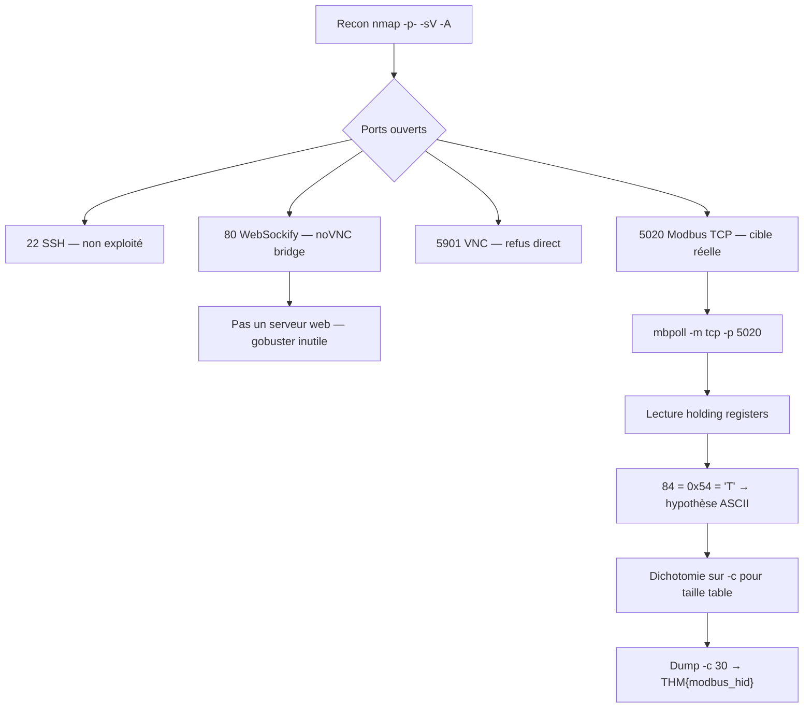

# THM — `brr` : Writeup d'un CTF OT/SCADA

> **Difficulté :** Easy  
> **Domaine :** Operational Technology (OT) / SCADA  
> **Protocoles rencontrés :** Modbus TCP, WebSocket (WebSockify), VNC, SSH  
> **Flag :** `Je ne vais pas vous le donner comme ça quand même`

---

## 1. Contexte et objectif

La box simule un environnement OT (« You've been called in to assess an OT environment »). La description complète est volontairement mystérieuse :

> *The cold never lies, but the SCADA panel guarding it just handed you the keys. Chase the chill all the way down.*

Les indices à retenir avant même de scanner :

- **« SCADA panel »** → un superviseur industriel est en jeu, pas un serveur web classique.
- **« handed you the keys »** → l'accès est probablement faible/absent, on n'aura pas besoin de brute-force.
- **« the cold »** → un process thermique (froid industriel) est impliqué ; le flag fait référence à Modbus, donc les données du process sont lisibles sur le bus.
- **Note THM supplémentaire :** *« You've accessed the SCADA panel, but what next? Look for Modbus details there. »* → le panneau SCADA est l'entrée, Modbus est la cible.

---

## 2. Reconnaissance réseau

### 2.1 Scan Nmap full-range + service detection

```bash
nmap -p- 10.112.160.22 -sV -A
```

Résultat pertinent :


| Port     | Service détecté                          | Version / Détail             |
| -------- | ---------------------------------------- | ---------------------------- |
| 22/tcp   | ssh                                      | OpenSSH 9.6p1 Ubuntu         |
| 80/tcp   | http                                     | **WebSockify Python/3.12.3** |
| 5020/tcp | (non identifié par nmap → `zenginkyo-1`) | Modbus TCP en réalité        |
| 5901/tcp | vnc                                      | VNC protocol 3.8, VeNCrypt   |


### 2.2 Le piège du port 80

Un `curl http://10.112.160.22/` renvoie un `405 Method Not Allowed` :  
WebSockify n'est pas un serveur web, c'est un proxy **WebSocket → TCP**. Il rejette les requêtes HTTP simples (GET sans upgrade) et n'expose aucun contenu. Un `gobuster dir` est donc inutile ici — il échoue immédiatement avec un wildcard 405.

> **Leçon OT/CTF :** Un port 80 qui répond 405 sur un GET normal et tourne sous `WebSockify` n'est pas un serveur web à énumérer, c'est presque toujours un pont **noVNC** (interface VNC dans le navigateur). Gobuster dans ce contexte = perte de temps.

:::info  
Vous le verrez en dessous, mais je ne l'ai pas exploité. Il est cependant possible que ce port ne soit pas là par hasard et soit bien utile à notre enquête. En tout cas il n'est pas nécessaire pour cette box  
:::

### 2.3 Le port 5901 (VNC)

TigerVNC direct sur `10.112.160.22:5901` → connexion refusée. Le serveur VNC n'est exposé qu'à travers le pont WebSocket du port 80 (via un navigateur moderne qui effectue l'upgrade). Le VNC n'est pas la voie d'attaque principale dans ce CTF — il s'agit probablement de l'IHM SCADA visuelle, mais le flag est lisible directement sur le bus Modbus.

### 2.4 Le port 5020

nmap l'étiquette `zenginkyo-1` parce que 5020 est un port IANA officiellement assigné à *zenginkyo-1* (un service financier japonais, cf. [IANA port registry](https://www.iana.org/assignments/service-names-port-numbers)). C'est un **faux ami** : ici, le port 5020 héberge **Modbus TCP**. Le port Modbus standard est 502, mais rien n'oblige à l'utiliser — un serveur Modbus peut écouter sur n'importe quel port.

---

## 3. Modbus TCP — rappels techniques

### 3.1 Le protocole en bref

Modbus est un protocole maître/esclave créé par Modicon (1979, aujourd'hui Schneider Electric). Deux variantes principales :

- **Modbus RTU** : transport série (RS-232 / RS-485), frames binaires, CRC, half-duplex sur un bus partagé. Un maître interroge des esclaves adressés 1–247.
- **Modbus TCP** : transport TCP/IP, port standard 502. Pas de CRC (fiable au niveau TCP), pas d'adresse esclave dans la trame série mais un *Unit Identifier* dans l'ADU. Full-duplex possible.

La trame Modbus TCP (MBAP header + PDU) :

```
| Transaction ID (2) | Protocol ID (2, =0) | Length (2) | Unit ID (1) | PDU (function code + data) |
```

### 3.2 Les quatre tables de données

Un esclave Modbus expose quatre tables distinctes. C'est la première chose à savoir quand on attaque un device :


| Table                 | Type de donnée | Accès            | Code fonction de lecture           |
| --------------------- | -------------- | ---------------- | ---------------------------------- |
| **Coils**             | bit (0/1)      | lecture/écriture | FC 1 (lecture), FC 5/15 (écriture) |
| **Discrete Inputs**   | bit (0/1)      | lecture seule    | FC 2                               |
| **Input Registers**   | mot 16-bit     | lecture seule    | FC 4                               |
| **Holding Registers** | mot 16-bit     | lecture/écriture | FC 3 (lecture), FC 6/16 (écriture) |


### 3.3 Le point de sécurité fondamental

**Modbus n'a aucune authentification, aucun chiffrement, aucune intégrité.** Le protocole part du principe que le réseau est isolé et de confiance (air-gap). En pratique, dans un CTF comme en environnement réel mal segmenté, n'importe quel client TCP peut lire et écrire toutes les tables. C'est exactement ce que la box illustre : pas de mot de passe, pas de clé, juste une lecture.

### 3.4 Les codes d'erreur utiles à connaître

L'esclave répond avec le bit de poids fort du code fonction mis à 1 en cas d'erreur, suivi d'un code d'exception :


| Code exception | Signification        | Implication pratique                           |
| -------------- | -------------------- | ---------------------------------------------- |
| 01             | Illegal Function     | FC non supportée par cet esclave               |
| 02             | Illegal Data Address | Registre hors plage → la table est plus petite |
| 03             | Illegal Data Value   | Valeur invalide                                |
| 04             | Slave Device Failure | Erreur interne                                 |


Ici, `-c 125` → `Illegal Data Address` : la table des holding registers n'a pas 125 entrées, il faut réduire.

---

## 4. Exploitation : lecture du flag dans les holding registers

### 4.1 Outils

- `libmodbus5` : la bibliothèque C de référence (Schneider).
- `mbpoll` : client CLI en Modbus RTU/TCP, parfait pour du one-shot. Install : `apt install mbpoll`.

### 4.1 Premier contact

```bash
mbpoll -m tcp -p 5020 10.112.160.22
# Lit par défaut 1 holding register à l'adresse 1, esclave 1
# → [1]: 84
```

84 en décimal et cette valeur ne bouge pas, c'est ce qui met la puce à l'oreille. Et en décimale, 84 = `0x54` = **'T'** en ASCII. Les flags THM commencent par `THM{`. Coïncidence ? Non.

### 4.2 Déterminer la taille de la table

```bash
mbpoll -m tcp -p 5020 -a 1 -r 1 -c 125 10.112.160.22
# → Read output (holding) register failed: Illegal data address
```

La table est plus petite que 125. En baissant, on trouve que **30 registres** répondent (15 non nuls + 15 à zéro).

### 4.3 Lecture complète du flag

```bash
mbpoll -m tcp -p 5020 -a 1 -r 1 -c 30 10.112.160.22
```

Sortie :

```
[1]:  84   → T
[2]:  72   → H
[3]:  77   → M
[4]:  123  → {
[5]:  109  → m
[6]:  111  → o
[7]:  100  → d
[8]:  98   → b
[9]:  117  → u
[10]: 115  → s
[11]: 95   → _
[12]: 104  → h
[13]: 105  → i
[14]: 100  → d
[15]: 125  → }
[16-30]: 0
```

Flag : **`THM{modbus_hid}`**

### 4.4 Lecture directe en mode string

`mbpoll` supporte l'affichage en caractères avec `-t 4:string` :

```bash
mbpoll -m tcp -p 5020 -a 1 -r 1 -c 15 -t 4:string -1 10.112.160.22
```

Chaque holding register (16-bit) est interprété comme deux caractères ASCII. Suivant l'endianness, le flag peut apparaître directement ou en big/little endian inversé. En cas de doute, le dump numérique reste la méthode la plus fiable.

---

## 5. Autres tables — vérification de l'hypothèse

Pour mémoire, les autres tables sont vides sur cette box :

```bash
mbpoll -m tcp -p 5020 -a 1 -r 1 -t 3 -c 125 10.112.160.22   # input registers → 0
mbpoll -m tcp -p 5020 -a 1 -r 1 -t 0 -c 125 10.112.160.22   # coils → 0
mbpoll -m tcp -p 5020 -a 1 -r 1 -t 1 -c 125 10.112.160.22   # discrete inputs → 0
```

La donnée utile vit uniquement dans les **holding registers**, table 4.

---

## 6. Arborescence d'attaque — résumé



---

## 7. Leçons retenues

1. **Un port 80 qui 405 sur GET + tourne en WebSockify = pont noVNC, pas un web server.** Ne pas énumérer de répertoires, on perd son temps.
2. **nmap peut mal identifier un service OT.** 5020 = `zenginkyo-1` selon l'IANA, mais c'est du Modbus TCP ici. Toujours valider à la main avec un client dédié quand le contexte (OT/SCADA, ports non web) le suggère.
3. **Modbus TCP = zéro authentification.** Si le port est joignable, les données sont lisibles. C'est le défaut de conception historique du protocole, pas un bug.
4. **Les 4 tables Modbus sont indépendantes.** Il faut toutes les tester (coils, discrete inputs, input registers, holding registers) avec `-t 0/1/3/4` parce que la donnée utile peut être dans n'importe laquelle.
5. **Penser ASCII quand on lit des registres 16-bit.** Un registre qui vaut 84/72/77/123 doit immédiatement faire tiquer : ce sont des codes ASCII de `THM{`. Le réflexe est de convertir en hex puis en caractère.
6. **« Illegal data address » = la table est plus petite que demandé.** Utiliser la dichotomie sur `-c` pour trouver la taille exacte plutôt que de tâtonner.
7. **Les hints de THM sont à lire littéralement.** « Look for Modbus details there » + « handed you the keys » = pas de bruteforce, juste une lecture de bus.

---

## 8. Outils et références

### Outils utilisés

- `nmap` (7.99) — reconnaissance.
- `curl`, `telnet` — validation manuelle du port 80.
- `mbpoll` (1.5.2) — client Modbus TCP, lecture des holding registers.
- `libmodbus5` (3.1.11) — bibliothèque sous-jacente.

### Références

- **Modbus Specifications** — Modbus Organization : [https://www.modbus.org/specs.php](https://www.modbus.org/specs.php)
- **Modbus TCP — Application Layer Spec** — Schneider Electric.
- **IANA Service Name &amp; Port Number Registry** — [https://www.iana.org/assignments/service-names-port-numbers](https://www.iana.org/assignments/service-names-port-numbers)
- **WebSockify** — GitHub : [https://github.com/novnc/websockify](https://github.com/novnc/websockify)
- **noVNC** — GitHub : [https://github.com/novnc/noVNC](https://github.com/novnc/noVNC)
- **mbpoll** — [https://github.com/epsilonrt/mbpoll](https://github.com/epsilonrt/mbpoll)

---

## 9. Commandes reproductibles (cheat sheet)

```bash
# Recon full-range
nmap -p- 10.112.160.22 -sV -A

# Vérifier que le port 80 n'est pas un web server classique
curl -i http://10.112.160.22/

# Modbus TCP — lecture 1 holding register (défaut)
mbpoll -m tcp -p 5020 10.112.160.22

# Trouver la taille de la table (dichotomie sur -c)
mbpoll -m tcp -p 5020 -a 1 -r 1 -c 30 -1 10.112.160.22

# Dump complet en mode one-shot
mbpoll -m tcp -p 5020 -a 1 -r 1 -c 30 -1 10.112.160.22

# Dump en mode string
mbpoll -m tcp -p 5020 -a 1 -r 1 -c 15 -t 4:string -1 10.112.160.22

# Vérifier les autres tables
mbpoll -m tcp -p 5020 -a 1 -r 1 -t 3 -c 125 -1 10.112.160.22   # input registers
mbpoll -m tcp -p 5020 -a 1 -r 1 -t 0 -c 125 -1 10.112.160.22   # coils
mbpoll -m tcp -p 5020 -a 1 -r 1 -t 1 -c 125 -1 10.112.160.22   # discrete inputs

# Balayer les unit IDs (esclaves) 1 à 10
for u in $(seq 1 10); do
  echo "=== Unit $u ==="
  mbpoll -m tcp -p 5020 -a $u -r 1 -c 30 -1 -o 1 10.112.160.22
done
```
