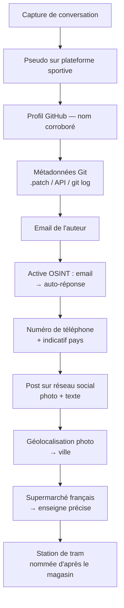

# OSINT — Tracer un hacker retiré

> **Difficulté :** Medium  
> **Type :** OSINT  
> **Skills :** Metadata extraction, active OSINT, social media geolocation, public footprint analysis  
> **Date :** 02/09/2026

## Contexte

Le scénario : un hacker retraité a laissé des traces de son identité éparpillées sur l'internet ouvert. Le point de départ est une capture d'écran de conversation dans laquelle il mentionne un profil sur une plateforme de suivi d'activités sportives. À partir de là, il faut remonter la piste : profils publics, détails oubliés, petites erreurs qui se connectent en une chaîne cohérente. Le challenge comporte explicitement une étape d'active OSINT — interagir avec l'infrastructure découverte fait partie du challenge contrôlé.

:::info  
J'ai volontairement masqué toute information compromettante du challenge. C'est horrible de faire une recherche google et se faire directement spoil par des golios qui ont mis toutes les réponses dans leur blog.  
Vous trouverez donc ici la méthodologie, mais aucune réponse. Bonne chasse !  
:::

## Étape 1 — La capture de conversation

L'image fournie montre une conversation entre deux utilisateurs sur une plateforme de messagerie. L'un des deux, le hacker retiré, explique qu'il a changé de vie : fini le hacking, place au vélo et à la randonnée. Il partage un lien vers son profil sur une plateforme de suivi d'activités outdoor.

Premier pivot identifié : le profil sportif. Le pseudo de l'utilisateur sur cette plateforme donne un nom potentiel — mais rien ne dit que c'est son vrai nom. Il faut corroborer.

## Étape 2 — Corroboration du nom via GitHub

Depuis le site donné dans la conversation, on récupère le profil github de l'utilisateur. La bio du profil confirme le changement de vie (« ex-hacker », « starting a security consulting firm ») et le nom affiché correspond à celui trouvé sur la plateforme sportive.

À ce stade, on a un nom de famille et un prénom. Mais le challenge demande aussi une adresse email, un numéro de téléphone, une ville et un arrêt de tram. Le nom ne suffit pas.

## Étape 3 — Extraction d'email depuis les métadonnées Git

C'est ici que la plupart des gens bloquent : l'interface web de GitHub n'affiche pas l'email de l'auteur d'un commit, seulement son pseudo. Mais l'email est bel et bien présent dans les métadonnées de chaque commit Git, dans le champ `author` au format `Nom <email>`.

Trois méthodes pour le révéler :

**Méthode 1 — Le `.patch` (la plus rapide)**

GitHub génère un patch au format mbox pour chaque commit. Il suffit d'ajouter `.patch` à l'URL d'un commit :

```
https://github.com/<user>/<repo>/commit/<sha>.patch
```

Le tout premier champ est une ligne `From: Nom <email>` contenant l'email brut de l'auteur.

**Méthode 2 — `git log` après clonage**

```bash
git clone https://github.com/<user>/<repo>.git
cd <repo>
git log --format="%an <%ae>"
```

Affiche `Nom <email>` pour chaque commit. Ajouter `--all` si le repo a plusieurs branches ou tags.

**Méthode 3 — L'API REST GitHub**

```bash
curl -s https://api.github.com/repos/<user>/<repo>/commits | \
  jq '.[].commit.author'
```

Chaque commit contient un objet `commit.author.email`. C'est la même donnée que le `.patch`, en JSON. Avantage : scriptable, pas besoin de cloner.

Sur ce challenge, le commit initial révèle l'email de l'auteur. Le nom d'auteur du commit (`<quelquechose>-cell`) est aussi un indice — le suffixe `-cell` peut indiquer un compte lié à la téléphonie, à suivre pour la suite de la piste.

:::note  
Sur GitHub, il faut toujours chercher l'**author**, pas le **committer**. Le committer est souvent `GitHub <noreply@github.com>` quand le commit est fait via l'interface web. L'email réel est dans le champ auteur.  
:::

## Étape 4 — Active OSINT : le numéro de téléphone

Une fois l'email récupéré, la tentation est forte de chercher le numéro via des people-search sites (Spokeo, BeenVerified, etc.). C'est une mauvaise direction pour plusieurs raisons : ces sites agrègent des données réelles, pas des données de CTF, et dans un vrai engagement on n'utilise jamais ce genre de service sans autorisation.

Le challenge précise explicitement qu'il comporte une étape d'active OSINT. Le pattern est clair : si le challenge a prévu une interaction qui déclenche une réponse automatisée, il faut interagir.

L'email trouvé est une adresse Gmail valide. En lui envoyant un message, on déclenche une réponse automatique d'absence (out-of-office) signée par notre cible, contenant dans la signature un numéro de téléphone avec un indicatif international.

:::warning  
L'active OSINT — envoyer un email, un SMS, interagir avec une infrastructure découverte — peut alerter la cible dans un contexte réel. Ce type d'action ne se fait qu'avec autorisation explicite. Dans le cadre d'un CTF contrôlé, l'interaction est prévue par le challenge.  
:::

## Étape 5 — Identification de la ville

L'indicatif du numéro de téléphone donne le pays, mais pas la ville. La plateforme de suivi sportif est vide — aucune trace enregistrée. Il faut chercher ailleurs.

La cible a un compte sur un réseau social (type X/Twitter). Un post daté du jour demandé par le challenge mentionne un trajet en tram et un café dans un « supermarché français ». Le post contient une photo de rue.

Deux éléments à exploiter dans ce post :

1. **La photo** — Avec une recherche google-search et en recherchant l'enseigne de la photo on tombe directement sur la ville.
2. **Le texte du post** — « supermarché français » est un adjectif précis, pas une coïncidence. Il désigne une chaîne d'origine française présente dans le pays. Ce n'est pas n'importe quel supermarché et c'est le dernier indice qui permet de récupérer la dernière réponse au challenge : l'arrêt de tram.

## Étape 6 — L'arrêt de tram

Une fois le supermarché identifié et géolocalisé, il reste à déterminer à quel arrêt de tram la cible est descendue. C'est l'étape où la précision de l'indice « supermarché français » prend tout son sens : la station de tram qui dessert ce supermarché porte souvent le nom du magasin dans son intitulé. Il n'y a pas douze stations candidates — il n'y en a qu'une, celle qui est nommée d'après l'enseigne.

Le raisonnement complet :

1. « French supermarket » → identifier la chaîne (origine française présente dans le pays)
2. Chercher cette enseigne dans la ville identifiée
3. Chercher l'arrêt de tram le plus proche sur une carte de transport en commun
4. L'arrêt porte le nom du supermarché — c'est la réponse

## Résumé de la chaîne d'investigation



## Leçons retenues

1. **Les métadonnées Git ne sont pas visibles dans la GUI GitHub, mais elles sont publiques.** Le `.patch` est la méthode la plus rapide. L'API REST est la plus scriptable. Le `git log` après clonage est la plus complète. Trois méthodes, même donnée : l'email de l'auteur du commit.
2. **Author vs Committer** : sur GitHub, le committer est souvent `noreply@github.com` (commit via interface web). L'email réel est dans le champ auteur. Ne jamais chercher l'email du committer.
3. **L'active OSINT fait partie de certains challenges.** Si le challenge le dit explicitement, il faut interagir avec l'infrastructure découverte. Envoyer un email à une adresse leakée peut déclencher une réponse automatique contenant la prochaine information.
4. **Les people-search sites (Spokeo, BeenVerified) ne sont pas la bonne direction en CTF.** Ils agrègent des données réelles, pas des données plantées par les créateurs de challenge. Et dans un vrai engagement, leur utilisation pose des questions légales et éthiques.
5. **Un post sur réseau social contient souvent plusieurs indices.** Le texte (« French supermarket ») et l'image (panneau géolocalisable) sont deux pistes indépendantes qui se recoupent. Il faut exploiter les deux.
6. **« French supermarket » n'est pas un adjectif décoratif.** Dans un CTF OSINT, chaque mot d'un indice est délibéré. L'adjectif « français » permet d'identifier la chaîne précise, donc l'adresse précise, donc la station précise. Sans cet adjectif, il y aurait des dizaines de supermarchés candidats.
7. **Les noms de stations de transport public reflètent souvent les points d'intérêt voisins.** Une station nommée d'après un supermarché élimine l'ambiguïté — il n'y a qu'une réponse possible.

## Outils utilisés

- **Inspection manuelle** — analyse de la capture de conversation, navigation des profils publics
- **GitHub REST API** — récupération des commits et extraction de l'email auteur
- **`.patch` URL** — révélation des métadonnées de commit sans clonage
- **Client mail** — envoi d'un email pour déclencher la réponse automatique
- **Google Maps** — géolocalisation du panneau visible sur la photo et identification du supermarché
- **Réseau social (X/Twitter)** — analyse du post daté et de sa photo
- **Carte des transports en commun** — identification de la station de tram
