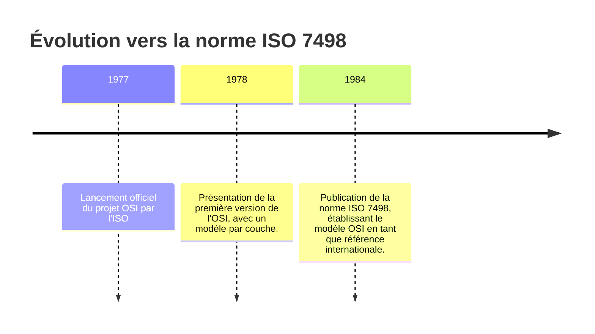
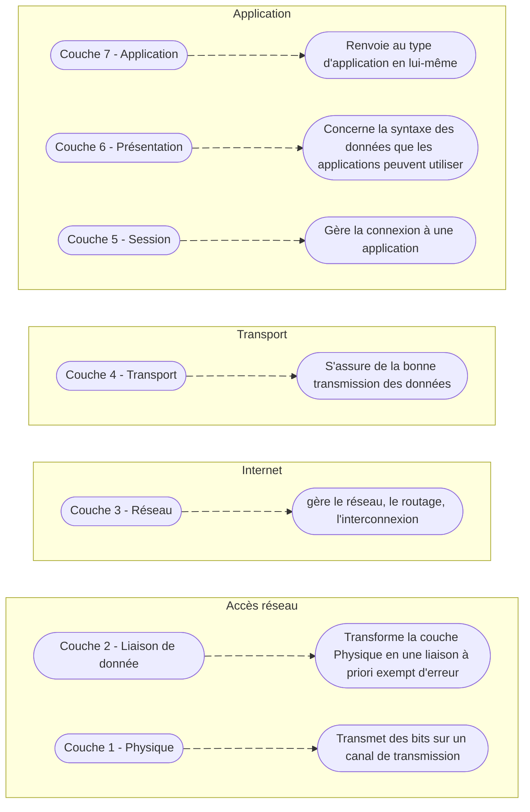

# Histoire du modèle OSI
Le **modèle OSI** ou **O**pen **S**ystem **I**nterconnection est une norme de communication de tous les systèmes informatiques en réseau. 

Ce modèle est né d'un besoin crucial dans les années 1970 : permettre l'interopérabilité entre des systèmes informatiques hétérogènes, à une époque où les réseaux étaient dominés par des architectures propriétaires comme [SNA](https://fr.wikipedia.org/wiki/IBM_Systems_network_architecture) (de IBM) ou [DECnet](https://fr.wikipedia.org/wiki/Decnet) (Digital Equipement Corporation).

## Contexte
Durant les années 1970, plusieurs initiatives nationales et industrielles ont émergé pour développer des réseaux informatiques. Parmi elles, le réseau CYCLADES en France, dirigé par **Louis Pouzin**, a introduit le concept de **datagramme**, influençant le développement ultérieur de TCP/IP. Cependant, l'absence de normes communes rendait difficile la communication entre systèles de différents fabricants.
Pour remédier à cela, L'**O**rganisation **I**nternationale de **N**ormalisation (**ISO**) a lancé en 1977 le projet OSI, visant à définir un cadre standardisé pour l'interconnexion de systèmes ouverts.

# Le modèle OSI en Détail
## Les différentes couches
### Couche Physique
* **rôle** : Transmet les bits bruts sur un support physique (câble, fibre optique, ondes radio). Elle définit les caractéristiques électriques, mécaniques et procédurales pour activer, maintenir et désactiver la connexion physique.
* **Responsabilités** :
	* Définition des caractéristiques électriques, mécaniques et procédurales pour activer, maintenir et désactiver la connexion physique.
	* Conversion des données numériques en signaux électriques, optiques ou radio.
	* Spécification des connecteurs, câbles, tensions, synchronisation et topologies physiques.
* **PDU** : BIT / Synbole
* **Exemples** : Ethernet (100BASE-T), USB, Bluetooth, Wi-Fi (IEEE 802.11)

### Couche liaison de donnée
* **Rôle** : Assure une communication fiable entre deux nœuds directement connectés. Elle gère l'encapsulation des données en trames, le contrôle d'accès au média, la détection et la correction d'erreurs de transmission.
* **Responsabilités** :
	* Encapsulation des données en trames.	
	* Contrôle d'accès au média (MAC) pour éviter les collisions.	
	* Détection et correction des erreurs de transmission.	
	* Gestion des adresses physiques (MAC).
* **PDU** : Trame
* **Exemples** : Ethernet (IEEE 802.3), PPP, HDLC, Wi-Fi (IEEE 802.11), ARP

### Couche Réseau
* **Rôle** : Gère l'adressage logique et le routage des paquets à travers des réseaux multiples. Elle détermine le chemin optimal pour acheminer les données du point d'origine à la destination finale.
* **Responsabilités** :
	* Adressage logique (par exemple, adresses IP).
	* Routage des paquets via les routeurs.
	* Fragmentation et réassemblage des paquets si nécessaire.
* **PDU** : Segment (TCP) / Datagramme (UDP)
* **Exemples** : TCP, UDP, SCTP

### Couche Session
* **Rôle** : Établit, gère et termine les sessions entre applications. Elle synchronise le dialogue entre les applications et gère l'échange de données en définissant des points de synchronisation.
* **Responsabilités** :
	* Établissement, gestion et terminaison des sessions.
	* Synchronisation des échanges et gestion des dialogues.
* **PDU** : Données
* **Exemples** : RPC, NetBIOS, SMB

### Couche Présentation
* **Rôle** : Assure la traduction, le chiffrement et la compression des données. Elle convertit les données du format utilisé par l'application en un format commun pour la transmission, et vice versa.
* **Responsabilités** :
	* Conversion de formats de données (par exemple, EBCDIC en ASCII).
	* Chiffrement et déchiffrement des données.
	* Compression et décompression des données.
* **PDU** : Données
* **Exemples** : SSL/TLS, JPEG, MPEG, ASCII, EBCDIC

### Couche Application
* **Rôle** : Fournit des services réseau aux applications de l'utilisateur final. Elle permet aux applications d'accéder aux services du réseau et définit les protocoles utilisés par les applications pour la communication.
* **Responsabilité** :
	* Interface avec les applications utilisateur.
	* Fourniture de services tels que le courrier électronique, le transfert de fichiers, la navigation web.
* **PDU** : Données
* **Exemples** : HTTP, FTP, SMTP, DNS, SNMP

## Son utilisation Aujourd'hui
Bien que le modèle OSI ne soit pas directement implémenté dans les infrastructures réseau modernes, il demeure un outil conceptuel fondamental pour comprendre, concevoir et dépanner les systèmes de communication. Sa structure en couches offre une approche méthodique pour analyser les interactions complexes entre les différentes composantes d'un réseau.

Dans le contexte actuel, dominé par la suite de protocoles **TCP/IP**, le modèle OSI sert de référence pédagogique et professionnelle. Il facilite la segmentation des responsabilités, permettant ainsi aux ingénieurs et techniciens de **cibler précisément** les niveaux concernés lors de la résolution de problèmes ou de la mise en œuvre de nouvelles solutions. Par exemple, lors d'un dysfonctionnement réseau, identifier la couche impliquée—qu'il s'agisse de la couche physique pour des problèmes de câblage ou de la couche application pour des erreurs logicielles—accélère le diagnostic et la correction.

En somme, le modèle OSI reste un cadre de référence essentiel, offrant une vision structurée des communications réseau et contribuant à l'efficacité opérationnelle des professionnels du domaine.

