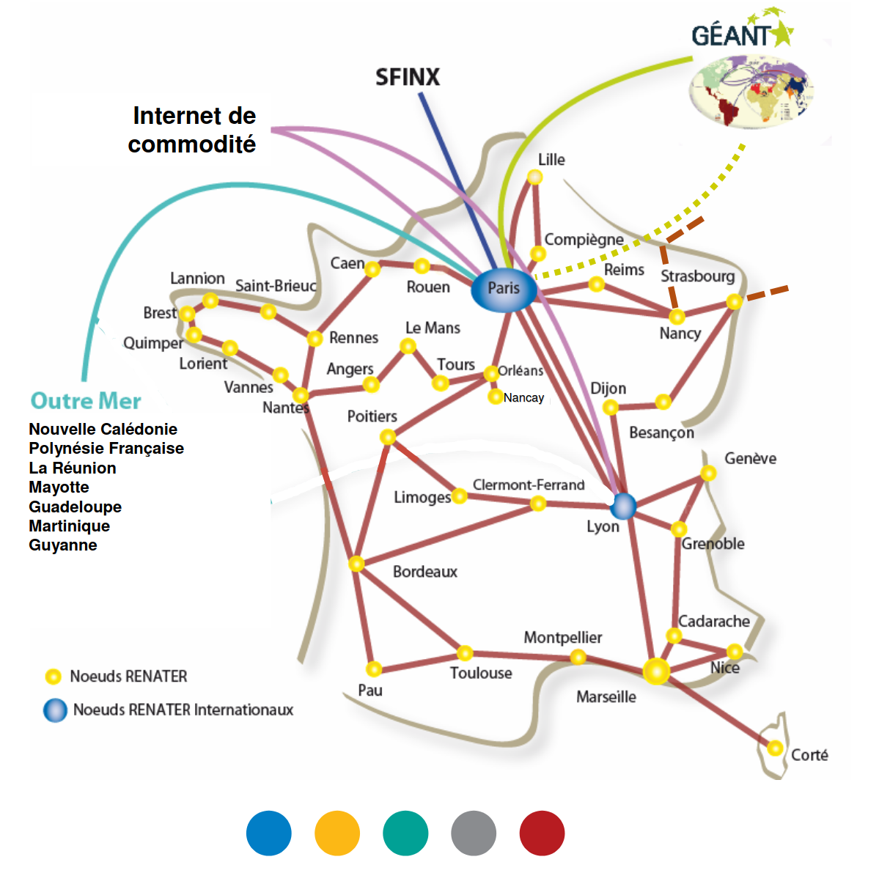
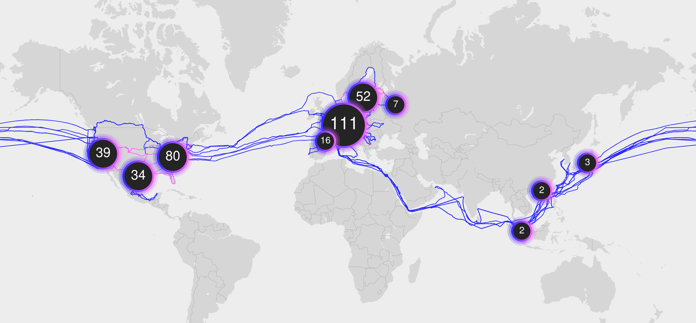
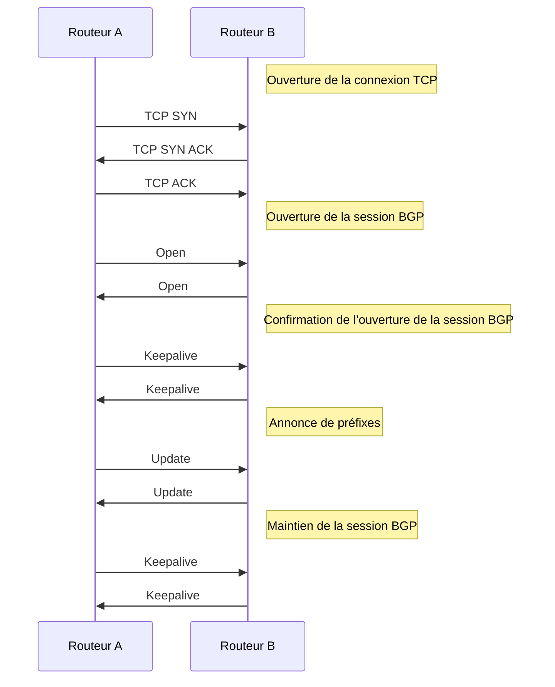

# Introduction à la structure d'internet
Avant de rentrer dans le vif du sujet, il faut comprendre quelques éléments important. Déjà, BGP est un protocole purement opérateur, leur configuration sera principalement politique, c'est à dire que les liens mis en place dépendent des contrats signés entre des entreprises.

Comme nous l'avons vu dans le [Protocole MPLS](./Protocole_MPLS), les opérateurs d'internet font en sorte que dans leurs réseaux, MPLS soit utilisé afin que le temps pris à parcourir une table de réseau IP soit optimisé le plus possible.

## La problématique du routage internet
Mais avant tout, on a un problème actuellement avec "internet". La question [c'est quoi internet ?](https://docs.bastienbonora.fr/blog/C-est-quoi-internet) prend tout son sens ici. Ne vous êtes vous jamais posé la question "par où passent mes données lorsque je vais sur internet ?".

Prenons un exemple simple avec **FREE** qui est un opérateur internet **Français** (ça prend tout son sens). Vous souscrivez donc à un abonnement internet et free vous relie donc à internet.
Mais comment ça se passe, si par exemple vous allez sur un VPN qui est sur le continent Américain. Est-ce que c'est Free qui est directement connecté au VPN ? Est-ce que c'est Free qui vous connecte au VPN ?

## Une réalité plus complexe
 
Conrètement, c'est plus comme ça :

En réalité, les opérateurs disponsent de connexion entre eux (et donc de contrats entre eux). Si jamais on veut aller sur un VPN sur le continent Américain, on passe donc par Free (on y est directement connecté), puis par un autre opérateur (probablement TeliaSonera) et enfin un autre opérateur sur le continent américain qui relie notre VPN à internet.

Cela signifie plusieurs choses :
* Les opérateurs disposent de plusieurs interconnexions avec d'autres opérateurs
* Pour joindre une même destination, il existe plusieurs chemins

On parle alors de routage **externe**. Lorsque l'on maîtrise notre propre réseau, on utilise un protocole de routage interne tel que OSPF ou RIP. Cela nous permet dans notre réseau de router des paquets d'un bout à l'autre de **notre réseau**.

Cependant, là on parle que l'on a pleins de réseaux différents que l'on doit traverser. Chacun de ces réseaux doivent communiquer entre eux afin de dire par exemple "Je suis TeliaSonera, pour joindre google, donne moi ce paquet ici et je gère la suite". Et pour gérer cette communication, on utilise ce que l'on appelle un protocole de routage **Externe** (vu que l'on route sur un réseau qui n'est pas le notre).
Et on retrouve donc quelques spécificités :
* La complexité des réseaux internes traversés et masqué (vu que les réseau MPLS commutent, on ne voit pas d'IP de routeur, on ne peut donc pas voir quels équipements ont été traversés)
* Chaque résrau traversé est considéré comme une seule et unique entité

Maintenant on peut se demander :
* Qui propage ces informations ? Quel protocole le permet, et quels mécanismes sont mis en oeuvre ?
* Quel est le meilleur chemin à utiliser ? Qui le décide et sur quels critères ?

# Notion de systèmes autonomes

Les réseaux d'opérateurs sont appelés **AS** : **S**ystèmes **A**utonomes (ou *Autonomous Systems* en Anglais). Concrètement, c'est un ensemble de réseaux connectés qui sont gérés par la même entité juridique. L'AS se comporte alors comme une seule entité pour le routage externe.

Par exemple, votre fournisseur internet est un AS à part entière. Pour Renater, en France, leur AS ressemble à ceci :

Leur AS possède des liens direct avec d'autres opérateurs et permet de lier les différentes universités et lieu de recherche en France (et outre mer).

On peut alor faire des différence entre les différents AS :
* Des AS qui permettent à des clients comme des entreprises ou vous par exemple
* Des AS qui permettent à d'autres AS de s'interconnecter

On retrouve donc des "opérateurs d'opérateurs" comme TeliaSonera :

C'est un schéma de tous les liens physiques qu'ils possèdent. Ces liens sont alors utilisés par tous leurs clients qui sont des opérateurs (Free, Orange, SFR etc...).

## Numéros d'AS

Afin que chacun des AS puissent s'identifier sur internet, il est nécessaire de mettre en place un moyen de tous les identifier. Le numéro d'AS, codé sur 16 bits qui est géré par l'**IANA**(**I**nternet **A**signed **N**umbers **A**uthority). En Europe, la gestion est assignée aux **RIPE** (**R**egional **I**nternet **R**egistry) :

On retrouve par exemple Renater qui correspond au numéro `2200`.

## La taille d'internet Aujourd'hui
On retrouve certains schémas sur le nombre d'AS présent sur tout internet : 

On peut donc estimer que l'on a un peu plus de 100 000 AS au total aujourd'hui sur internet. Certaines statistiques sont également intéressantes pour hiérarchiser les opérateurs :
* 80% des ces AS sont des réseaux terminaux (là où se trouvent les clients comme les entreprises ou les particuliers).
* 64% ont entre un ou deux voisins (c'est-à-dire un AS qui est directement connecté à lui).
* 1% ont plus de 100 voisins
* 46 ont plus de 1000 voisins

En regardant ces chiffres, on pourrait presque dire qu'il existe des "opérateurs d'opérateurs d'opérateurs".

## Interconnexion des AS

Comme j'en avais parlé au tout début, concrètement, avec BGP, tout est possible, cependant ce protocole étant utilisé pour des opérateurs, des contrats définissent quels liens peuvent être utilisés et de quelles manières. C'est ensuite aux techniciens de mettre en place ces liens afin qu'ils respectent ces contrats.

## Transit
Les contrat de transit sont des accords commerciaux entre un client et un fournisseur. Dans ce cas, le fournisseur assure l'acheminement du trafic du client vers ou depuis le reste d'internet.

## Peering
Ici on se retrouve avec un contrat simple dans lequel le lien entre les deux AS n'a pas de facturation, c'est purement un accord politique entre deux entreprises qui les avantages les deux.

## Points d'échanges 
Il existe également des points d'échange dans lesquels on peut s'interconnecter avec d'autres AS. Ce sont des structures dans lesquelles des connexion d'un grand nombre d'AS se rasssemblent afin de faciliter l'interconnextion de ces structures. [FranceIX](https://www.franceix.net/fr/) est un acteur français qui permet de faire ceci, on y retrouve également la liste des opérateurs le lieu de la connexion ainsi que le débit.

# Principes du routage externe, Stratégies de routage
Bon, maintenant que l'on a un peu de théorique, on rentre dans le vif : la technique.

## Annonce de routage externe et tables de routage
On considère un environnement très simple avec deux AS qui communiquent :

Donc :
* Chaque AS gère se spréfixes @ip/netmask
* Le routage externe permet de rendre joignable ces réseaux par internet (ici uniquement par l'AS A et B).

Grâce à ce système, le routeur de l'**AS A** annonce ses préfixes réseaux à son voisin de l'**AS B**. Ainsi, le routeur de l'AS B peut mettre à jour sa table de routage, ce qui lui permet de router du trafic vers le routeur de l'AS A.

## Annonce de routage externe et tables de routage
Dans un premier temps, il faut que nos annonces soient relayés avec nos préfixes. C'est une fonction importante du routage externe.

Ce relai permet à un AS de propager l'information de ses préfixes en ayant un nombre réduit de voisins directs. Ici, l'AS C possède l'information que l'AS A est accessible via l'AS B.

De proche en proche, l'information se propage pour atteindre tous les AS d'internet.

Ainsi, pour les tables de routage de chacun des routeurs, on se retrouve avec quelque chose comme :

Ainsi, si un équipement de l'AS C veut aller communiquer avec un équipement de l'AS A, il faut qu'il envoie ses informations à l'AS B, ce sera ensuite à lui de s'organiser pour que le traffic soit correctement transmis.

## Stratégies de routage
Cette fonctionnalité est l'une des principales du routage externe. Cela consiste à **contrôler** l'envoi des annonces de préfixes et le traitement des annonces reçues.
Une stratégie de routage est **décidée par chacun des AS**.

En reprenant notre schéma précédent, on peut considérer que A choisisse alors de masquer un de ses réseaux, cela aura pour conséquence de bloquer la rediffusion de son réseau jusqu'à C. Et alors deux entrées identiques dans une table de routage peuvent totalement faire changer la manière dont le trafic est routé.

## Stratégies de routage : Gérer le trafic entrant

Maintenant, on peut aller plus loin encore et décider l'endroit par lequel on veut que le trafic entrant passe (idem pour le réseau sortant).

On modifie un petit peu notre schéma en rajoutant ujn lien entre l'**AS C** et l'**AS E**

Désormais les choses se compliquent. Ce qui se passe c'est que l'AS A :
* l'AS A décidé de diffuser son réseau `192.168.1.0/24`, ici en *vert* uniquement en directioon de l'AS D. Ce qui a eu pour conséquence de fournir ce nouveau chemin à l'entièreté des AS connectés.
* l'AS A à l'inverse décide de diffuser son réseau `10.1.0.0/16` uniquement à l'AS B, qui diffuse alors l'information.

Donc même si l'AS B est colé à l'AS A, pour joindre son réseau `192.168.1.0/24` il devra faire tout le tour comme le montre le chemin vert.

Cela montre plusieurs choses :
* Premièrement, on possède un contrôle total sur nos réseaux. Cela ne change pas
* Le trafic sortant / entrant dans notre AS n'est plus forcément sous notre contrôle. Il peut être dépendant des choix des AS alentours

Et donc, il faut que chaque opérateur ait le contrôle sur son infrstructure pour router correctement les paquets en entrée et sortie de son AS. A lui de mettre en place des protocoles comme [MPLS](./Protocole_MPLS) pour commuter en interne les paquets.

# Principes du protocole BGP

Bien évidemment, pour échanger des informations sur le réseau, il faut donc établir une sesison entre les deux équipements.
Cela se passe sur le port `TCP/179`. Ce message permet d'échanger les différentes informations de routage entre les équipements.

## Sessions iBGP et eBGP

Comme on l'a vu, dans BGP, on arrive à router des paquets hors de notre réseau et à récupérer les informations des autres réseaux d'internet.

Cependant :
* Lorsqu'un routeur de bordure reçoit de nouvelles informations, comment l'AS entier reçoit l'information
* Et donc comment, les AS voisins ont reçoivent l'information.

Pour se faire, on doit faire une différence entre les sessions BGP que l'on a en **interne** et celles que l'on a en **externe** :
* Les routeurs de bordures doivent établir des sessions entre eux pour partager les nouvelles informations de routage qu'ils reçoivent
* Les routeurs de bordures doivent établir des sessions avec leurs voisins externe pour récupérer des nouvelles informations

Refaisons de petits schéma, c'est toujours plus simple :

Ici, on a l'AS A qui diffuse un nouveau réseau. Ce dernier se partage avec son AS voisin qui à son tour partage avec tous les routeurs de proximité la nouvelle route qu'il possède et enfin l'information est relayé aux AS voisins de l'AS B.

On a donc deux sessions distinctes :
> En considérant que nous sommes l'AS B :

* Les **sessions internes** entre B1-B2 et B1-B3.
* Les **sessions externes** entre B1-A1, B2-C1 et B3-D1

Ainsi, le réseau de l'AS A est diffusé dans tout l'AS B ainsi qu'à ses voisins.

## Le protocole

BGP est constitué de 4 messages distincts, un servant à l'**établissement de session**, à **son maintien**, à l'**échange de préfixes** et à la **fermeture de la connexion**.

Le message **OPEN** :
* c'est le message qui permet d'ouvrir la session BGP
* Il permet d'annoncer les numéros d'AS et les identifiants des routeurs. L'ouverture de la session fait suite à un accord entre les deux AS

Le message **KEEPALIVE** :
* Il est envoyé périodiquement afin de maintenir la session BGP
* Celle-ci est fermée si aucun message KeepAlive n'est reçu pendant une période de temps définie.

Le message **NOTIFICATION** :
* il sert à dignaler des erreurs, la session est immédiatement fermée suite à l'émission de ce message

Le message **UPDATE** :
* Il contient la liste des préfixes qu'un routeur souhaite annoncer ou supprimer (ne plus envoyer l'annonce équivaut à le supprimer)
* Contient différents attributs que l'on va voir un peu plus [loin](#1)

On peut représenter cela par : 

# Attributs du protocole BGP
Au sein de BGP, on va pouvoir s'amuser à mettre des arguments pour modifier le comportement de notre réseau.

## AS_PATH
:::note
attribut obligatoire
:::

Cet argument est annoncé par chaque routeur et permet de renseigner le chemin des AS

Concrètement, au fur et à mesure que l'information se diffuse au sein de BGP, on ajoute par quel AS on passe, par exemple : 

La valeur de l'AS B est ajoutée lorsque l'on sort de cette AS. Le routeur de sortie ajoute son AS dans la trame.

En continuant, la valeur de l'AS_PATH contiendra pour **chaque préfixe** l'ensemble des numéros d'AS à traverser pour atteindre le dit préfixe.

Ainsi, un AS peut choisir de passer par un chemin passant par plus ou moins d'AS 
:::note
Sachant que l'on ne connaît pas la complexité des réseau traversé, un chemin avec plus d'AS traversé pourrait s'avérer être plus rapide qu'un chemin en comportant moins. 

C'est à l'AS de choisir quel chemin prendre.
:::

## NEXT_HOP
:::note
attribut obligatoire
:::
Celui-ci est plustôt simple, Lorsqu'un AS relaie une diffusion BGP, il va ajouter son propre AS en tant que *destination suivante* En reprenant notre schéma, on se retrouve avec quelque chose comme :

:::note
On voit que pour B2, le next hop est toujours A1, la raison est que l'on considère un AS comme étant une entité unique, donc A1 es le prochain saut sur la route vers l'AS A

Ou alors, on peut dire à B1 d'ajouter son adresse IP dans le NEXT_HOP
:::

## LOCAL_PREF (choix de la sortie)
:::note
Cet attribut est facultatif.
::::

Cet attribut permet de contrôler la route empruntée par le trafic en sortie d'un AS?
On suppose que l'AS C a reçu deux annonces de routage pour le préfixe 10.1.0.0/16 :

Ici, on a :
* C1 qui ajoute un LOCAL_PREF à 300 dans les annonces iBGP, alors que C2 en ajoute une de 200
* Les routeurs C1, C2 et C3 recoivent les deux informations et sélectionnent celle qui a la **préférence la plus élevée**

Cela signifie que le trafic sortant pour le préfixe `10.1.0.0/16` sortiront de l'as C par C1 même si C2 possède une route identique.

## MED (choix de l'entrée)
:::note
Cet attribut est facultatif
:::

On vient de voir que l'on peut définir vers quel routeur on veut sortir de notre AS pour un préfixe spécifique. Eh bien on peut faire exactement la même chose mais pour le trafic entrant.

Déjà MED = **M**ulti-**E**xit **D**iscriminator

Cet attribut est utilisé lorsque deux AS ont mis en place plusieurs liens d'interconnexion. Dans ce cas :
* L'as A choisit de diffuser un MED à 2000 sur A1 et 1000 sur A2.

Les routeurs de l'AS B disposent alors des deux informations et sélectionnent celle qui a l'attribut MED le plus petit.

Ainsi, tout le trafic de l'AS B à destination de 10.1.0.0/16 arrivera vers A via le lien A2-B2.

:::note
Cela fonctionne, cependant, l'AS B ayant la pleine maîtrise de son réseau peut tout simplement refuser ces attributs et n'en faire qu'à sa tête
:::

## ORIGIN
:::note 
Attribut obligatoire
:::

C'est un attribut qui permet de décrire l'origine de l'information de routage pour le préfixe annoncé et il y a trois valeurs possible :
* 0 = le **préfixe annoncé** par BGP est **interne** à l'AS qui a généré l'information
* 1 = le **préfixe annoncé** par BGP est **externe** à l'AS qui a généré l'information
* 2 = l'origine de l'information est incomplète

Pour un même préfixe, une annonce avec l'attribut ORIGIN à 0 est préférée à une annonce avec l'attribut à 1 qui à son tour est préférée à 2.

## COMMUNITIES
:::note
attribut optionnel
:::

Cet attribut permet d'appliquer une même stratégie à un groupe de préfixe annoncé par BGP
* Cette stratégie peut consister à contrôler l'acceptation, le relayage ou la modification des attributs du groupe de préfixes
* L'objectif principal est la simplification de configuration des routeurs BGP

On peut faire des communautés par types de clients, par région ou avec des accord d'échange de trafic entre les voisins.

**Exemple de communauté prédéfinie :**
* **no-export** : les préfixes annoncés avec une telle communauté **ne sont pas relayés** vers les voisins eBGP

