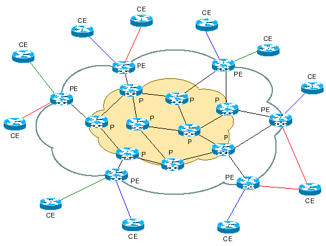
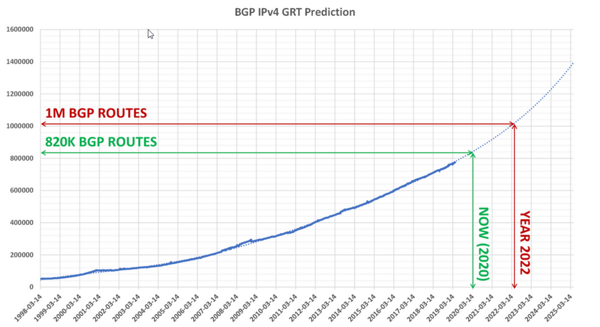
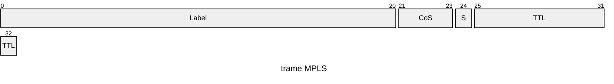
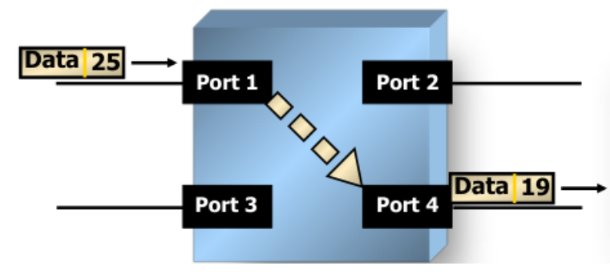

# Le protocole MPLS

## Une petite définition
Le protocole MPLS, signifie **M**ulti**P**rotocol **L**abel **S**witching. Et ils nous permet en gros de connecter des de manière très rapide deux sites distants. On va venir dans les détials afin d'expliquer cela.

## Quel objectif ?
L'objectif de ce protocol est de permettre la connexion de deux appareils distant bien plus rapidement qu'avec la manière traditionnelle.

## Un peu de vocabulaire
On a un peu de vocabulaire spécifique lorsque l'on parle de ce protocole. Je rentrerais dans les détails un peu plus loin.
* **FEC** : **F**orwarding **E**quivalence **P**ath : Cela correspond à l'ensemble des paquets qui suivent un même LSP.
* **LSP** : **L**abel **S**witch **P**ath : C'est le chemin suivi par tous les paquêts d'un même FEC.
* **LSR** : **L**abel **S**witching **R**outer. Un LSR est généralement un routeur qui :
	* Commute le paquet IP d'une interface vers une autre grâce à une table de commutation (opération *swap*)
	* Est capable de traiter les paquets IP nativement
	* Exécute un ou plusieurs algorithmes de routage tel que RIP, OSPF, BGP etc...
	* Effectue des contrôles **uniquement** sur l'en-tête MPLS
* *ingress* **LER** : **L**abel **E**dge **R**outer. C'est généralement un routeur qui :
	* traite les paquets lorsqu'ils **entrent** dans un réseau MPLS (et donc qu'ils arrivent dans le coeur de réseau)
	* Classifie chaque paquet en **FEC**
	* Génère l'en-tête MPLS et assigne le label initial.

* *egress* **LER** : Cet équipement retire l'en-tête MPLS lorsque le paquet quitte le coeur de réseau. Cette opération est effectuée par **l'avant dernier routeur** (pénultième) du réseau de destination.
* *ingress* node : C'est le routeur d'entrée dans le réseau MPLS.

Pour comprendre la théorie, voici un petit schéma :


Veuillez remarquer que le **pénultième** routeur enlève le label MPLS, ensuite nous ne sommes donc plus dans le réseau MPLS, le routeur suivant fait uniquement office de routeur et plus de routeur MPLS.
Ainsi, un **iLER** dans un sens, est un routeur dans l'autre.

### Terminologie utilisée par les opérateurs

* **P** = **P**rovider : C'est un équipement de coeur de réseau, il ne fait pas de routage mais de la commutation.
* **PE** = **P**rovider **E**dge : C'est un routeur de périphérique qui permet d'envoyer le trafic des clients vers le coeur de réseau.
* **CE** = **C**ustomer **E**dge : C’est un équipement professionnel généralement fourni par le FAI (ex. Livebox pro) reliée au **PE** par une technologie d’accès (FTTx, xDSL, etc)

Pour un peu plus de clareté de ce à quoi ressemble un réseau MPLS opérateur : 



### Rappel sur le routage IP
Immaginons que l'on souhaite aller joindre Google (www.google.fr). On doit donc depuis notre poste faire un petit `ping www.google.fr` et on voit que l'on arrive à joindre google.

Ce qui se passe dans le fond cependant est plus intéressant.

Traditionnellement, on utilise les tables de routage IP. Ce sont de gigantesques tableaux dans lesquels sont présents le réseau de destination, l'interface par laquelle passer, l'adresse IP du prochain saut etc...

Sur votre PC, vous pouvez également afficher ces routes avec la commande `ip route` :
```
# Exemple avec des routes vmware sous Linux
192.168.0.0/24 dev vmnet1 proto kernel scope link src 192.168.0.1 
192.168.2.0/24 dev vmnet8 proto kernel scope link src 192.168.2.1 
```
Dans le fonctionnement de base, le routeur (ou votre PC) doit recevoir votre paquet, et se dire, vous voulez aller vers `142.250.201.3` (IP de www.google.fr), et il va commencer à parcourir chacune des routes jusqu'à finir vers la route par défaut (tout en bas de la table).

Au niveau de votre PC, vous avez probablement entre 2 et une dizaine de règles, ce qui est extrèmement rapide. Cependant, pour un routeur d'internet, on parle alors de millions de règles.


Et donc un routeur doit traverser toutes ces routes jusqu'à trouver la bonne pour vous faire arriver à la bonne destination.
Et c'est ici que **MPLS** rentre en jeu afin d'optimiser drastiquement tous ces temps de latence généré par les routes IP.

## On rentre dans le détail

Il faut savoir que c'est un protocole que vous aurez rarement à manipuler sauf dans certains cas particuliers. Ce protocole est un protocole dit "opérateur", il permet de faire transiter des informations dans un réseau opérateur d'internet.

### Pouquoi un opérateur ?

Pour les entreprises, un opérateur est simplement un fournisseur de service. Et comme tout fournisseur son objectif est de faire de l'argent :
* Il ne doit donc pas trop investir pour ses clients
* Il doit faire en sorte de réduire ses coûts de fonctionnement (coût humain ou électrique).
* Faire en sorte de pouvoir fournir la totalité de ses services au plus grand nombre de client.

Et pour cela, MPLS est très fort et répond à la plupart des besoisn :
* il offre une plus grande résilience que les réseaux IP traditionnels
* permettre de faire de l'*ingénieurie de trafic*, c'est-à-dire allouer efficacement les ressources d'un réseau en fonction d'un client.
* D'imposer des chemins spécifiques pour certains flux.

Et aucun besoins de racheter des équipements, ce protocole est utilisable directement sur l'infrastructure de l'opérateur.

### Fonctionnement de base
Le protocole MPLS se place entre la trame Ethernet et IP, un peu comme une couche "2.5".

Dans cette trame, il va ajouter un label qui va servir aux commutateurs suivants pour commuter le paquet.



Une fois que c'est fait, pour que tout fonctionne correctement, il faut que les commutateurs suivants possèdent une table de commutation MPLS :
| IN (port, label) | OUT (port, label) | Label operation |
| --- | --- | --- |
| (1,22) | (5,17) | Swap |
| (2,25) | (3,17) | Swap |
| (1,25) | (4,19) | Swap |

Comme je l'ai dis, c'est une table de commutation. Et tout comme une table mac, cette dernière est locale à l'équipement. Cela signifie qu'un même label peut être utilisé sur tout un tas d'équipement sans qu'ils n'interfèrenet entre eux.

Une fois qu'un commutateur a cette table, il peut commuter de cette façon :


Ici, le commutateur sait que :
* une trame arrive sur le port 1
* la trame arrive avec le label 25

Et maintenant, au lieu de parcourir toute la table de commutation, il va directement aller sur l'entrée (1,25). Automatiquement, la table sort alors qu'il faut aller sur le **port 4** en utilisant le **label 19**.

Cela permet de faire plusieurs choses :
* Permettre une vitesse de transit extrèment rapide. C'est comme si on traitait des paquet de niveau 2 pour transiter dans un réseau opérateur.
* Permettre de choisir le chemin. En choisissant judicieusement les labels que l'on met en entrée et sortie, on peut faire passer les paquets sur les équipements que l'on veut en fonction du client.

On voit également que dans cette table, il y a une opération qui est effectuée. Sous MPLS, il y a un total de 3 opérations disponibles :
* **PUSH** :
	* C'est l'action d'ajouter un label à un paquet
	* Le paquet commence par être routé par l'équipement, puis à l'issue de ce processus de routage, le label MPLS y est ajouté.
* **SWAP** :
	* C'est l'action effectuée par un LSR qui est de modifier un label par un autre.
	* Un label n'a de sens que sur le lien : la même valeur de label peut être utilisé sur le trajet.
* **POP** : 
	* C'est l'action de suppression d'un label en sortie du réseau MPLS. Après la suppression, le paquet sera routé comme le ferait un routeur classique.
