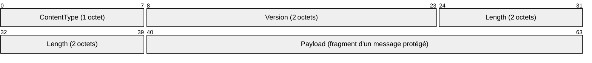
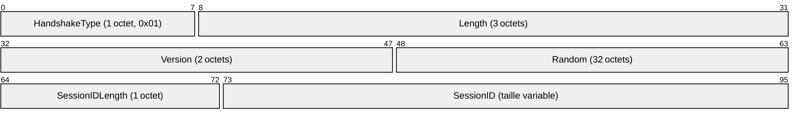

Le protocole TLS (**T**ransport **S**ecurity **L**ayer) est un protocole cryptographique assurant la confidentialité, l’intégrité et l’authenticité des données entre deux applications. Il est structuré en deux couches principales :

* **Record Layer** (Couche d'Enregistrement) : gère le fragmentage, le chiffrement, l’intégrité et le transport des données.
* **Handshake Protocol** : protocole de négociation permettant d’établir les clés, certificats et algorithmes.

## Histoire du protocole

Le protocole TLS est un protocole utilisé pour sécuriser les connexions et l'échange de données. Cette sécurité s'opère avec des protocoles cryptographiques

Il se base sur le protocole **SSL** (**S**ecure **S**ocket **L**ayer).  
Si le SSL est configuré correctement aucune personne tierce ne pourra connaître les informations de connexions telles que le type de chiffrement utilisé, la fréquence de transmission ou la quantité de données transmises.  
La personne ne pourra voir passer que des informations chiffrées et êxtrêmement complexe à déchiffrer.

Après la normalisation du protocole SSL par l'IETF, il a été nommé TLS. À partir de ce moment là, les protocoles SSL et TLS décrivent des versions différentes du protocole. Ils est donc préférable de ne pas les confondre ou penser que l'un signifie l'autre.

|Protocole|Date de publication|
|---|---|
|SSL 2.0|1995|
|SSL 3.0| Novembre 1996|
|TLS 1.0 et TLS 1.1| Avril 2006|
|TLS 1.2| Août 2008|
|TLS 1.3| Août 2018|

Chaque version proposant au fil des années de nouveaux algorithmes de chiffrement afin de rendre plus robuste le protocole face aux attaques devenant de plus en plus avancées.

Au sein de nos navigateurs internets tels que Firefox, Google Chrome ou Edge, TLS est utilisé pour vérifier que la connexion est sécurisée. D'où le fait que l'on voit un petit 🔒 au côté de l'URL.

## Fonctionnement du protocole TLS

## Record Layer - Structure et tailles de trame
Exemple d'une en-tête de trame TLS en version 1.2/1.3 : 
* **Header** (5 octets) :
	* `ContentType` (1 octet)
	* `Version` (2 octets)
	* `Length` (2 octets) : taille des données chiffrées ou en clair

* **Payload** :
	* Jusqu'à 16384 octets (214), soit ~16KB de données non chiffrées
	* **MAC** (jusqu'à 32 octets en TLS 1.2 et non utilisé en 1.3 car AEAD)
	* **IV / nonce**: variable selon le cupher, ex. GCM
	* **padding** (le cas échéant)
	
|---|---|---|---|  
| 5 octets header | 16384 octets data | ~32 octets MAC | IV | padding |

Ce qui nous fait un total de ~16 421 octets avant le chiffrement

## Handshake protocol - étapes et tailles par étape

Au sein du protocole TLS, on retrouve deux versions principalement qui se distinguent et qui sont mondialement utilisées aujourd'hui : TLS 1.2 et 1.3. Voici donc l'établissement des sessions en fonction de la version :

### TLS 1.2 (handshake complet)
1. `ClientHello`  
	* Header Record (5 octets)
	* Contenu: version, random (32 octets), session ID, liste cipher suites, extensions...
2. `ServerHello`
	* Header (5 octets)
	* Contenu: version, random, session ID, cipher choisi
3. Certificate / `ServerKeyExchange` / `ServerHelloDone` :
	* Header + certificat (typiquement 1-2ko) + autres messages (ECDHE public key...)
4. `ClientKeyExchange` :
	* Header + pre-master secret chiffré (512-2048 octets selon la version de RSA, voire plus)
5. `ChangeCipherSpecs` + Finished :
	* Toujours encapsulé dans des records : header + quelques dizaines d'octets

#### Les messages

**Client Hello** - TLS 1.2

**ServerHello** - TLS 1.2

### TLS 1.3 (handshake optimisé 1RTT)
* Fusion des messages handshake après `ServerHello`, tous schiffrés
* Suppression des suites non-AEAD, CRC, padding inutile
