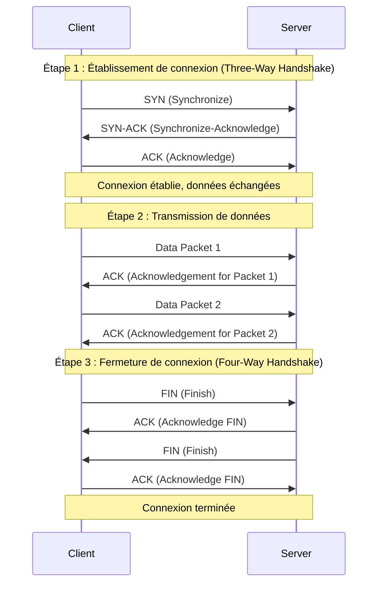

# échange SYN / ACK TCP

Lorsque l'on effectue des échanges sur internet, on doit dans un premier temps établir une sesison avec le serveur que l'on a en face. C'est comme cela que fonctionne TCP pour avoir un contrôle des erreurs et des paquets qui sont envoyés sur le réseau.

Pour cela, il y a des échanges préalable nommé : 
* **SYN** pour **S**ynchronisation
* **ACK** pour **A**cknoledge (prise de connaissance en français).

une fois cet échange effectué, le client et le serveur peuvent dialoguer et échanger des informations. 

Afin que rien ne soit perdu, le protocole segmente les données qu'il envoie. À chaque fois que les données sont envoyées, un paquet `ACK` est envoyé par le destinataire pour dire qu'il a bien reçu le paquet.

Enfin, lorsque les échanges sont terminés, il faut fermer la connexion entre le client et le serveur, on utilise donc le message `FIN`.

Concrètement, cela fonctionne comme suit : 

