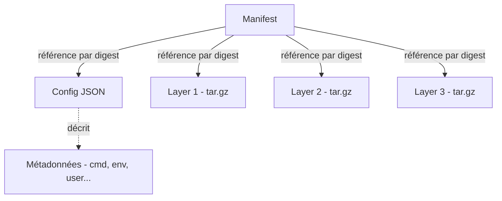
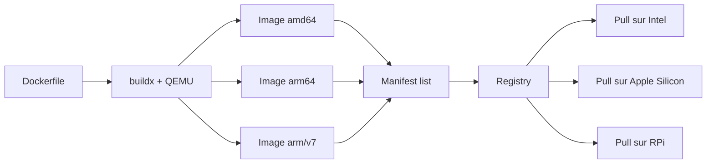
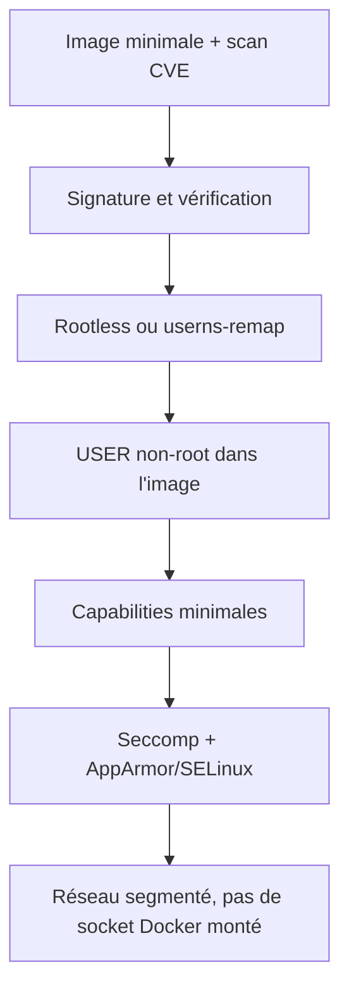

# Sujets avancés et bonnes pratiques de production

Cet article rassemble cinq sujets techniques rarement traités ensemble, mais qui caractérisent le passage d'une utilisation correcte de Docker à une utilisation pleinement maîtrisée. Chaque section a été écrite pour être lue indépendant, comme une référence technique :

1. [PID 1, signaux et init systems](#pid-1-signaux-et-init-systems)
2. [Anatomie d'une image OCI](#anatomie-dune-image-oci)
3. [Builds multi-architectures avec buildx](#builds-multi-architectures-avec-buildx)
4. [Debugging avancé : namespaces, cgroups, strace](#debugging-avancé--namespaces-cgroups-strace)
5. [Rootless Docker et hardening](#rootless-docker-et-hardening)

## PID 1, signaux et init systems

### Le problème du PID 1

Sur un système Unix, le processus de PID 1 est `init`. Le noyau lui attribue deux responsabilités particulières :

- **Réveiller les processus orphelins** : quand un processus parent meurt avant ses enfants, ces derniers sont rattachés à PID 1, qui doit les *reaper* (lire leur code de sortie pour libérer les ressources). Sans cela, les processus terminés persistent en état zombie.
- **Recevoir les signaux différemment** : le noyau **ne délivre pas** les handlers par défaut de `SIGTERM` et `SIGINT` à PID 1. Un PID 1 qui n'enregistre pas explicitement de handler pour ces signaux les ignore purement et simplement.

Dans un conteneur, c'est l'application qui devient PID 1. Ces deux particularités s'appliquent donc à elle.

### Conséquences concrètes

**Cas 1 — Forme shell** :

```dockerfile
CMD node server.js
```

L'instruction est exécutée comme `/bin/sh -c "node server.js"`. C'est donc `sh` qui devient PID 1, pas `node`. `sh` ne transmet pas les signaux à ses enfants — un `docker stop` enverra `SIGTERM` à `sh`, qui l'ignorera. Au bout des 10 secondes de grâce, `docker stop` envoie `SIGKILL` à `sh`, ce qui termine `node` brutalement, sans aucune possibilité de fermeture propre.

**Cas 2 — Forme exec, application sans handler de signaux** :

```dockerfile
CMD ["node", "server.js"]
```

`node` est bien PID 1, mais si l'application n'enregistre pas explicitement de handler pour `SIGTERM`, le signal est silencieusement ignoré. Même symptôme : arrêt brutal après timeout.

**Cas 3 — Application qui fork** :

Si l'application en PID 1 lance des sous-processus (par exemple via `child_process.spawn`) et que ces enfants se terminent, ils deviennent zombies parce que l'application ne les *reaper* pas. Sur un conteneur de longue durée, les zombies s'accumulent jusqu'à épuiser la table des processus.

### Solutions

**Forme exec systématique** pour `CMD` et `ENTRYPOINT`. C'est nécessaire mais pas toujours suffisant.

**Application correctement écrite** qui installe ses propres handlers `SIGTERM` / `SIGINT` :

```javascript
process.on('SIGTERM', () => {
  server.close(() => process.exit(0));
});
```

C'est la solution idéale, mais elle suppose qu'on contrôle le code applicatif et que l'application ne forke pas.

**Init léger via le flag `--init`** :

```bash
docker run --init -d mon-app
```

Docker injecte `tini` comme PID 1, qui forwarde les signaux à votre application et *reape* les orphelins. Solution générique, recommandée par défaut pour toute application non triviale.

**Init dans l'image elle-même** :

```dockerfile
FROM node:20-alpine
RUN apk add --no-cache tini
ENTRYPOINT ["/sbin/tini", "--"]
CMD ["node", "server.js"]
```

Préférable au `--init` runtime quand on veut garantir le comportement indépendamment de la commande de lancement. `dumb-init` est une alternative équivalente avec une syntaxe similaire.

:::tip Pratique recommandée
Pour toute image destinée à de la production : **forme exec partout, init explicite via tini** dans le Dockerfile, **gestion correcte de `SIGTERM`** dans l'application. Trois précautions indépendantes mais cumulatives.
:::

## Anatomie d'une image OCI

### Que contient une image

Une image OCI (Open Container Initiative) n'est pas un fichier binaire opaque, mais un ensemble structuré référencé par hachage cryptographique. Trois composants :



- **Manifest** : document JSON qui liste les couches et la configuration, chacune référencée par son SHA-256 (*digest*). C'est ce manifest qui est désigné par le tag d'une image.
- **Config** : document JSON contenant les métadonnées de runtime (commande par défaut, variables d'environnement, point d'entrée, utilisateur, etc.) et l'historique de construction.
- **Layers** : archives `tar` (généralement gzippées) contenant les fichiers du système de fichiers, chacune représentant un *diff* par rapport à la couche précédente.

### Inspection pratique

`docker save` exporte une image au format OCI dans une archive tar :

```bash
docker save nginx:1.27 -o nginx.tar
mkdir nginx-extracted && tar xf nginx.tar -C nginx-extracted
ls nginx-extracted
```

On y trouve un fichier `manifest.json`, un fichier de configuration par image, et un dossier par couche contenant elle-même une `layer.tar`.

Pour examiner une image **directement depuis un registre** sans la télécharger, deux outils indépendants de Docker sont précieux :

```bash
# skopeo : inspection et copie d'images entre registres
skopeo inspect docker://docker.io/library/nginx:1.27

# crane : inspection légère et manipulation de manifests
crane manifest docker.io/library/nginx:1.27
crane config docker.io/library/nginx:1.27
```

`crane` est particulièrement utile en CI/CD : il ne nécessite pas de daemon Docker et permet de scripter des manipulations d'image (retagging, copie entre registres, extraction de digests).

### Stockage local

Sur l'hôte, Docker stocke les couches dans le répertoire du driver de stockage actif, généralement OverlayFS :

```bash
ls /var/lib/docker/overlay2/
```

Chaque couche y a son répertoire, identifié par un hash. Au lancement d'un conteneur, Docker empile les couches en lecture seule via OverlayFS et y ajoute une couche en écriture pour le conteneur. C'est ce qui explique que plusieurs conteneurs partageant la même image n'occupent pas plusieurs fois l'espace de l'image — seule leur couche en écriture est distincte.

```bash
docker system df -v
```

Cette commande détaille l'espace réellement consommé par chaque image et conteneur, en distinguant la part partagée de la part unique.

:::note Image OCI vs image Docker
Historiquement, Docker utilisait son propre format. Depuis 2017, le format OCI est la norme, et Docker l'a adopté. Les deux formats restent compatibles, et la quasi-totalité des outils (Docker, containerd, podman, buildah, kaniko) parlent OCI.
:::

## Builds multi-architectures avec buildx

### Le problème

Le développement se fait souvent sur x86_64 (Intel/AMD), mais les cibles de déploiement se diversifient : ARM64 sur les serveurs Graviton d'AWS, ARM64 sur les Mac M1/M2/M3, ARM sur Raspberry Pi. Construire une image qui « fonctionne partout » suppose de produire **plusieurs images binaires**, une par architecture, regroupées sous un même tag via un *manifest list*.



Au `docker pull`, le client sélectionne automatiquement l'image correspondant à son architecture, parmi celles listées dans le *manifest list*.

### Mise en place

`buildx` est désormais intégré à Docker Engine. Pour les builds multi-architectures, il faut un *builder* utilisant le driver `docker-container` (le driver par défaut, `docker`, ne supporte pas le multi-plateforme) :

```bash
# Installer les émulateurs QEMU pour les architectures non natives
docker run --privileged --rm tonistiigi/binfmt --install all

# Créer et utiliser un builder multi-arch
docker buildx create --use --name multiarch
docker buildx inspect --bootstrap
```

`tonistiigi/binfmt` installe les handlers `binfmt_misc` qui permettent au noyau d'exécuter des binaires ARM via QEMU sur un hôte x86 (et vice versa).

### Construire et publier

```bash
docker buildx build \
  --platform linux/amd64,linux/arm64,linux/arm/v7 \
  --tag registry.example.com/equipe/mon-app:1.0.0 \
  --push \
  .
```

L'option `--push` envoie directement les images et le *manifest list* dans le registre. `buildx` ne peut pas charger un build multi-plateforme dans le store local (`--load`), parce que le format de stockage du daemon Docker n'accepte qu'une seule plateforme par image. C'est pour ça que la sortie typique d'un build multi-arch passe par `--push` vers un registre.

### Cross-compilation native

L'émulation QEMU fonctionne mais est **lente** pour les langages compilés (Go, Rust, C). Pour aller plus vite, on peut exploiter le fait que `buildx` expose des variables automatiques décrivant la plateforme cible :

```dockerfile
# syntax=docker/dockerfile:1
FROM --platform=$BUILDPLATFORM golang:1.22 AS builder
ARG TARGETOS
ARG TARGETARCH
WORKDIR /src
COPY . .
RUN CGO_ENABLED=0 GOOS=$TARGETOS GOARCH=$TARGETARCH \
    go build -o /out/app .

FROM gcr.io/distroless/static:nonroot
COPY --from=builder /out/app /app
ENTRYPOINT ["/app"]
```

Le stage `builder` tourne sur la plateforme native (`$BUILDPLATFORM`), pas sur la cible — donc à pleine vitesse — et Go cross-compile vers la cible via `GOOS` et `GOARCH`. Le stage final, lui, est bien construit pour la plateforme cible. Sur des langages qui supportent la cross-compilation, cette approche divise par cinq ou dix les temps de build par rapport à l'émulation pure.

## Debugging avancé : namespaces, cgroups, strace

Quand `docker exec` ne suffit plus — image distroless sans shell, conteneur planté, comportement étrange à investiguer — il existe un palier en dessous : interagir directement avec les mécanismes Linux que Docker manipule.

### Inspecter les namespaces d'un conteneur

Chaque conteneur tourne dans un ensemble de namespaces accessibles via `/proc/[pid]/ns/`. La première étape est de récupérer le PID hôte du processus principal du conteneur :

```bash
docker inspect --format '{{.State.Pid}}' mon-conteneur
# 12345

ls -la /proc/12345/ns/
```

```
lrwxrwxrwx 1 root root cgroup -> 'cgroup:[4026531835]'
lrwxrwxrwx 1 root root ipc    -> 'ipc:[4026532256]'
lrwxrwxrwx 1 root root mnt    -> 'mnt:[4026532254]'
lrwxrwxrwx 1 root root net    -> 'net:[4026532258]'
lrwxrwxrwx 1 root root pid    -> 'pid:[4026532257]'
lrwxrwxrwx 1 root root user   -> 'user:[4026531837]'
lrwxrwxrwx 1 root root uts    -> 'uts:[4026532255]'
```

Chaque lien pointe vers un namespace identifié par un numéro d'inode unique. Deux processus partageant le même inode sont dans le même namespace.

`lsns` (de `util-linux`) liste tous les namespaces de l'hôte avec leurs processus associés :

```bash
sudo lsns
sudo lsns -t net    # Filtrer par type
```

### Entrer dans les namespaces avec nsenter

`nsenter` permet d'exécuter une commande dans un sous-ensemble des namespaces d'un autre processus. C'est la voie de secours quand `docker exec` n'est pas utilisable :

```bash
# Entrer dans tous les namespaces du conteneur (équivalent de docker exec sans le binaire)
sudo nsenter -t 12345 -m -u -i -n -p -- /bin/bash

# Seulement le namespace réseau, pour inspecter la pile réseau du conteneur depuis l'hôte
sudo nsenter -t 12345 -n -- ip addr
sudo nsenter -t 12345 -n -- ss -tlnp
```

Cas particulièrement utile : un conteneur distroless ne contient ni shell ni `ip`. `nsenter -n` permet d'utiliser les outils de l'hôte tout en regardant *à travers les yeux* du conteneur.

### Inspecter les cgroups

Les limites de ressources d'un conteneur sont visibles directement dans `/sys/fs/cgroup/` (cgroups v2) :

```bash
# Trouver le cgroup d'un conteneur
docker inspect --format '{{.HostConfig.CgroupParent}}' mon-conteneur

# Avec systemd, le chemin est généralement de la forme :
ls /sys/fs/cgroup/system.slice/docker-<id>.scope/

cat /sys/fs/cgroup/system.slice/docker-<id>.scope/memory.current   # Mémoire utilisée
cat /sys/fs/cgroup/system.slice/docker-<id>.scope/memory.max       # Limite
cat /sys/fs/cgroup/system.slice/docker-<id>.scope/cpu.stat         # Statistiques CPU
```

C'est ce que `docker stats` lit en arrière-plan. Y accéder directement permet de scripter des collectes plus fines ou de croiser avec d'autres métriques système.

### Tracer un processus conteneurisé

`strace` permet de voir les appels système d'un processus en direct :

```bash
sudo strace -f -p 12345

# Avec filtrage
sudo strace -f -e trace=network -p 12345
sudo strace -f -e trace=openat,read -p 12345
```

Particulièrement utile quand une application « ne fait rien » sans message d'erreur : `strace` montrera immédiatement si elle attend un fichier qui n'existe pas, une socket bloquée, une lecture qui ne revient pas.

Sur des conteneurs en lecture seule ou sans privilèges, `strace` lancé *depuis le conteneur* nécessite `CAP_SYS_PTRACE`. C'est plus simple de le lancer **depuis l'hôte** en ciblant le PID hôte du processus — ce qui ne demande que des droits root sur l'hôte, pas de privilège dans le conteneur.

## Rootless Docker et hardening

L'isolation par conteneur est plus faible qu'une isolation par hyperviseur, mais peut être considérablement renforcée par un empilement de mécanismes complémentaires. Cette section couvre les principaux.

### Rootless Docker

En mode rootless, le daemon `dockerd` tourne sous l'identité d'un utilisateur non privilégié, dans son propre user namespace. Une vulnérabilité d'évasion vers l'hôte y accorde au pire les privilèges de cet utilisateur, pas de root.

Installation sur Debian/Ubuntu :

```bash
sudo apt install -y uidmap dbus-user-session
dockerd-rootless-setuptool.sh install

# Activer le démarrage automatique au login
systemctl --user enable docker
loginctl enable-linger $USER

export DOCKER_HOST=unix:///run/user/$(id -u)/docker.sock
```

Limitations à connaître :

- Impossibilité par défaut d'écouter sur les ports privilégiés (`< 1024`). Contournable via `sysctl net.ipv4.ip_unprivileged_port_start=80` ou via `setcap`.
- Performances réseau légèrement dégradées (utilisation de `slirp4netns` ou `vpnkit` pour la pile réseau utilisateur).
- Pas de `--net=host` (un user namespace n'a pas accès à la pile réseau de l'hôte).
- Quelques fonctionnalités indisponibles : `--cap-add`, `--privileged` réduit, certaines options cgroups.

Rootless est devenu suffisamment mature pour un usage en production sur des charges non triviales. C'est probablement le levier le plus impactant pour réduire la surface d'attaque.

### User namespace remapping

Indépendamment du rootless, on peut configurer le daemon Docker (même en mode root) pour que les conteneurs s'exécutent dans un user namespace dédié, où `root` dans le conteneur est mappé à un UID non privilégié sur l'hôte.

```json
// /etc/docker/daemon.json
{
  "userns-remap": "default"
}
```

Le mapping utilise typiquement la plage `100000–165535` (configurable dans `/etc/subuid` et `/etc/subgid`). Un fichier appartenant à `root:root` dans le conteneur appartient en réalité à `100000:100000` sur l'hôte, ce qui contient toute compromission.

### Capabilities

Le superutilisateur Linux dispose d'environ 40 *capabilities* — privilèges granulaires comme `CAP_NET_ADMIN` (configuration réseau), `CAP_SYS_ADMIN` (administration système), etc. Docker en accorde par défaut un sous-ensemble réduit à chaque conteneur. On peut affiner :

```bash
docker run --cap-drop=ALL --cap-add=NET_BIND_SERVICE nginx
```

Pratique standard pour un service réseau : **tout droper sauf ce qui est strictement nécessaire**. `NET_BIND_SERVICE` permet d'écouter sur un port `< 1024`, ce qui est généralement le seul privilège dont a besoin un serveur web exécuté en tant qu'utilisateur non root.

### Seccomp

`seccomp` filtre les appels système autorisés. Docker applique par défaut un profil qui interdit une cinquantaine d'appels (modules noyau, `reboot`, `mount`…) sans impact sur la plupart des charges applicatives.

On peut écrire son propre profil JSON et le passer au runtime :

```bash
docker run --security-opt seccomp=mon-profil.json mon-app
```

À l'inverse, **désactiver** seccomp (`--security-opt seccomp=unconfined`) est une erreur fréquente, parfois nécessaire pour des outils de bas niveau mais à n'utiliser qu'en connaissance de cause.

### AppArmor / SELinux

Sur les distributions qui les fournissent par défaut (Ubuntu pour AppArmor, RHEL/Fedora pour SELinux), un profil de contrôle d'accès obligatoire s'applique automatiquement aux conteneurs Docker. Il restreint les opérations système (lecture de fichiers sensibles, écriture dans `/proc`, etc.) au-delà des permissions Unix classiques.

Profils personnalisés possibles via `--security-opt apparmor=mon-profil`.

### Scan d'images

Une image peut contenir des bibliothèques avec des CVE connues. Plusieurs outils scannent une image et listent les vulnérabilités identifiées :

```bash
# Trivy : le scanner le plus utilisé, rapide et complet
trivy image nginx:1.27

# Avec sortie filtrée sur les CVE critiques
trivy image --severity CRITICAL,HIGH nginx:1.27

# Intégration CI : sortie JSON, code d'erreur si vulnérabilités détectées
trivy image --exit-code 1 --severity CRITICAL nginx:1.27
```

`grype` est une alternative équivalente, et la plupart des registres modernes (Docker Hub, GHCR, GitLab) proposent un scan intégré.

Bonnes pratiques :

- Scanner systématiquement les images en CI avant publication.
- Reconstruire régulièrement les images, même sans changement de code, pour récupérer les patchs des dépendances de base.
- Préférer des images de base maintenues activement (officielle, distroless, Wolfi, Chainguard) plutôt que des images abandonnées.

### Signatures d'images

`cosign` permet de signer cryptographiquement une image après publication, et de vérifier sa signature à la consommation. Indispensable dans une supply chain sérieuse : un attaquant qui pousse une image malveillante avec le bon tag ne pourra pas la signer avec votre clé.

```bash
# Signature lors du push (avec une clé locale)
cosign sign --key cosign.key registry.example.com/equipe/mon-app:1.0.0

# Vérification à la consommation
cosign verify --key cosign.pub registry.example.com/equipe/mon-app:1.0.0
```

Mode *keyless* possible aussi, basé sur OIDC et un journal public (Rekor), où la « clé » devient une identité (un email, un compte GitHub Actions). Plus moderne et plus simple à opérer à grande échelle.

### Politique de défense en profondeur

Aucune de ces protections n'est suffisante isolément. Une stratégie raisonnable cumule plusieurs couches :



Chaque couche compense les angles morts des précédentes : un attaquant qui exploite une CVE applicative se heurte au `USER` non-root ; s'il escalade, il bute sur les capabilities ; s'il tente un syscall sensible, seccomp le bloque ; s'il atteint le filesystem, AppArmor restreint ; et même en cas d'évasion complète, le rootless le maintient hors de root sur l'hôte.

## Conclusion

Ces cinq sujets couvrent ce qui distingue, à mon sens, une utilisation pragmatique de Docker d'une utilisation pleinement professionnelle. Aucun n'est strictement indispensable pour faire tourner une application en conteneur — mais leur maîtrise change la nature même de ce qu'on peut diagnostiquer, sécuriser et déployer en confiance.

Le passage d'un sujet à l'autre suit une logique : **comprendre ce qui s'exécute** (PID 1, signaux), **comprendre ce qu'on déploie** (anatomie OCI), **savoir construire pour des environnements hétérogènes** (multi-arch), **savoir diagnostiquer en profondeur** (namespaces, strace), et **savoir durcir le tout** (rootless, capabilities, scan, signature). C'est probablement dans cet ordre qu'ils prennent leur valeur opérationnelle.
