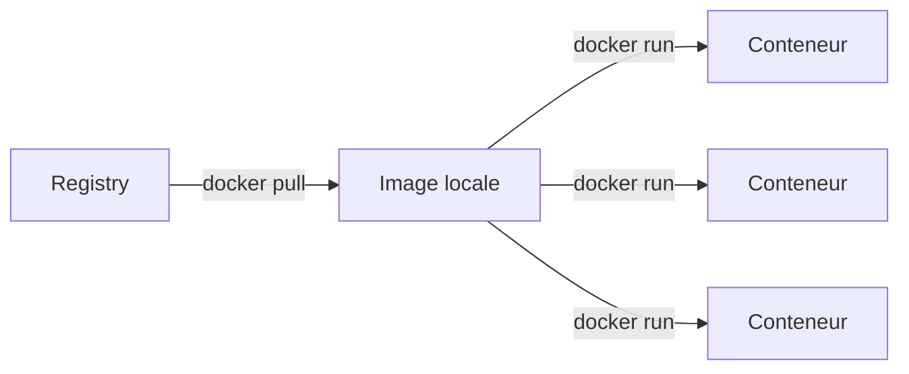
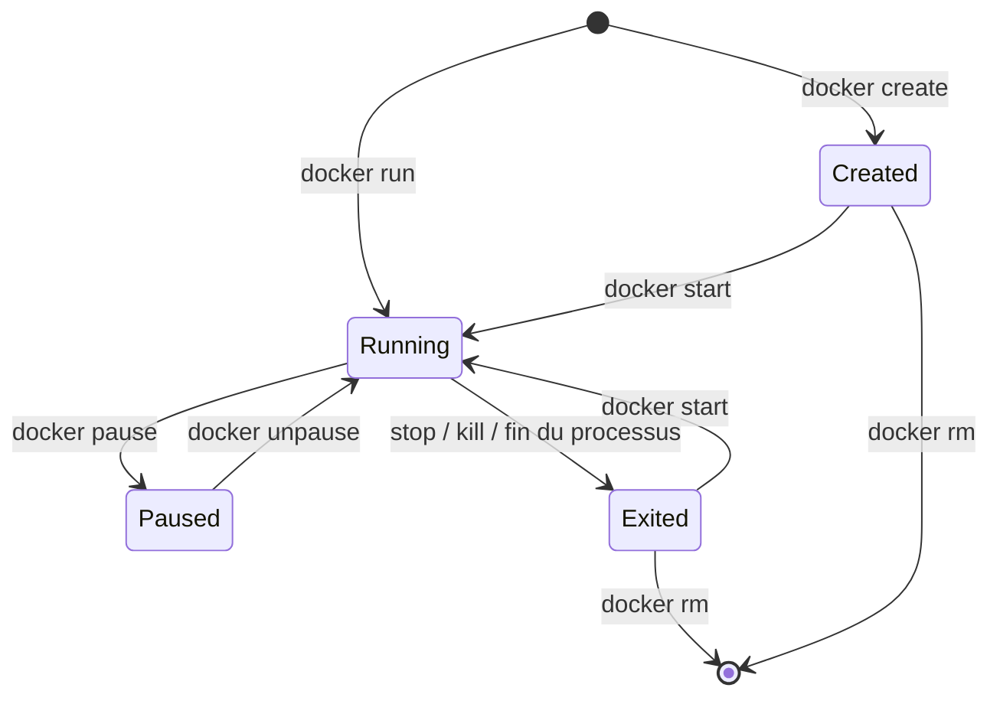

# Commandes fondamentales et cycle de vie d'un conteneur

Cette page recense les commandes Docker utilisées au quotidien : lancer un conteneur, l'observer, interagir avec lui, gérer les images locales et nettoyer ce qui ne sert plus. L'approche est délibérément pratique — la CLI Docker est vaste, on se concentre ici sur ce qui couvre l'essentiel des usages courants.

## Modèle mental

Trois objets suffisent à comprendre l'essentiel :

- Une **image** est un modèle en lecture seule. Elle décrit le contenu d'un système de fichiers et la commande à exécuter par défaut. Une image est immuable et identifiée par un *digest* (empreinte cryptographique).
- Un **conteneur** est une instance exécutable d'une image. On peut lancer autant de conteneurs que voulu à partir d'une même image ; chacun dispose de sa propre couche en écriture, de son propre PID 1, de son propre réseau.
- Un **registre** (*registry*) stocke et distribue les images. Docker Hub est utilisé par défaut, mais n'importe quel registre conforme à la spécification OCI peut être configuré.



Ce qui rend Docker confortable au quotidien, c'est cette séparation stricte : on construit ou récupère une image **une seule fois**, on en dérive autant de conteneurs jetables que nécessaire.

## Cycle de vie d'un conteneur

Un conteneur passe par plusieurs états bien définis. Le diagramme suivant résume les transitions principales :



Quelques précisions :

- `docker run` est en réalité un raccourci pour `docker create` suivi de `docker start`.
- Un conteneur dans l'état `Exited` n'est **pas** supprimé : son système de fichiers et sa configuration restent disponibles. Il peut être relancé avec `docker start` ou supprimé avec `docker rm`.
- L'option `--rm` à `docker run` demande la suppression automatique du conteneur dès qu'il quitte l'état `Running`. C'est ce qu'on veut presque toujours pour des conteneurs éphémères (tests, scripts, commandes ponctuelles).

## Lancer et arrêter un conteneur

### `docker run`

La commande la plus utilisée. Forme générale :

```bash
docker run [OPTIONS] IMAGE [COMMAND] [ARG...]
```

Exemples :

```bash
# Conteneur éphémère, sortie redirigée vers le terminal
docker run --rm alpine echo "hello"

# Shell interactif dans un conteneur Debian
docker run --rm -it debian:12 bash

# Serveur nginx en arrière-plan, port 8080 de l'hôte vers 80 du conteneur
docker run -d --name web -p 8080:80 nginx:1.27
```

Options à connaître :

| Option | Effet |
|--------|-------|
| `-d`, `--detach` | Détache le conteneur du terminal (mode arrière-plan). |
| `-it` | Combine `-i` (stdin ouvert) et `-t` (TTY) — nécessaire pour un shell interactif. |
| `--rm` | Supprime automatiquement le conteneur à la sortie. |
| `--name NOM` | Attribue un nom au conteneur (sinon généré aléatoirement). |
| `-p HOTE:CONTENEUR` | Publie un port. |
| `-v CHEMIN_HOTE:CHEMIN_CONTENEUR` | Monte un volume ou un dossier de l'hôte. |
| `-e CLE=VALEUR` | Définit une variable d'environnement. |
| `--restart unless-stopped` | Politique de redémarrage du conteneur. |
| `--network RESEAU` | Attache le conteneur à un réseau Docker précis. |

### Démarrer, arrêter, redémarrer

```bash
docker start CONTENEUR     # Relance un conteneur arrêté
docker stop CONTENEUR      # SIGTERM puis SIGKILL après 10 s
docker restart CONTENEUR
docker kill CONTENEUR      # SIGKILL immédiat
```

:::tip Arrêt propre et signaux
`docker stop` envoie d'abord un `SIGTERM`, laisse 10 secondes au processus pour terminer proprement, puis envoie `SIGKILL`. Ce délai se règle via `--time` (`docker stop -t 30 mon-conteneur`). Les applications correctement écrites traitent `SIGTERM` pour fermer leurs connexions et vider leurs buffers — un point souvent négligé dans les images mal conçues.
:::

### Supprimer

```bash
docker rm CONTENEUR              # Conteneur arrêté
docker rm -f CONTENEUR           # Force la suppression même en cours d'exécution
docker rm $(docker ps -aq)       # Supprime tous les conteneurs (à utiliser avec prudence)
```

## Observer

### Lister les conteneurs

```bash
docker ps           # Conteneurs en cours d'exécution
docker ps -a        # Tous les conteneurs (y compris arrêtés)
docker ps -q        # IDs uniquement, utile pour scripter
docker ps --format '{{.Names}}\t{{.Status}}\t{{.Ports}}'
```

L'option `--format` accepte un *template* Go et permet de produire une sortie exploitable par d'autres outils, plus stable qu'un `grep` sur la sortie tabulaire par défaut.

### Inspecter

`docker inspect` renvoie un JSON complet décrivant un objet :

```bash
docker inspect mon-conteneur
docker inspect --format '{{.NetworkSettings.IPAddress}}' mon-conteneur
docker inspect --format '{{json .Config.Env}}' mon-conteneur
```

Le second exemple — extraction d'un champ précis via template — est particulièrement utile dans les scripts.

### Logs

```bash
docker logs mon-conteneur
docker logs -f mon-conteneur          # Suivi en temps réel
docker logs --tail 100 mon-conteneur
docker logs --since 10m mon-conteneur
```

:::note
`docker logs` ne fonctionne qu'avec les pilotes de journalisation qui le supportent : `json-file` (par défaut), `local`, `journald`. Avec un pilote distant comme `syslog` ou `gelf`, les logs sont expédiés directement vers le collecteur et ne sont plus consultables via la CLI Docker.
:::

### Statistiques et processus

```bash
docker stats                          # CPU/mémoire/IO de tous les conteneurs, en direct
docker stats --no-stream              # Instantané
docker top mon-conteneur              # Processus en cours dans le conteneur
```

## Interagir avec un conteneur en cours

### `exec`

Exécute une nouvelle commande **à l'intérieur** d'un conteneur déjà démarré :

```bash
docker exec -it mon-conteneur bash
docker exec mon-conteneur cat /etc/hostname
docker exec -u root mon-conteneur apt update
```

C'est la commande à utiliser pour ouvrir un shell de débogage, vérifier une configuration ou déclencher une tâche ponctuelle.

### `attach`

`attach` connecte le terminal aux flux stdin/stdout du **processus principal** du conteneur (le PID 1). C'est différent de `exec` : on observe le processus existant, on n'en démarre pas un nouveau.

```bash
docker attach mon-conteneur
```

:::warning
`Ctrl-C` dans une session `attach` envoie `SIGINT` au processus principal, ce qui arrête généralement le conteneur. Pour se détacher sans tuer le processus, utiliser la séquence `Ctrl-P` puis `Ctrl-Q`.
:::

### Copier des fichiers

```bash
docker cp ./local.conf mon-conteneur:/etc/app/config.conf
docker cp mon-conteneur:/var/log/app.log ./
```

Pratique pour récupérer un log ou injecter ponctuellement un fichier, mais à utiliser de manière exceptionnelle : la bonne approche reste de **construire ce qu'il faut dans l'image** ou de **monter un volume**.

## Gérer les images

### Récupérer et lister

```bash
docker pull nginx:1.27
docker images                  # Images locales
docker image ls --digests      # Affiche aussi les empreintes
```

### Tags et digests

Le tag (`nginx:1.27`) est un alias **mutable** : il peut pointer aujourd'hui vers une image et demain vers une autre, par exemple après un patch de sécurité. Pour garantir une exécution strictement reproductible, on peut référencer l'image par son **digest** :

```bash
docker pull nginx@sha256:5ed8fcc66f4ed123c1b2560ed708dc148755b6e4cbd693...
```

C'est la méthode recommandée pour la production : le digest est immuable, le tag ne l'est pas.

:::warning Le piège du tag `latest`
Le tag `latest` n'a **aucune sémantique particulière** dans Docker : c'est un tag comme un autre, utilisé par convention quand aucun tag n'est précisé. Rien ne garantit qu'il pointe vers la version la plus récente ni vers la version stable. Toujours préciser une version explicite dans les environnements de production et dans tout fichier destiné à durer.
:::

### Supprimer une image

```bash
docker rmi nginx:1.27
docker image rm nginx:1.27          # Équivalent
docker image prune                  # Supprime les images "dangling" (sans tag)
docker image prune -a               # Supprime toutes les images inutilisées
```

### Inspecter l'historique d'une image

```bash
docker history nginx:1.27
```

Affiche les couches successives, leur taille et la commande Dockerfile qui les a produites. Utile pour comprendre pourquoi une image est plus volumineuse que prévu.

### Publier dans un registre

```bash
docker tag mon-app:dev registry.example.com/equipe/mon-app:1.0.0
docker login registry.example.com
docker push registry.example.com/equipe/mon-app:1.0.0
```

## Nettoyer

L'utilisation quotidienne de Docker accumule rapidement des conteneurs arrêtés, des images intermédiaires et des volumes orphelins. La commande `prune` permet de faire le ménage :

```bash
docker container prune        # Conteneurs arrêtés
docker image prune            # Images dangling
docker volume prune           # Volumes non référencés
docker network prune          # Réseaux non utilisés
docker system prune           # Tout ce qui précède (sauf volumes par défaut)
docker system prune -a --volumes    # Nettoyage radical
```

:::warning
`docker system prune -a --volumes` supprime **toutes** les images non utilisées par un conteneur en cours d'exécution, ainsi que tous les volumes non référencés. Cette commande peut effacer plusieurs gigaoctets de données — à exécuter en connaissance de cause.
:::

Pour visualiser ce qui occupe l'espace avant de nettoyer :

```bash
docker system df
docker system df -v           # Détail par image, conteneur, volume
```

## Bonnes pratiques pour la CLI

Quelques réflexes utiles à acquérir tôt :

- **Toujours nommer ses conteneurs** (`--name`) plutôt que de manipuler des identifiants générés. Les commandes en deviennent lisibles et reproductibles.
- **Utiliser `--rm` systématiquement** pour les conteneurs ponctuels (tests, scripts, commandes one-shot).
- **Préférer `exec` à `attach`** pour le débogage : on ne risque pas de tuer le processus principal en quittant.
- **Ne pas se reposer sur `latest`** : épingler une version explicite dans tout fichier ou script destiné à survivre au-delà de la session courante.
- **Scripter avec `--format` et `-q`** plutôt qu'avec `grep`/`awk` sur la sortie tabulaire, qui n'est pas garantie stable d'une version à l'autre.

## Et ensuite ?

Une fois ces commandes maîtrisées, l'étape suivante consiste à **produire ses propres images** via un `Dockerfile`, puis à orchestrer plusieurs conteneurs ensemble avec **Docker Compose**.
