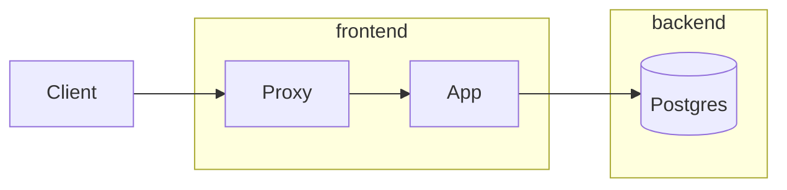
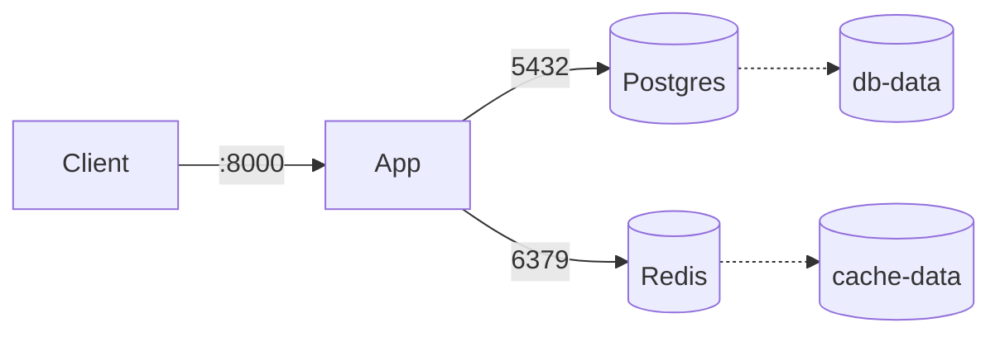

# Orchestrer plusieurs conteneurs avec Docker Compose

Une application réelle se compose rarement d'un seul conteneur. Une stack web typique combine une application, une base de données, un cache, parfois un reverse proxy ou un worker asynchrone — chacun avec sa configuration, son réseau, son stockage. **Docker Compose** permet de déclarer l'ensemble dans un unique fichier YAML et de gérer son cycle de vie avec quelques commandes.

Compose remplit deux rôles principaux :

- **En développement** : reproduire localement, en quelques secondes, un environnement proche de la production.
- **En déploiement simple** : faire tourner une stack sur un serveur unique, sans le surdimensionnement d'un orchestrateur comme Kubernetes.

## Premier exemple

Un fichier `compose.yaml` minimal pour une application web Python avec une base PostgreSQL :

```yaml
services:
  app:
    build: .
    ports:
      - "8000:8000"
    environment:
      DATABASE_URL: postgresql://app:secret@db:5432/app
    depends_on:
      - db

  db:
    image: postgres:16-alpine
    environment:
      POSTGRES_USER: app
      POSTGRES_PASSWORD: secret
      POSTGRES_DB: app
    volumes:
      - db-data:/var/lib/postgresql/data

volumes:
  db-data:
```

Lancement :

```bash
docker compose up -d
```

Docker Compose crée automatiquement :

- un **réseau** dédié à la stack, sur lequel les services se résolvent par leur nom (`db` est joignable à `db:5432` depuis `app`) ;
- un **volume nommé** `db-data` pour persister les données PostgreSQL ;
- les conteneurs correspondant à chaque service, avec des noms préfixés par celui du projet.

C'est l'essentiel du modèle : on déclare *quoi*, Compose s'occupe du *comment*.

:::note Nom de fichier
Depuis Compose V2, le nom canonique est `compose.yaml` (ou `compose.yml`). Les anciens noms `docker-compose.yaml` et `docker-compose.yml` restent reconnus pour compatibilité. Le champ `version:` en haut du fichier est désormais ignoré et n'a plus à être renseigné.
:::

## Anatomie d'un fichier compose.yaml

Quatre sections principales se retrouvent dans la plupart des fichiers :

```yaml
services:    # Les conteneurs à lancer, leur configuration, leurs interactions
networks:    # Les réseaux personnalisés (optionnel - un réseau par défaut est créé)
volumes:     # Les volumes nommés persistants
configs:     # Fichiers de configuration injectés dans les conteneurs (rarement utilisé en standalone)
```

L'essentiel se passe dans `services`. Chaque service correspond à un conteneur (ou plus, en cas de scaling) et regroupe sa source (`image` ou `build`), ses paramètres réseau, ses volumes, ses dépendances, ses variables d'environnement.

## Services en détail

### Image ou build

Un service peut soit utiliser une image existante, soit être construit à partir d'un `Dockerfile` local :

```yaml
services:
  cache:
    image: redis:7-alpine

  app:
    build:
      context: .
      dockerfile: Dockerfile
      target: production       # Stage spécifique d'un build multi-stage
      args:
        APP_VERSION: 1.0.0
```

### Ports

```yaml
ports:
  - "8000:8000"           # Hôte:Conteneur
  - "127.0.0.1:5432:5432" # Limité à localhost (recommandé pour les bases de données)
```

:::tip Exposer le moins possible
N'exposer un port sur l'hôte que si un client externe à la stack en a besoin. Les services internes communiquent entre eux via le réseau interne de Compose sans publication de port — la base de données n'a aucune raison d'être accessible depuis l'extérieur.
:::

### Variables d'environnement

Trois formes équivalentes :

```yaml
environment:
  DATABASE_URL: postgresql://app:secret@db:5432/app
  LOG_LEVEL: info

# Ou en liste
environment:
  - DATABASE_URL=postgresql://app:secret@db:5432/app
  - LOG_LEVEL=info

# Ou depuis un fichier
env_file:
  - .env.app
```

Les variables peuvent être interpolées depuis l'environnement du shell ou depuis un fichier `.env` placé à côté du `compose.yaml` :

```yaml
environment:
  POSTGRES_PASSWORD: ${DB_PASSWORD}
  LOG_LEVEL: ${LOG_LEVEL:-info}     # Avec valeur par défaut
```

Le fichier `.env` correspondant :

```
DB_PASSWORD=changeme
LOG_LEVEL=debug
```

:::warning Le fichier `.env`
Compose charge automatiquement `.env` à la racine du projet. Ce fichier contient typiquement des secrets — ne **jamais** le commiter. Ajouter `.env` au `.gitignore` et fournir un `.env.example` documenté à sa place.
:::

### Volumes et bind mounts

Trois types de stockage couvrent les besoins courants :

```yaml
volumes:
  - db-data:/var/lib/postgresql/data       # Volume nommé, géré par Docker
  - ./config:/etc/app/config:ro            # Bind mount, lecture seule
  - /var/run/docker.sock:/var/run/docker.sock  # Bind mount d'un socket
```

Les volumes nommés sont persistants entre `up` et `down`. Pour les supprimer explicitement : `docker compose down -v`.

### Politique de redémarrage

```yaml
restart: unless-stopped
```

Valeurs possibles : `no` (par défaut), `always`, `on-failure`, `unless-stopped`. `unless-stopped` est généralement le bon choix pour un déploiement : le conteneur redémarre après un crash ou après reboot de la machine, mais reste arrêté si on l'a explicitement stoppé.

### Healthchecks

Un *healthcheck* permet à Compose de connaître l'état réel d'un service, au-delà du simple fait que le processus tourne :

```yaml
db:
  image: postgres:16-alpine
  healthcheck:
    test: ["CMD-SHELL", "pg_isready -U app"]
    interval: 5s
    timeout: 5s
    retries: 5
    start_period: 10s
```

Le service apparaît alors comme `healthy`, `starting` ou `unhealthy` dans `docker compose ps`.

### Dépendances avec conditions

`depends_on` détermine l'ordre de démarrage. Combiné aux healthchecks, il permet d'attendre qu'un service soit véritablement prêt avant d'en démarrer un autre :

```yaml
app:
  build: .
  depends_on:
    db:
      condition: service_healthy
    cache:
      condition: service_started
```

Sans `condition`, `depends_on` n'attend que le démarrage du conteneur — pas la disponibilité applicative. C'est rarement ce qu'on veut : un PostgreSQL démarré ne signifie pas qu'il accepte déjà les connexions.

## Réseaux

Par défaut, Compose crée un réseau unique pour la stack, sur lequel chaque service est joignable par son nom. Pour des architectures plus segmentées, on peut déclarer plusieurs réseaux et n'attacher chaque service qu'à ceux dont il a besoin :

```yaml
services:
  proxy:
    image: traefik:v3
    networks:
      - frontend

  app:
    build: .
    networks:
      - frontend
      - backend

  db:
    image: postgres:16-alpine
    networks:
      - backend

networks:
  frontend:
  backend:
```



Dans cet exemple, la base de données est isolée sur le réseau `backend`, inaccessible depuis `proxy`. C'est le principe de **moindre privilège réseau** appliqué à une stack : seules les communications nécessaires sont autorisées.

## Variables d'environnement et fichiers `.env`

Compose distingue deux usages des variables d'environnement, à ne pas confondre :

- Les variables consommées **par Compose lui-même** lors de l'interpolation du `compose.yaml` (par exemple `${TAG}` dans une référence d'image). Elles viennent du shell ou du fichier `.env` placé à côté du `compose.yaml`.
- Les variables passées **aux conteneurs** via `environment:` ou `env_file:`.

Exemple combinant les deux :

```yaml
services:
  app:
    image: mon-app:${TAG:-latest}        # Variable consommée par Compose
    env_file:
      - .env.app                          # Variables injectées dans le conteneur
    environment:
      LOG_LEVEL: ${LOG_LEVEL:-info}       # Combinaison des deux
```

## Profils

Les profils permettent de définir des services optionnels, activés uniquement à la demande. Utile pour des outils de debug, des migrations, ou des composants nécessaires en développement seulement :

```yaml
services:
  app:
    build: .

  db:
    image: postgres:16-alpine

  adminer:
    image: adminer
    ports:
      - "8080:8080"
    profiles: [dev]
```

`docker compose up` ne démarre que `app` et `db`. Pour inclure `adminer` :

```bash
docker compose --profile dev up
```

## Surcharges multi-fichiers

Compose lit par défaut deux fichiers s'ils existent : `compose.yaml` puis `compose.override.yaml`, dont le contenu est fusionné par-dessus le premier. Le pattern courant :

- `compose.yaml` : configuration de base, généralement orientée production.
- `compose.override.yaml` : surcharges spécifiques au développement (bind mount du code source, ports debug, services optionnels).

`compose.override.yaml` est appliqué automatiquement en local. Pour la production, on l'écarte explicitement :

```bash
docker compose -f compose.yaml up -d
```

Un schéma de fichiers d'environnement multiples reste possible :

```bash
docker compose -f compose.yaml -f compose.prod.yaml up -d
```

Les fichiers passés à droite ont la priorité ; chaque fichier supplémentaire surcharge le précédent.

## Cycle de vie : commandes principales

```bash
# Démarrer la stack (construit les images si nécessaire)
docker compose up -d

# Reconstruire avant de démarrer
docker compose up -d --build

# Voir l'état des services
docker compose ps

# Suivre les logs (option -f) de tous les services ou d'un seul
docker compose logs -f
docker compose logs -f app

# Exécuter une commande dans un service en cours
docker compose exec app bash

# Exécuter une commande dans un nouveau conteneur (utile pour les tâches one-shot)
docker compose run --rm app python manage.py migrate

# Arrêter la stack (conserve les volumes nommés)
docker compose down

# Tout supprimer, y compris les volumes
docker compose down -v
```

:::tip `exec` vs `run`
`exec` ouvre une commande **dans un conteneur déjà démarré**, `run` lance **un nouveau conteneur** à partir de la définition du service. Pour un shell de debug : `exec`. Pour une migration de base de données, un script ponctuel : `run --rm`.
:::

## Exemple complet : application web, base, cache

Une stack complète pour une application web Python (FastAPI, Django, Flask, peu importe) avec PostgreSQL et Redis :

```yaml
# compose.yaml
services:
  app:
    build:
      context: .
      target: production
    ports:
      - "8000:8000"
    environment:
      DATABASE_URL: postgresql://app:${DB_PASSWORD}@db:5432/app
      REDIS_URL: redis://cache:6379/0
      LOG_LEVEL: ${LOG_LEVEL:-info}
    depends_on:
      db:
        condition: service_healthy
      cache:
        condition: service_started
    restart: unless-stopped

  db:
    image: postgres:16-alpine
    environment:
      POSTGRES_USER: app
      POSTGRES_PASSWORD: ${DB_PASSWORD}
      POSTGRES_DB: app
    volumes:
      - db-data:/var/lib/postgresql/data
    healthcheck:
      test: ["CMD-SHELL", "pg_isready -U app"]
      interval: 5s
      timeout: 5s
      retries: 5
    restart: unless-stopped

  cache:
    image: redis:7-alpine
    volumes:
      - cache-data:/data
    restart: unless-stopped

volumes:
  db-data:
  cache-data:
```

L'architecture résultante :



Surcharge pour le développement, dans `compose.override.yaml` :

```yaml
services:
  app:
    build:
      target: development
    volumes:
      - ./src:/app/src        # Code source monté pour le live reload
    environment:
      LOG_LEVEL: debug
    command: uvicorn app.main:app --reload --host 0.0.0.0 --port 8000

  adminer:
    image: adminer
    ports:
      - "8080:8080"
    depends_on:
      - db
```

En local, `docker compose up` lance la stack avec le live reload, le niveau de log `debug` et Adminer. En production, `docker compose -f compose.yaml up -d` lance la même stack sans aucun de ces ajouts.

## Patterns développement vs production

Quelques principes utiles pour structurer ses fichiers Compose :

- **Une seule source de vérité pour la stack** : le `compose.yaml` doit décrire la stack telle qu'elle tourne en production. Les ajustements pour le développement passent par des fichiers de surcharge.
- **Pas de bind mount du code en production.** Le code applicatif fait partie de l'image, qui est versionnée et reproductible. Les bind mounts sont une commodité de développement, pas un mode de déploiement.
- **Pas de secrets en clair dans `compose.yaml`.** Les valeurs sensibles passent par `.env`, des variables d'environnement du shell, ou les **secrets Compose** (`secrets:` au niveau racine, montés dans les conteneurs).
- **Healthchecks systématiques** sur les services critiques. Sans eux, `depends_on` n'a qu'une utilité limitée et le diagnostic en cas de panne devient plus difficile.
- **Politique de redémarrage explicite.** `restart: unless-stopped` sur tout service destiné à durer.

## Limites de Compose

Compose convient parfaitement à un déploiement sur un hôte unique : un VPS, un serveur de staging, une machine de développement. Au-delà, il atteint vite ses limites :

- pas de réplication ni de répartition de charge sur plusieurs hôtes ;
- pas de basculement automatique en cas de panne machine ;
- pas de mise à jour applicative sans interruption (*rolling update*).

Ces besoins relèvent d'un orchestrateur dédié — **Docker Swarm** (intégré, simple, peu adopté) ou **Kubernetes** (standard de facto, plus complexe). Le passage de Compose à Kubernetes n'est pas trivial mais reste conceptuellement progressif : les notions de services, volumes, réseaux et configuration y existent toutes, sous d'autres noms.

## Et ensuite ?

Cette série continue avec un article plus pointu sur les **réseaux et volumes Docker**, où on creuse les drivers, les types de réseaux, les volumes nommés vs bind mounts, et les patterns de stockage persistant pour des stacks plus exigeantes.
