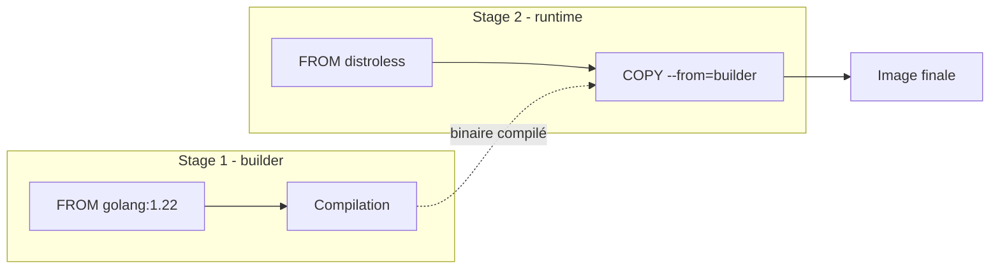

# Construire ses images avec Dockerfile

Le `Dockerfile` est le fichier qui décrit, de manière déclarative, la construction d'une image Docker. Chaque instruction y produit une **couche** du système de fichiers final ; l'enchaînement de ces instructions définit à la fois le contenu de l'image et la façon dont elle s'exécutera.

Maîtriser le `Dockerfile`, c'est comprendre trois choses : la sémantique de chaque instruction, le mécanisme de cache de couches qui détermine la rapidité des builds, et les patterns qui produisent des images petites, sûres et reproductibles.

## Anatomie d'un Dockerfile

Voici un exemple minimal pour une application Python :

```dockerfile
# syntax=docker/dockerfile:1
FROM python:3.12-slim

WORKDIR /app

COPY requirements.txt .
RUN pip install --no-cache-dir -r requirements.txt

COPY . .

EXPOSE 8000
CMD ["python", "-m", "http.server", "8000"]
```

Ce fichier produit, à la suite de `docker build`, une image qui :

- part d'une image officielle Python 3.12 (variante `slim`, allégée) ;
- définit `/app` comme répertoire de travail ;
- installe les dépendances déclarées dans `requirements.txt` ;
- copie le reste des sources dans l'image ;
- expose le port 8000 et lance un serveur HTTP au démarrage.

La première ligne (`# syntax=docker/dockerfile:1`) active la dernière version de la syntaxe Dockerfile via BuildKit — recommandé pour bénéficier des fonctionnalités modernes (cache mounts, secrets).

## Instructions principales

### `FROM` — image de base

Toute construction part d'une image de base. C'est l'instruction obligatoire qui ouvre tout `Dockerfile`.

```dockerfile
FROM debian:12-slim
FROM node:20-alpine
FROM gcr.io/distroless/static:nonroot
```

Le choix de la base influence directement la taille, la surface d'attaque et la complexité de l'image. À titre indicatif :

- `debian:12` — environ 120 Mo, complet, basé sur glibc.
- `debian:12-slim` — environ 80 Mo, sans les paquets non essentiels.
- `alpine:3.19` — environ 8 Mo, basé sur musl libc (incompatible avec certaines bibliothèques compilées en glibc).
- `gcr.io/distroless/*` — quelques Mo, sans shell ni gestionnaire de paquets.
- `scratch` — image vide, utilisable pour des binaires statiques (Go, Rust).

### `RUN` — exécuter pendant la construction

`RUN` exécute une commande pendant la construction et fige le résultat dans une nouvelle couche.

```dockerfile
RUN apt-get update \
    && apt-get install -y --no-install-recommends curl ca-certificates \
    && rm -rf /var/lib/apt/lists/*
```

Trois points à retenir :

- **Une seule couche par `RUN`** : chaîner les commandes avec `&&` plutôt que de multiplier les `RUN`. Multiplier les couches alourdit l'image et complique le cache.
- **Nettoyer dans la même couche** : supprimer les caches APT, pip, npm dans la même instruction `RUN` que leur installation. Sinon, ils restent présents dans la couche précédente même après leur suppression.
- **Échouer rapidement** : utiliser `&&` plutôt que `;` pour interrompre la commande en cas d'erreur intermédiaire.

### `COPY` et `ADD`

`COPY` copie des fichiers du contexte de build vers l'image :

```dockerfile
COPY package.json package-lock.json ./
COPY src/ ./src/
COPY --chown=app:app config/ /etc/myapp/
```

`ADD` fait la même chose mais ajoute deux comportements particuliers : décompression automatique des archives `.tar` locales, et téléchargement depuis une URL. Ces fonctionnalités magiques rendent `ADD` moins prévisible.

:::tip Règle simple
Utiliser `COPY` par défaut. `ADD` uniquement quand on a explicitement besoin de la décompression automatique d'une archive locale.
:::

### `WORKDIR`

Définit le répertoire de travail pour les instructions suivantes (`RUN`, `CMD`, `ENTRYPOINT`, `COPY`, `ADD`) et pour le conteneur au démarrage. Crée le répertoire s'il n'existe pas.

```dockerfile
WORKDIR /app
```

Préférer `WORKDIR` à un enchaînement `RUN cd /app && ...` : c'est plus clair et le changement de répertoire persiste pour les instructions suivantes.

### `ENV` et `ARG`

`ENV` définit une variable d'environnement présente **dans l'image finale**, et donc dans le conteneur à l'exécution :

```dockerfile
ENV LANG=C.UTF-8
ENV PATH="/opt/myapp/bin:${PATH}"
```

`ARG` définit une variable disponible uniquement **pendant la construction** :

```dockerfile
ARG APP_VERSION=1.0.0
RUN echo "Building version ${APP_VERSION}"
```

Les `ARG` peuvent être passés à `docker build` via `--build-arg APP_VERSION=1.2.3`.

:::warning Pas de secrets dans `ARG`
Les valeurs passées via `--build-arg` se retrouvent dans les métadonnées de l'image (visibles avec `docker history`). Ne jamais y mettre de mot de passe, jeton ni clé privée. Pour les secrets de build, utiliser le mécanisme `--secret` de BuildKit (voir plus bas).
:::

### `EXPOSE`

Déclare les ports qu'écoute le conteneur. **Purement informatif** : `EXPOSE` ne publie pas réellement le port, il documente l'intention.

```dockerfile
EXPOSE 8080
```

La publication effective se fait avec `-p` au lancement (`docker run -p 8080:8080 ...`) ou dans Docker Compose.

### `USER`

Définit l'utilisateur — et éventuellement le groupe — sous lequel s'exécutent les instructions suivantes et le conteneur :

```dockerfile
RUN useradd --system --uid 1001 --gid 0 --shell /sbin/nologin app
USER 1001
```

Par défaut, un conteneur s'exécute en `root`. C'est rarement souhaitable : utiliser `USER` réduit significativement la surface d'attaque en cas de compromission de l'application. La plupart des images officielles modernes fournissent déjà un utilisateur dédié (`node`, `nginx`, `postgres`).

### `CMD` et `ENTRYPOINT`

Les deux instructions qui déclarent **ce que le conteneur exécute au démarrage**. La distinction est subtile et reste une source classique de confusion.

**`CMD`** définit la commande par défaut, entièrement remplaçable par les arguments de `docker run` :

```dockerfile
CMD ["python", "app.py"]
```

`docker run mon-image` lance `python app.py`. `docker run mon-image bash` lance `bash` à la place.

**`ENTRYPOINT`** définit le binaire à exécuter, non remplaçable par défaut. Les arguments de `docker run` sont passés à ce binaire :

```dockerfile
ENTRYPOINT ["python"]
CMD ["app.py"]
```

`docker run mon-image` lance `python app.py`. `docker run mon-image -m http.server` lance `python -m http.server`.

**Forme exec vs forme shell** :

```dockerfile
# Forme exec — recommandée
CMD ["nginx", "-g", "daemon off;"]

# Forme shell — à éviter
CMD nginx -g "daemon off;"
```

La forme shell encapsule la commande dans `/bin/sh -c`, ce qui ajoute un processus intermédiaire qui **n'intercepte pas les signaux**. Conséquence directe : `docker stop` n'atteindra pas votre application, qui sera tuée brutalement par `SIGKILL` après le timeout.

:::tip Pattern recommandé
- `ENTRYPOINT` en forme exec pour le binaire principal.
- `CMD` en forme exec pour les arguments par défaut, surchargeables au lancement.
:::

### Autres instructions utiles

```dockerfile
# Métadonnées OCI
LABEL org.opencontainers.image.source="https://github.com/user/repo"
LABEL org.opencontainers.image.version="1.0.0"

# Vérification de santé périodique
HEALTHCHECK --interval=30s --timeout=3s --retries=3 \
  CMD curl -f http://localhost:8080/health || exit 1

# Documente un point de montage attendu
VOLUME ["/data"]
```

## Construction et contexte de build

```bash
docker build -t mon-image:1.0 .
```

Le point final désigne le **contexte de build** : le répertoire envoyé au daemon Docker pour exécuter les instructions `COPY` et `ADD`. Tout le contenu de ce répertoire est transmis au début de la construction.


### `.dockerignore`

Le fichier `.dockerignore`, placé à la racine du contexte, exclut des fichiers et dossiers de l'envoi au daemon. Indispensable dès que le projet contient des dossiers volumineux ou sensibles :

```
.git
node_modules
*.log
.env
.env.local
__pycache__
*.pyc
dist/
build/
```

Bénéfices :

- **Builds plus rapides** : le contexte est plus léger à transmettre.
- **Cache mieux invalidé** : un changement dans `.git/` ou `node_modules/` n'invalide pas une couche `COPY .`.
- **Sécurité** : on évite d'inclure accidentellement des fichiers sensibles dans l'image.

L'absence de `.dockerignore` est l'une des erreurs les plus courantes et les plus pénalisantes.

## Cache de couches

C'est le mécanisme qui rend les builds rapides, et qu'il faut comprendre pour structurer un `Dockerfile` efficace.

À chaque instruction, Docker calcule une empreinte basée sur l'instruction elle-même et son contexte (fichiers copiés pour `COPY`, valeurs de `ARG`, etc.). Si cette empreinte existe déjà en cache, la couche est réutilisée. Sinon, l'instruction est exécutée et **toutes les instructions suivantes le sont aussi**, leur cache devenant invalide en cascade.

D'où la règle d'or : **placer ce qui change rarement avant ce qui change souvent**.

### Exemple typique pour Node.js

Version naïve :

```dockerfile
FROM node:20-alpine
WORKDIR /app
COPY . .
RUN npm ci
CMD ["node", "server.js"]
```

À chaque modification du code source, `COPY . .` invalide le cache, et `npm ci` se réexécute intégralement. Sur une grosse application, ce sont plusieurs minutes perdues à chaque build.

Version optimisée :

```dockerfile
FROM node:20-alpine
WORKDIR /app

# Dépendances : invalidées uniquement si package.json change
COPY package.json package-lock.json ./
RUN npm ci

# Code applicatif : change souvent, mais le cache de npm est préservé
COPY . .

CMD ["node", "server.js"]
```

`npm ci` ne se réexécute désormais que si `package.json` ou `package-lock.json` changent. Le pattern est identique pour pip (`requirements.txt`), Go (`go.mod` / `go.sum`), Cargo (`Cargo.toml` / `Cargo.lock`), Composer (`composer.json` / `composer.lock`), etc.

## Builds multi-stages

Les builds multi-stages permettent de **séparer la construction de l'exécution** : on utilise une image volumineuse pour compiler, et on ne conserve que l'artefact final dans une image légère.



Exemple complet pour une application Go :

```dockerfile
# syntax=docker/dockerfile:1

# --- Stage de construction ---
FROM golang:1.22-alpine AS builder
WORKDIR /src

COPY go.mod go.sum ./
RUN go mod download

COPY . .
RUN CGO_ENABLED=0 go build -ldflags="-s -w" -o /out/app .

# --- Stage final ---
FROM gcr.io/distroless/static:nonroot
COPY --from=builder /out/app /app
USER nonroot:nonroot
ENTRYPOINT ["/app"]
```

L'image finale ne contient ni Go, ni shell, ni gestionnaire de paquets — uniquement le binaire et les certificats CA. Taille typique : quelques mégaoctets, surface d'attaque minimale.

Ce pattern s'applique à toute compilation : Rust, C/C++, Java (avec `jlink` ou GraalVM), TypeScript (compilation puis runtime Node minimal), etc.

:::tip Construire une cible précise
On peut construire un stage intermédiaire avec `--target` : `docker build --target builder -t mon-app:dev .` produit l'image du stage `builder`. Utile en développement, quand on veut conserver les outils de compilation pour itérer.
:::

## BuildKit et fonctionnalités modernes

BuildKit est le moteur de construction utilisé par défaut dans les versions récentes de Docker. Il apporte plusieurs fonctionnalités précieuses.

### Cache mounts

Le cache d'un gestionnaire de paquets peut être stocké hors du système de fichiers de l'image et partagé entre builds successifs :

```dockerfile
RUN --mount=type=cache,target=/root/.cache/pip \
    pip install -r requirements.txt
```

Avantage : on bénéficie du cache de pip d'un build à l'autre **sans** alourdir l'image finale.

### Secrets

Pour passer un secret au build sans qu'il apparaisse dans l'image ni dans les métadonnées :

```dockerfile
RUN --mount=type=secret,id=github_token \
    GITHUB_TOKEN=$(cat /run/secrets/github_token) \
    git clone https://"$GITHUB_TOKEN"@github.com/private/repo.git
```

Invocation :

```bash
docker build --secret id=github_token,src=./token.txt -t mon-app .
```

Le secret est monté éphémèrement, n'est pas écrit sur le disque de l'image et n'apparaît pas dans `docker history`.

## Bonnes pratiques

Les principes qui produisent des images petites, rapides à construire et sûres :

**Choisir une base minimale.** `slim`, `alpine` ou `distroless` quand le projet le permet. Plus la base est petite, moins il y a de CVE à patcher et de surface d'attaque.

**Épingler les versions.** `FROM python:3.12.4-slim`, pas `FROM python:latest`. Idéalement référencer par digest pour la production.

**Ordonner les instructions du plus stable au plus volatile.** Dépendances avant code applicatif. Toujours.

**Combiner les `RUN` qui vont ensemble.** Une installation et son nettoyage dans la même couche.

**Toujours fournir un `.dockerignore`.** Y inclure au minimum `.git/`, les caches et les fichiers de configuration locale.

**Exécuter en non-root.** `USER` représente trois lignes supplémentaires et élimine une classe entière de vulnérabilités.

**Préférer la forme exec** pour `CMD` et `ENTRYPOINT`, sauf besoin spécifique d'un shell pour interpréter une chaîne.

**Multi-stage par défaut** pour tout langage compilé. Aucune raison de garder le compilateur dans l'image de production.

**Ne pas mettre de secrets dans `ARG` ni dans `ENV`.** Utiliser BuildKit secrets pour le build, et l'injection à l'exécution (`-e`, secrets Docker, gestionnaires externes) pour le runtime.

## Et ensuite ?

Une image, c'est rarement suffisant : une application moderne combine plusieurs services — base de données, cache, application, reverse proxy. La prochaine étape est de les orchestrer ensemble avec **Docker Compose**.
