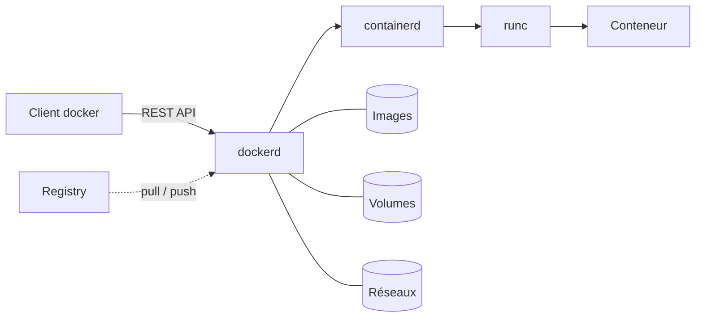

# Introduction à Docker

Docker est une plateforme open-source permettant de packager, distribuer et exécuter des applications dans des **conteneurs**. Un conteneur regroupe une application et l'ensemble de ses dépendances — bibliothèques, fichiers de configuration, binaires système — dans une unité isolée et reproductible, capable de s'exécuter de manière identique sur n'importe quel hôte compatible.

Depuis sa première version publique en 2013, Docker a profondément transformé les pratiques de développement et de déploiement, en popularisant un modèle léger d'isolation auparavant réservé à des outils plus complexes (LXC, FreeBSD jails, Solaris zones).

## Conteneurisation et virtualisation

Pour bien comprendre Docker, il convient de distinguer la **virtualisation matérielle** (machines virtuelles) de la **virtualisation au niveau du système d'exploitation** (conteneurs).

### Machines virtuelles

Une machine virtuelle (VM) simule un ordinateur complet. Un **hyperviseur** — KVM, VMware ESXi, Hyper-V — intercepte les appels matériels et présente à chaque VM un matériel virtualisé. Chaque VM embarque son propre noyau et son propre système d'exploitation invité.

```
┌─────────────────────────────────────────┐
│  App A   │  App B   │  App C            │
├──────────┼──────────┼───────────────────┤
│  OS A    │  OS B    │  OS C  (invités)  │
├──────────┴──────────┴───────────────────┤
│              Hyperviseur                │
├─────────────────────────────────────────┤
│        Système d'exploitation hôte      │
├─────────────────────────────────────────┤
│                Matériel                 │
└─────────────────────────────────────────┘
```

### Conteneurs

Un conteneur partage le **noyau de l'hôte** et n'embarque que les fichiers nécessaires à l'application : binaires, bibliothèques, configuration. L'isolation est assurée par des mécanismes du noyau Linux, et non par un hyperviseur.

```
┌─────────────────────────────────────────┐
│  App A   │  App B   │  App C            │
├──────────┼──────────┼───────────────────┤
│  Lib A   │  Lib B   │  Lib C            │
├──────────┴──────────┴───────────────────┤
│           Moteur de conteneurs          │
├─────────────────────────────────────────┤
│        Système d'exploitation hôte      │
│             (noyau partagé)             │
├─────────────────────────────────────────┤
│                Matériel                 │
└─────────────────────────────────────────┘
```

### Comparaison

| Critère | Machine virtuelle | Conteneur |
|---------|-------------------|-----------|
| Niveau d'isolation | Matériel virtualisé | Processus isolés (noyau partagé) |
| Empreinte disque | Gigaoctets (OS complet) | Mégaoctets (couche applicative) |
| Démarrage | Secondes à minutes | Quelques millisecondes |
| Densité par hôte | Faible (dizaines) | Élevée (centaines à milliers) |
| Portabilité | Dépend de l'hyperviseur | Standard OCI, indépendant du runtime |
| Cas d'usage typique | Cloisonnement fort multi-OS | Microservices, CI/CD, déploiements applicatifs |

:::note
Les deux approches ne sont pas exclusives. Il est courant d'exécuter des conteneurs **à l'intérieur** de machines virtuelles, par exemple sur les nœuds d'un cluster Kubernetes hébergé chez un fournisseur cloud.
:::

## Comment fonctionne un conteneur

L'isolation des conteneurs Linux repose sur trois mécanismes fournis par le noyau.

### Namespaces

Les *namespaces* cloisonnent les ressources visibles par un processus. Chaque conteneur dispose de ses propres vues isolées :

- `pid` : arborescence des processus (le PID 1 du conteneur n'est pas le PID 1 de l'hôte).
- `net` : interfaces réseau, tables de routage, règles `iptables`.
- `mnt` : points de montage du système de fichiers.
- `uts` : nom d'hôte et de domaine.
- `ipc` : files de messages, sémaphores, segments de mémoire partagée.
- `user` : correspondance entre les UID/GID du conteneur et ceux de l'hôte.

### Control groups (cgroups)

Les *cgroups* permettent de **limiter et mesurer** la consommation de ressources d'un groupe de processus : CPU, mémoire, entrées/sorties disque, bande passante réseau. C'est ce qui empêche un conteneur de monopoliser les ressources de l'hôte.

### Systèmes de fichiers en couches

Les images Docker sont construites en empilant des **couches** en lecture seule via un système de fichiers d'union (OverlayFS par défaut). Au lancement d'un conteneur, une couche en écriture est ajoutée par-dessus. Ce modèle apporte deux bénéfices :

- les couches communes entre images sont stockées et téléchargées **une seule fois** ;
- les modifications faites dans un conteneur sont isolées de l'image d'origine, qui reste immuable.

## Architecture de Docker

Docker repose sur une architecture client / serveur.



Les composants principaux :

- **Le client `docker`** : interface en ligne de commande qui dialogue avec le daemon via une API REST exposée sur un socket Unix.
- **Le daemon `dockerd`** : processus qui orchestre les opérations sur les images, conteneurs, volumes et réseaux.
- **`containerd`** : runtime de haut niveau, responsable du cycle de vie des conteneurs.
- **`runc`** : runtime de bas niveau conforme à la spécification OCI, qui interagit directement avec le noyau pour créer les conteneurs.
- **Le registry** : dépôt distant pour stocker et distribuer les images (Docker Hub, GitHub Container Registry, GitLab Registry, instance privée auto-hébergée).

## Bénéfices

**Reproductibilité.** L'environnement d'exécution est défini de manière déclarative dans un `Dockerfile`. Une même image produit le même comportement en développement, en intégration et en production, ce qui élimine la classique objection « ça marche sur ma machine ».

**Portabilité.** Toute infrastructure compatible OCI peut exécuter l'image, qu'il s'agisse d'un poste de développement, d'un serveur bare-metal, d'une VM ou d'un orchestrateur (Kubernetes, Nomad, Docker Swarm).

**Efficacité.** L'absence de système d'exploitation invité réduit l'empreinte mémoire et accélère le démarrage. Sur un même hôte, on peut faire cohabiter un grand nombre de conteneurs là où quelques VM saturent déjà les ressources.

**Cloisonnement.** Chaque service s'exécute dans son propre environnement, ce qui limite les conflits de versions de bibliothèques et facilite la coexistence d'applications hétérogènes sur un même hôte.

**Cycle de vie applicatif.** Les conteneurs s'intègrent naturellement dans les chaînes CI/CD : construction de l'image à chaque commit, exécution des tests sur cette image, puis promotion du même artefact vers les environnements supérieurs sans le reconstruire.

## Sécurité

L'isolation par conteneur est **plus faible** qu'une isolation par hyperviseur : tous les conteneurs partagent le même noyau, et une vulnérabilité du noyau peut potentiellement être exploitée depuis un conteneur compromis. Plusieurs mécanismes complémentaires renforcent toutefois la posture de sécurité :

- **User namespaces** pour exécuter le PID 1 du conteneur en tant qu'utilisateur non privilégié sur l'hôte.
- **Capabilities Linux** : un conteneur ne reçoit par défaut qu'un sous-ensemble réduit des privilèges du superutilisateur.
- **Seccomp** : filtrage des appels système autorisés.
- **AppArmor / SELinux** : politiques de contrôle d'accès obligatoire.
- **Rootless Docker** : exécution complète du daemon sans privilèges root.

Pour des charges critiques ou multi-tenants nécessitant une isolation plus forte, on peut envisager des runtimes alternatifs comme **gVisor** (noyau utilisateur intermédiaire) ou **Kata Containers** (micro-VM par conteneur).

## Limites et considérations

Docker n'est pas une solution universelle. Quelques points méritent attention :

- **Applications fortement persistantes.** Les conteneurs sont conçus pour être éphémères ; les données doivent être externalisées dans des volumes ou des services dédiés.
- **Charges à très faible latence ou accès matériel direct.** Les workloads exigeant un accès à un GPU, à un périphérique spécifique ou à des paramètres noyau particuliers demandent une configuration plus fine.
- **Observabilité.** La nature éphémère et distribuée des conteneurs impose une stratégie adaptée : agrégation des logs, métriques exposées par les conteneurs, traçage distribué.
- **Complexité opérationnelle à l'échelle.** Au-delà de quelques hôtes, l'orchestration (Kubernetes, Swarm) devient indispensable et apporte sa propre courbe d'apprentissage.

## Pour aller plus loin

La suite de cette documentation aborde :

- [L'installation de Docker](./installation) sur Arch Linux et Debian / Ubuntu.
- *(À venir)* Les commandes fondamentales et le cycle de vie d'un conteneur.
- *(À venir)* La rédaction d'un `Dockerfile`.
- *(À venir)* L'orchestration multi-conteneurs avec Docker Compose.
