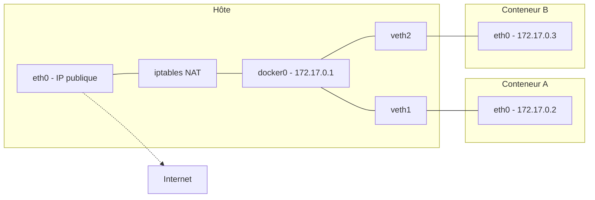
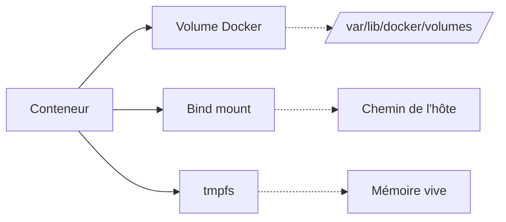

# Réseaux et volumes Docker

Deux dimensions transverses sous-tendent toute utilisation sérieuse de Docker : **comment les conteneurs communiquent** (entre eux, avec l'hôte, avec l'extérieur) et **où vivent leurs données** (au-delà de leur cycle de vie éphémère). Les deux sujets sont indépendants mais partagent une caractéristique : ils sont triviaux dans les cas simples et deviennent vite techniques dès qu'on en sort.

## Réseaux

### Modèle réseau

Chaque conteneur dispose par défaut de son propre **network namespace** : une pile réseau isolée avec ses propres interfaces, tables de routage, règles `iptables`. Cette isolation est ce qui permet à plusieurs conteneurs de tous écouter sur le port 80 sans conflit — chacun a son propre `lo`, son propre `eth0`.

Docker connecte les conteneurs entre eux et au reste du monde via des **réseaux logiques**. Trois réseaux existent par défaut :

```bash
docker network ls
```

```
NETWORK ID     NAME      DRIVER    SCOPE
abc123...      bridge    bridge    local
def456...      host      host      local
ghi789...      none      null      local
```

- `bridge` : le réseau par défaut. Tout conteneur lancé sans option `--network` y est attaché.
- `host` : le conteneur partage directement la pile réseau de l'hôte (aucune isolation).
- `none` : aucune connectivité réseau (utile pour des conteneurs purement calculatoires).

### Le driver `bridge`

Le driver le plus utilisé. Docker crée une interface bridge Linux (`docker0` par défaut) à laquelle chaque conteneur est rattaché via une paire `veth`. Le conteneur reçoit une IP dans un sous-réseau privé (typiquement `172.17.0.0/16`).



Le trafic sortant des conteneurs est masqueradé (SNAT) via `iptables` pour apparaître comme provenant de l'hôte. Le trafic entrant utilise du DNAT, configuré quand on publie un port avec `-p`.

### Bridge par défaut vs bridge personnalisé

Distinction cruciale, et source classique de confusion : **le bridge par défaut (`bridge`) ne fournit pas de résolution DNS entre conteneurs**. Les conteneurs y communiquent uniquement par adresse IP, ce qui est fragile (les IP changent à chaque redémarrage).

Un **bridge personnalisé** (créé via `docker network create`) fournit en revanche un résolveur DNS embarqué qui résout les noms de conteneurs vers leurs IP. C'est ce qui fait fonctionner les exemples Compose qu'on a vus précédemment, où `app` joint `db` simplement en utilisant le nom `db`.

```bash
docker network create mon-reseau
docker run -d --name db --network mon-reseau postgres:16-alpine
docker run -d --name app --network mon-reseau mon-app
# Depuis le conteneur "app", la commande suivante fonctionne :
# psql -h db -U app
```

:::tip Règle simple
Toujours créer un réseau personnalisé plutôt que d'utiliser le `bridge` par défaut. Compose le fait automatiquement.
:::

### Le driver `host`

Avec `--network host`, le conteneur **partage la pile réseau de l'hôte**. Pas d'isolation, pas de port publishing : si le conteneur écoute sur 8080, c'est directement sur 8080 de l'hôte.

```bash
docker run --rm --network host nginx
```

Utilité : performances réseau maximales (pas de NAT, pas de bridge), et accès direct à des protocoles bas niveau (multicast, broadcast, sondes ICMP brutes). Inconvénient évident : **aucune isolation**, à réserver à des cas spécifiques où l'on accepte ce compromis.

### Le driver `macvlan`

`macvlan` donne à chaque conteneur sa propre adresse MAC sur le réseau physique de l'hôte, comme s'il s'agissait d'une machine indépendante connectée au switch. Le conteneur reçoit une IP du réseau physique (par DHCP ou attribution manuelle) et est joignable directement, sans NAT.

```bash
docker network create -d macvlan \
  --subnet=192.168.1.0/24 \
  --gateway=192.168.1.1 \
  -o parent=eth0 \
  reseau-physique

docker run --rm --network reseau-physique --ip=192.168.1.100 nginx
```

Cas d'usage : conteneur qui doit apparaître comme un équipement à part entière sur le LAN — DHCP server, application qui doit recevoir du multicast, intégration avec des systèmes hérités qui s'attendent à un hôte « réel ».

:::warning Limite classique de macvlan
Par défaut, **l'hôte ne peut pas communiquer avec ses propres conteneurs macvlan** : le trafic part par l'interface physique et est rejeté par le switch. Pour contourner, il faut créer une interface `macvlan` supplémentaire côté hôte.
:::

### Les drivers `overlay` et `ipvlan`

`overlay` est le driver utilisé par Docker Swarm pour faire communiquer des conteneurs **entre plusieurs hôtes**. Il encapsule le trafic dans des tunnels VXLAN. Hors Swarm ou clusters dédiés, on le croise rarement en pratique.

`ipvlan` est proche de `macvlan` mais sans changement d'adresse MAC — les conteneurs partagent celle de l'interface parente. Utile dans des environnements où le switch limite le nombre de MAC autorisées par port.

### Publication des ports

Pour exposer un service d'un conteneur à l'extérieur (hôte ou réseau) :

```bash
docker run -d -p 8080:80 nginx              # 8080 hôte → 80 conteneur
docker run -d -p 127.0.0.1:5432:5432 postgres   # Liaison à localhost seulement
docker run -d -p 80:80 -p 443:443 nginx     # Plusieurs ports
docker run -d -P nginx                       # Publie tous les ports EXPOSE sur des ports aléatoires
```

La forme `127.0.0.1:5432:5432` est importante en production : sans préciser l'IP, Docker écoute sur `0.0.0.0`, donc le port est ouvert sur toutes les interfaces — y compris l'interface publique du serveur. Beaucoup de bases de données se retrouvent exposées à Internet à cause de ça.

:::warning Docker et le firewall
Docker manipule directement `iptables` pour mettre en place le NAT et le port publishing. Conséquence souvent ignorée : les règles `iptables` configurées par `ufw`, `firewalld` ou autres outils habituels **peuvent être contournées** par les règles ajoutées par Docker. Sur un serveur exposé à Internet, vérifier explicitement avec `iptables -L -n` ce qui est réellement filtré.
:::

### Gestion des réseaux

```bash
docker network ls                              # Lister
docker network create --driver bridge mon-net  # Créer
docker network inspect mon-net                 # Inspecter (subnet, conteneurs attachés)
docker network connect mon-net mon-conteneur   # Attacher un conteneur en cours
docker network disconnect mon-net mon-conteneur
docker network rm mon-net                      # Supprimer (doit être inutilisé)
docker network prune                           # Supprimer tous les réseaux non utilisés
```

Un conteneur peut être attaché à **plusieurs réseaux simultanément** — pattern utile pour segmenter une stack (un service applicatif sur un réseau `frontend` accessible au proxy, et sur un réseau `backend` accessible à la base de données).

## Volumes et stockage

Le système de fichiers d'un conteneur est éphémère par conception : tout ce qui y est écrit pendant l'exécution disparaît à la suppression du conteneur. Pour conserver des données entre exécutions, ou pour les partager avec l'hôte, Docker propose trois mécanismes.



### Volumes

Les **volumes** sont gérés intégralement par Docker. Ils sont stockés dans `/var/lib/docker/volumes/` sur l'hôte (à ne pas manipuler directement) et persistent indépendamment du cycle de vie des conteneurs.

```bash
docker volume create db-data
docker run -d -v db-data:/var/lib/postgresql/data postgres:16-alpine

# Le volume survit à la suppression du conteneur
docker rm -f $(docker ps -aq)
docker volume ls   # db-data est toujours là
```

C'est le mécanisme **recommandé** pour les données persistantes (bases de données, uploads utilisateurs, état applicatif). Avantages :

- Géré par Docker (sauvegarde, migration, drivers tiers).
- Performances natives sur Linux (même filesystem que l'hôte).
- Pas de problème de permissions UID/GID sur le filesystem hôte.
- Indépendant de la structure du système de fichiers hôte.

### Bind mounts

Un **bind mount** monte un répertoire de l'hôte dans le conteneur. Le contenu est exactement celui du répertoire hôte, accessible en lecture/écriture depuis les deux côtés.

```bash
docker run -d -v /chemin/sur/hote:/chemin/dans/conteneur:ro nginx
docker run --rm -v "$(pwd)":/workspace -w /workspace python:3.12 python script.py
```

Cas d'usage :

- **Développement** : monter le code source pour itérer sans reconstruire l'image.
- **Configuration** : monter un fichier de config en lecture seule (`:ro`).
- **Accès à des ressources hôte** : sockets (`/var/run/docker.sock`), périphériques, journaux.

:::warning Le piège des permissions
Le conteneur écrit dans le bind mount avec son propre UID (souvent `root` ou un UID arbitraire). Les fichiers créés appartiennent alors à cet UID sur l'hôte, ce qui peut causer des problèmes d'accès depuis l'utilisateur courant. Trois solutions courantes :

- Aligner l'UID du processus dans le conteneur avec celui de l'utilisateur hôte (`--user $(id -u):$(id -g)`).
- Ajuster les permissions dans le `Dockerfile` ou via un script d'entrée.
- Utiliser un volume plutôt qu'un bind mount.
:::

:::note Performance sur macOS et Windows
Sur ces systèmes, Docker tourne dans une VM Linux et les bind mounts passent par un pont de fichiers (gRPC FUSE, virtiofs selon les versions). Les performances sur de gros arbres de fichiers — `node_modules`, dépôts Git volumineux — peuvent être significativement dégradées. Sur Linux, l'accès est natif.
:::

### tmpfs

Un **tmpfs** monte un système de fichiers en mémoire vive, vidé à l'arrêt du conteneur.

```bash
docker run --rm --tmpfs /cache:size=64m,mode=1777 mon-image
```

Cas d'usage : données très volatiles dont on veut éviter la persistance disque — secrets temporaires décodés, cache éphémère, scratch space d'un build sensible.

### Drivers de volume

Le driver par défaut, `local`, stocke les volumes sur le filesystem de l'hôte. D'autres drivers permettent de stocker les volumes ailleurs : NFS, SSHFS, AWS EBS, GlusterFS, etc.

```bash
docker volume create --driver local \
  --opt type=nfs \
  --opt o=addr=10.0.0.5,rw \
  --opt device=:/exports/data \
  nfs-data
```

Utile pour partager un volume entre plusieurs hôtes ou s'appuyer sur un stockage existant. En pratique, dès qu'on a besoin de plusieurs hôtes, on se tourne plutôt vers un orchestrateur (Swarm, Kubernetes) qui gère ça plus proprement.

### Gestion des volumes

```bash
docker volume ls                       # Lister
docker volume create mon-volume        # Créer
docker volume inspect mon-volume       # Détails (chemin, driver, options)
docker volume rm mon-volume            # Supprimer (doit être inutilisé)
docker volume prune                    # Supprimer tous les volumes non utilisés
```

### Sauvegarder et restaurer un volume

Patron classique pour sauvegarder un volume nommé, sans devoir interrompre les services qui l'utilisent :

```bash
docker run --rm \
  -v db-data:/data:ro \
  -v "$(pwd)":/backup \
  alpine tar czf /backup/db-data.tar.gz -C /data .
```

On démarre un conteneur Alpine éphémère, on lui monte le volume en lecture seule et le répertoire courant en écriture, puis on archive. La restauration utilise le pattern inverse :

```bash
docker run --rm \
  -v db-data:/data \
  -v "$(pwd)":/backup \
  alpine tar xzf /backup/db-data.tar.gz -C /data
```

Pour les bases de données, préférer toutefois les outils natifs (`pg_dump`, `mysqldump`) à la sauvegarde de volume : ils produisent des dumps cohérents et indépendants de la version du moteur, là où une archive du volume brut peut être incohérente si le service écrit pendant la copie.

## Réseau vs volumes : comparaison synthétique

|  | Volume | Bind mount | tmpfs |
|---|---|---|---|
| Géré par Docker | Oui | Non | Oui |
| Stockage | `/var/lib/docker/volumes/` | Chemin hôte arbitraire | Mémoire |
| Persistance | Oui | Oui | Non |
| Performances Linux | Natives | Natives | Excellentes |
| Performances macOS/Windows | Natives | Dégradées | Excellentes |
| Cas d'usage type | Données applicatives | Dev, config, sockets | Données volatiles, secrets |

|  | bridge (par défaut) | bridge perso | host | macvlan |
|---|---|---|---|---|
| Isolation réseau | Oui | Oui | Non | Oui |
| DNS entre conteneurs | Non | Oui | N/A | Oui |
| Performances | Bonnes | Bonnes | Maximales | Bonnes |
| Conteneur visible sur le LAN | Non (NAT) | Non (NAT) | Oui (via hôte) | Oui (IP propre) |
| Cas d'usage type | À éviter | Stack applicative | Performance pure | Intégration LAN |

## Sécurité et bonnes pratiques

**Réseau :**

- Toujours utiliser des **bridges personnalisés** plutôt que le bridge par défaut.
- **Lier les ports à `127.0.0.1`** pour les services qui ne doivent pas sortir de la machine.
- **Segmenter** : un conteneur n'a pas à être sur le même réseau que tous les autres. Le pattern frontend / backend visu dans l'article Compose s'applique ici à plein régime.
- **Vérifier explicitement** les règles `iptables` en production, indépendamment de l'outil de firewall utilisé.

**Stockage :**

- **Volumes nommés** pour tout ce qui doit persister.
- **Bind mounts en lecture seule** quand on n'a besoin que de lire (`:ro`).
- **Ne jamais monter des chemins système** (`/`, `/etc`, `/proc`) sans raison impérieuse.
- **Ne jamais monter le socket Docker** (`/var/run/docker.sock`) dans un conteneur qui exécute du code non maîtrisé : c'est une élévation de privilèges directe vers `root` sur l'hôte.

## Et ensuite ?

Cette série a couvert les fondamentaux d'une utilisation autonome de Docker : concepts, installation, commandes, construction d'images, orchestration locale, réseaux et stockage. Les étapes naturelles au-delà sont :

- **Docker Swarm** pour étendre Compose à un cluster de plusieurs hôtes — l'outil natif Docker, simple à prendre en main mais peu adopté.
- **Kubernetes** pour les charges plus exigeantes ou les environnements de production sérieux — courbe d'apprentissage significative, mais standard de facto.
- **Sécurité avancée** : rootless Docker, scan d'images (Trivy, Grype), signatures (cosign), politiques d'admission.
- **Observabilité** : agrégation des logs, métriques exposées par les conteneurs, traçage distribué.

Ces sujets dépassent le périmètre d'une documentation Docker pure et relèvent davantage d'une documentation orientée production ou orchestration.
