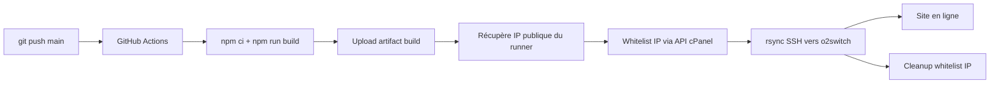

# Déploiement automatique d'un site Docusaurus sur o2switch via GitHub Actions

Cette page décrit la mise en place d'un déploiement entièrement automatisé d'un site statique généré par Docusaurus vers un hébergement mutualisé o2switch. Le déclencheur est un `git push` sur la branche `main` : GitHub Actions s'occupe du build, de l'autorisation IP temporaire côté pare-feu, puis du transfert via `rsync` SSH.

## Architecture



Le système contourne volontairement l'outil **Git Version Control** du cPanel d'o2switch, qui impose un clic manuel sur "Deploy HEAD Commit" à chaque mise à jour. Le `rsync` direct est plus rapide (transfert différentiel uniquement), plus simple et entièrement scriptable.

## Pré-requis

### Côté o2switch

1. **Domaine configuré** dans cPanel → *Domaines*, pointant vers un dossier dédié (par exemple `/home/UTILISATEUR/docs.exemple.fr/`). Éviter `public_html` pour ne pas polluer le site principal.
2. **Token API cPanel** généré via l'outil *Créer un jeton d'API*. Choisir une expiration longue (1 an) et noter le token immédiatement, il ne s'affiche qu'une fois.
3. **Clé SSH dédiée au déploiement**, autorisée côté serveur :
   - Générer une paire de clés sur un poste local (la clé privée n'a vocation à n'aller que dans GitHub) :
     ```bash
     ssh-keygen -t ed25519 -C "github-deploy-o2switch" -f ~/.ssh/o2switch_deploy
     ```
   - Importer le contenu de `~/.ssh/o2switch_deploy.pub` dans cPanel → *Accès SSH* → *Gérer les clés SSH* → *Importer une clé*, puis cliquer sur **Autoriser**.
4. **Hostname du serveur** : disponible dans l'URL d'accès au cPanel, sous la forme `nomduserveur.o2switch.net`. Le même hostname sert pour les connexions SSH.

:::warning Limite des exceptions firewall
o2switch limite la whitelist SSH à **5 IP simultanées**. Le workflow détaillé plus bas ajoute son IP au début et la retire à la fin, donc une seule place est utilisée temporairement.
:::

### Côté GitHub

Sept secrets de dépôt à créer dans `Settings` → `Secrets and variables` → `Actions` → `Repository secrets`.

| Secret | Contenu attendu |
|---|---|
| `CPANEL_USERNAME` | Identifiant cPanel |
| `CPANEL_API_TOKEN` | Token généré côté o2switch |
| `CPANEL_SERVER` | `nomduserveur.o2switch.net` |
| `SSH_HOST` | `nomduserveur.o2switch.net` |
| `SSH_USER` | Identifiant cPanel (identique à `CPANEL_USERNAME`) |
| `SSH_PRIVATE_KEY` | Contenu complet de la clé privée, incluant les lignes `BEGIN`/`END` |
| `SSH_TARGET_PATH` | Chemin absolu du dossier de destination, avec un `/` final |

:::info Repository secrets vs Environments
La page *Actions secrets* contient aussi une zone *Environments*. Pour un site personnel sans logique de staging, les **Repository secrets** suffisent. Les Environments servent à isoler des contextes (`production`, `staging`) et à imposer des règles de protection.
:::

### Côté projet

Le `.gitignore` doit exclure le dossier de build pour ne pas polluer le dépôt. Les valeurs par défaut générées par `create-docusaurus` conviennent. Vérifier la présence des entrées suivantes :

```
/node_modules
/build
.docusaurus
.env
```

## Le workflow

Fichier à créer à `.github/workflows/deploy.yml` :

```yaml
name: Build & Deploy to o2switch

on:
  push:
    branches: [main]
  workflow_dispatch:

jobs:
  build:
    name: Build Docusaurus
    runs-on: ubuntu-latest
    steps:
      - uses: actions/checkout@v4

      - name: Setup Node.js
        uses: actions/setup-node@v4
        with:
          node-version: 20
          cache: 'npm'

      - name: Install dependencies
        run: npm ci

      - name: Build
        run: npm run build

      - name: Upload build artifact
        uses: actions/upload-artifact@v4
        with:
          name: build
          path: build/
          retention-days: 1

  deploy:
    name: Deploy to o2switch
    needs: build
    runs-on: ubuntu-latest
    steps:
      - name: Download build artifact
        uses: actions/download-artifact@v4
        with:
          name: build
          path: build

      - name: Get runner public IP
        id: ip
        uses: haythem/public-ip@v1.3

      - name: Whitelist runner IP
        run: |
          curl -sm 45 \
            -H "Authorization: cpanel ${{ secrets.CPANEL_USERNAME }}:${{ secrets.CPANEL_API_TOKEN }}" \
            "https://${{ secrets.CPANEL_SERVER }}:2083/execute/SshWhitelist/add?address=${{ steps.ip.outputs.ipv4 }}&port=22"

      - name: Setup SSH key
        run: |
          mkdir -p ~/.ssh
          echo "${{ secrets.SSH_PRIVATE_KEY }}" > ~/.ssh/id_ed25519
          chmod 600 ~/.ssh/id_ed25519
          ssh-keyscan -H ${{ secrets.SSH_HOST }} >> ~/.ssh/known_hosts

      - name: Deploy via rsync
        run: |
          rsync -avz --delete \
            --exclude='.htaccess' \
            --exclude='.well-known' \
            --exclude='.nojekyll' \
            -e "ssh -i ~/.ssh/id_ed25519 -o StrictHostKeyChecking=no" \
            build/ \
            ${{ secrets.SSH_USER }}@${{ secrets.SSH_HOST }}:${{ secrets.SSH_TARGET_PATH }}

      - name: Remove runner IP from whitelist
        if: always()
        run: |
          curl -sm 45 \
            -H "Authorization: cpanel ${{ secrets.CPANEL_USERNAME }}:${{ secrets.CPANEL_API_TOKEN }}" \
            "https://${{ secrets.CPANEL_SERVER }}:2083/execute/SshWhitelist/remove?address=${{ steps.ip.outputs.ipv4 }}&port=22&direction=in" || true
          curl -sm 45 \
            -H "Authorization: cpanel ${{ secrets.CPANEL_USERNAME }}:${{ secrets.CPANEL_API_TOKEN }}" \
            "https://${{ secrets.CPANEL_SERVER }}:2083/execute/SshWhitelist/remove?address=${{ steps.ip.outputs.ipv4 }}&port=22&direction=out" || true
```

### Points de détail

**Le `rsync --delete`** synchronise le dossier distant à l'identique du `build/` local : tout fichier absent côté source est supprimé côté serveur. Cela garantit qu'un fichier supprimé localement (page renommée, blog post retiré) disparaît bien en production.

**Les `--exclude`** préservent les fichiers gérés indépendamment du build :

- `.htaccess` : configuration Apache (redirections HTTPS, règles de réécriture). Ce fichier est édité côté serveur et n'est pas généré par Docusaurus.
- `.well-known/` : utilisé par Let's Encrypt pour le renouvellement automatique du certificat SSL. Sa suppression compromettrait le prochain renouvellement.
- `.nojekyll` : marqueur GitHub Pages, sans usage chez o2switch.

**Le `remove` du whitelist** doit cibler explicitement les directions `in` et `out`. L'API d'o2switch retourne une erreur "Suppression impossible, l'autorisation n'existe pas" si la direction n'est pas précisée. Le `|| true` neutralise l'échec d'une direction si l'autre a déjà été nettoyée.

**Le `if: always()`** sur le step de nettoyage garantit son exécution même si le `rsync` a échoué, ce qui évite les IP orphelines en cas d'incident.

## Pièges connus

:::warning L'outil "Autorisation SSH" d'o2switch
L'interface propose plusieurs ports dans son menu déroulant, mais seul **22 (SSH)** ouvre réellement la connexion. Sélectionner un autre port provoque la création d'une règle inutilisable et un timeout à la connexion.
:::

:::warning Perte des fichiers côté serveur au premier déploiement
Si le dossier de destination contient des fichiers ajoutés à la main (anciennes pages, archives `.zip`, dossiers indépendants), le premier `rsync --delete` les efface. Vérifier le contenu du dossier serveur **avant** le premier push et déplacer ce qui doit être conservé, ou ajouter des `--exclude` ciblés.
:::

:::tip Tester le SSH avant le workflow
Avant de pousser le workflow, valider que la clé fonctionne depuis un poste local :

```bash
ssh -i ~/.ssh/o2switch_deploy UTILISATEUR@nomduserveur.o2switch.net
```

L'IP du poste doit évidemment être whitelistée. Si la commande échoue, le workflow échouera également.
:::

:::tip Suivre l'exécution
L'onglet *Actions* du dépôt GitHub affiche chaque run en temps réel. Cliquer sur un job ouvre les logs étape par étape, ce qui permet d'identifier rapidement la cause d'un échec.
:::

## Coût

GitHub Actions est **gratuit et illimité** sur les dépôts publics avec les runners standards. Pour un dépôt privé, le plan Free inclut 2000 minutes Linux par mois, ce qui couvre largement quelques centaines de déploiements (un run complet prend 2 à 3 minutes).

## Pour aller plus loin

Plusieurs améliorations sont possibles selon les besoins :

- **Environnements GitHub** : créer un environnement nommé `production` pour afficher l'historique des déploiements dans l'onglet *Deployments* du dépôt.
- **Notifications** : ajouter un step qui poste sur Discord ou par mail en cas d'échec.
- **Cache npm distant** : utiliser `actions/cache` pour réduire encore le temps d'installation des dépendances.
- **Tests pré-déploiement** : ajouter un job intermédiaire qui exécute des vérifications (liens cassés, validation HTML, etc.) avant d'autoriser le déploiement.
